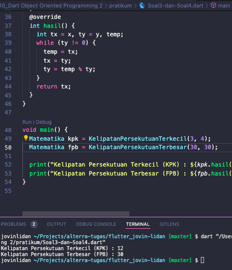

# (10) Dart Object Oriented Programming 2

## Resume

Dalam materi ini, mempelajari :

1. Lanjutan dan Sifat Object Oriented Programming (OOP)
2. Abstract Class
3. Generic Type

### Lanjutan dan Sifat Object Oriented Programming (OOP)

#### Constructor

Fungsi yang dijalankan pertama kali bersamaan saat sebuah objek dari kelas dibuat. Berbeda dengan fungsi biasa, di constructor tidak terdapat pengembalian nilai, namun dapat memiliki parameter.
Constructor biasanya digunakan untuk memasukkan nilai awal dari property class.

```
class Mahasiswa{
    var nama;
    var nim;

    Mahasiswa(){ // Ini adalah constructor
        nama = "Jovin Lidan";
        nim = "191111525";
    }
}
```

#### Overriding

Dengan overriding pada bagian method, maka class anak akan menulis ulang isi dari method class induxnya.
Overriding dilakukan ketika class anak mewarisi suatu class (class induk), dan method yang diwariskan harus terdapat dalam class induk.
`@override` ditambahkan sebelum baris method.

#### Inheritance

Pewarisan yang terdapat didalam kelas, dimana class anak dapat mewarisi property dan method yang dimiliki class induk.
Keyword untuk pewarisan yang digunakan :

- `implements` , pada implements seluruh method pada class induk wajib diwariskan ke class anaknya. Biasanya dengan menggunakan Implements maka class induknya akan disebut sebagai _interface_.
  ```
  class MahasiswaAkhir implements Mahasiswa{
  }
  ```
- `extends` , pada extends tidak seluruh method pada class induk wajib diwariskan ke class anaknya.
  ```
  class MahasiswaBaru extends Mahasiswa{
  }
  ```

#### Polymorphism

Pada class anak , kita dapat membuat objeknya dan menggunakan tipe data class indux sebagai tipe data dari objek tersebut menggunakan keyword `extends` atau `implements`.

```
void main() {
  Mahasiswa jovin = MahasiswaAkhir();
  jovin.belajar();
}
```

### Abstract Class

abstract class adalah class yang tidak dapat dibuat objek nya, dan hanya dapat diwarisi oleh class-class anaknya.
Cara pewarisan pada class anak menggunakan keyword `extends`.

```
abstract class Mahasiswa {
  Mahasiswa() {
  }
  belajar() {
    print("mahasiswa belajar");
  }
}

class MahasiswaAkhir extends Mahasiswa {
  MahasiswaAkhir() {
  }
  @override
  belajar() {
    print("mahasiswaAkhir belajar");
  }
}
```

### Generics

Suatu cara yang digunakan dalam class ataupun fungsi agar keduanya dapat menerima data dengan tipe yang dinamis sesuai dengan tipe yang kita masukkan ketika membuat objek dari class atau memanggil fungsi.

```
class Mahasiswa<T, S> {
  late T data1;
  late S data2;
  Mahasiswa(T data1, S data2) {
    this.data1 = data1;
    this.data2 = data2;
  }
  cetakUmur<Z>(Z umur) {
    print(umur);
  }
}
void main() {
  Mahasiswa jovin = Mahasiswa<int, String>(1, "Jovin");
  jovin.cetakUmur<String>("asd");
}
```

## Task

### Soal 1 dan Soal 2

**Soal:**


**Output:**


**Penjelasan**

- Pertama, membuat class BangunRuang dengan 3 property yaitu panjang, lebar, dan tinggi.Kemudian buat constructor dengan 3 parameter (p,l,t) dan masukkan nilai dari 3 parameter tersebut ke 3 property yang sudah dibuat diatas secara berurutan.
- Buat Method Volume dengan return data type `int`, didalam fungsi tersebut kembalikan hasil perkalian ke-3 property diatas.
- Selanjutnya, Buat class Kubus yang mewarisi class BangunRuang. Buat property sisi dengan tipe `int`, dan buat sebuah constructor yang menerima 1 buah parameter yaitu sisi, kemudian panggil constructor yang ada dikelas induk dan masukkan nilai dari parameter sisi kedalam parameter constructor yang ada di class induknya. Setelah itu, masukkan nilai dari parameter sisi kedalam property sisi yang sudah dibuat sebelumnya.
- Lakukan `@override` atau _Overriding_ pada method Volume yang sudah dibuat di kelas induk _(BangunRuang)_ , kemudian didalam method tersebut kembalikan hasil perkalian dari `sisi * sisi * sisi`.
- Selanjutnya, buat class Balok yang mewarisi class BangunRuang.Kemudian buat constructor dengan 3 parameter yaitu (p,l,t) dan panggil constructor pada kelas induknya dengan memberikan nilai dari 3 parameter tersebut ke constructor induknya.
- Lakukan `@override` atau _Overriding_ pada method Volume yang sudah dibuat di kelas induk _(BangunRuang)_ , kemudian didalam method tersebut kembalikan hasil perkalian dari `panjang * lebar * tinggi`.

Pada fungsi main, buat ketiga objek dari class `BangunRuang`, `Kubus`, dan `Balok` kemudian cetak hasil volume dari ketiga objek class tersebut.

### Soal 3 dan Soal 4

**Soal:**


**Output:**



**Penjelasan**

- Pertama , Buat class `Matematika` dengan 1 method yaitu hasil yang mengembalikan nilai 0.
- Kemudian buat class `KelipatanPersekutuanTerkecil` yang mengimplements class Matematika. didalam class tersebut, buat 2 property baru yaitu `x` dan `y` dengan tipe data `int`.
- Kemudian buat constructor dengan 2 parameter dan masukkan nilai dari 2 parameter tersebut kedalam property `x` dan `y` secara berurutan.
- Lakukan `@override` atau _Overriding_ method hasil. Isi dari method hasil yaitu ambil nilai terbesar antara x atau y dan masukkan nilai tersebut ke variabel `temp`. Lakukan perulangan apabila variabel `tenp` dapat habis dibagi x dan y maka kembalikan nilai dari variabel `temp`, jika tidak maka nilai dari variabel `temp` di tambah 1.
- Kemudian buat class `KelipatanPersekutuanTerbesar` yang mengimplements class Matematika. didalam class tersebut, buat 2 property baru yaitu `x` dan `y` dengan tipe data `int`.
- Kemudian buat constructor dengan 2 parameter dan masukkan nilai dari 2 parameter tersebut kedalam property `x` dan `y` secara berurutan.
- Lakukan `@override` atau _Overriding_ method hasil.Isi dari method hasil tersebut yaitu buat 3 variabel baru yaitu `tx`, `ty`, dan `temp`. Masukkan nilai `x` dan `y` kevariabel `tx` dan `ty`.
- Untuk setiap perulangan apabila nilai `ty` bukan 0, maka masukkan nilai `tx` kedalam `temp` , nilai `ty` kedalam `tx`, dan nilai `ty` adalah hasil dari `temp` di modulo `ty`.
- Jika nilai dari ty adalah 0, maka kembalikan nilai dari tx.

Pada fungsi main, buat objek dari kedua class anak tersebut, dan panggil method hasil dari masing-masing objek tersebut.
