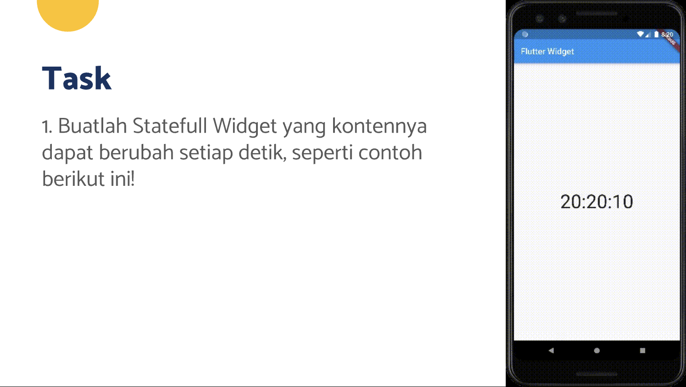
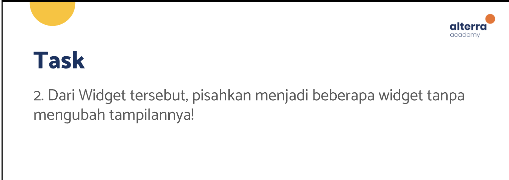
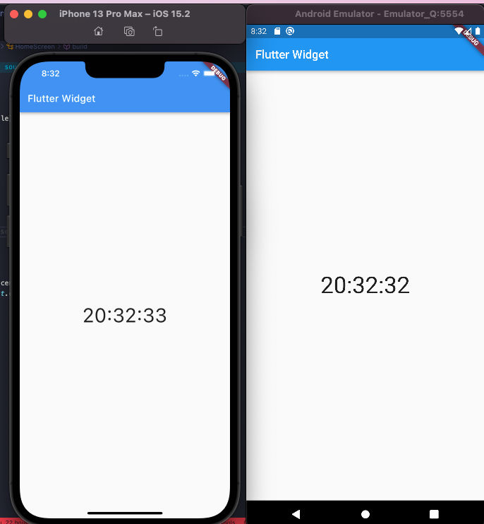

# (11) Introduction Flutter Widget

## Resume

Dalam materi ini, mempelajari :

1. Pengenalan Flutter
2. Pengenalan Widget
3. Built in Widget

### Pengenalan Flutter

Flutter adalah open source SDK yang dikembangkan oleh google untuk melakukan pengembangan aplikasi berbasis mobile, desktop dan web.

Cara membuat project baru adalah dengan menggunakan perintah `flutter create <nama_project>` dan `flutter run` untuk menjalankannya.

Kode-kode dart akan diketikkan dan dibuat didalam folder `lib`, untuk folder `android` dan `ios` berisi native code yang mungkin akan diubah saat ingin mengintegrasikan library yang membutuhkan penyesuaian dalam kode native seperti java, swift.

### Pengenalan Widget

Widget merupakan suatu class yang terdapat didalam flutter dan digunakan untuk membuat tampilan UI.

Ada 2 jenis Widget :

- Stateless Widget, Widget ini hanya berguna untuk tampilan saja dan tidak akan berubah meskipun data didalamnya berubah.

  ```dart
  class ContohStatelesWidget extends StatelessWidget {
      const ContohStatelesWidget({Key? key}) : super(key: key);
      @override
      Widget build(BuildContext context) {
          return Container();
      }
  }
  ```

- Stateful Widget, Widget ini berguna untuk tampilan dan juga dapat berubah sesuai dengan data yang diberikan.

  ```dart
  class ContohStatefulWidget extends StatefulWidget {
      const ContohStatefulWidget({Key? key}) : super(key: key);
      @override
      State<ContohStatefulWidget> createState() => _ContohStatefulWidgetState();
  }

  class _ContohStatefulWidgetState extends State<ContohStatefulWidget> {
      @override
      Widget build(BuildContext context) {
          return Container();
      }
  }
  ```

  Cara Mengubah data:

  ```dart
  class _ContohStatefulWidgetState extends State<ContohStatefulWidget> {
    String nama = "Jovin";
    void ubahnama() {
        setState(() {
            nama = "Jovin Lidan";
        });
    }
  @override
  Widget build(BuildContext context) {
    return Container(
        child: Text(nama),
      );
    }
  }
  ```

### Built in Widget

Widget yang sudah ada saat membuat project baru dan terinstall bersamaan dengan flutter.

Jenis Built in Widget:

- MaterialApp, widget yang biasanya menjadi root dari aplkasi dengan desain material.
- Scaffold, Widget yang digunakan untuk membuat halaman baru atau screen baru.
- AppBar, Widget ini digunakan untuk membentuk appbar atau sejenis header yang terdapat pada bagian atas screen.
- Text, widget ini digunakan untuk menampilkan teks.

## Task

**Soal:**





**Output:**



**Penjelasan:**

**`main.dart`**,

```dart
class MyApp extends StatelessWidget {
  const MyApp({Key? key}) : super(key: key);

  @override
  Widget build(BuildContext context) {
    return const MaterialApp(
      title: 'Flutter Widget',
      home: HomeScreen(title: "Flutter Widget"),
    );
  }
}
```

Class MyApp diatas adalah Widget dengan jenis stateless yang berarti hanya berfokus pada tampilan tidak dengan perubahan data.
Widget diatas mereturn widget MaterialApp dan didalam MaterialApp pada parameter homenya berisi sebuah Widget HomeScreen yang berupa custom widget dengan parameter title berisi teks.

**`home_screen.dart`**,

```dart
class HomeScreen extends StatelessWidget {
  const HomeScreen({Key? key, required this.title}) : super(key: key);
  final String title;

  @override
  Widget build(BuildContext context) {
    return Scaffold(
      appBar: AppBar(
        title: Text(title),
        centerTitle: false,
      ),
      body: const Center(
        child: TimeWidget(),
      ),
    );
  }
}

```

Class diatas juga merupakan stateless widget, constructor kelas diatas akan menerima nilai title yang diberikan kemudian memasukkannya kedalam variabel `final String title`.
Pada fungsi build, akan mengembalikan widget Scaffold yang berarti membuat halaman baru, didalamnya terdapat AppBar dengan title berisi widget Text yang isi dari widget text tersebut adalah variabel `title` yang sudah diisi nilai nya melalui constructor.centerTitle untuk merubah posisi dari title kesebelah kiri (secara default posisi title center pada iOS).

Kemudian didalam body Scaffold, berisi Widget Center untuk mengubah posisi dari jam tersebut menjadi tengah, didalam Center terdapat TimeWidget yang merupakan custom widget.

**`time_widget.dart`**,

```dart
class TimeWidget extends StatefulWidget {
  const TimeWidget({Key? key}) : super(key: key);

  @override
  State<TimeWidget> createState() => _TimeWidgetState();
}

class _TimeWidgetState extends State<TimeWidget> {
  String time = "";
  Timer? _timer;

  void setDateTime() {
    _timer = Timer.periodic(const Duration(seconds: 1), (timer) {
      final now = DateTime.now();
      String formattedDate = DateFormat('HH:mm:ss').format(now);
      setState(() {
        time = formattedDate;
      });
    });
  }

  @override
  void initState() {
    super.initState();
    setDateTime();
  }

  @override
  void dispose() {
    super.dispose();
    _timer?.cancel();
  }

  @override
  Widget build(BuildContext context) {
    return Text(time, style: const TextStyle(fontSize: 40));
  }
}
```

TimeWidget diatas adalah class Stateful Widget yang berarti setiap tampilan akan berubah sesuai dengan data yang diberikan.

initState adalah fungsi dari class induk yang akan dipanggil hanya pertama kali saat widget di mount atau dirender. dispose adalah fungsi dari class induk yang akan dipanggil saat widget akan di unmount.

Variabel `_timer` untuk menyimpan instansi dari Timer yang akan berguna difungsi dispose untuk menghapus timer.
Variabel `time` untuk menyimpan waktu dalam bentuk String.

`setDateTime()`, fungsi ini akan mengisi variabel `_timer` dengan nilai dari hasil `Timer.periodic` dengan sebuah interval dimana dalam setiap 1 detik akan memanggil sebuah fungsi yaitu :

```dart
(timer) {
    final now = DateTime.now();
    String formattedDate = DateFormat('HH:mm:ss').format(now);
    setState(() {
      time = formattedDate;
    });
  }
```

Fungsi diatas akan menggambil waktu sekarang, kemudian melakukan formatting dengan format `HH:mm:ss` sesuai dengan contoh soal. `DateFormat` sendiri merupakan salah satu fungsi dari library `intl` untuk melakukan formatting datetime.
Kemudian hasil dari waktu yang sudah diformat dimasukkan ke string `formattedDate`, dan lakukan setState untuk mengubah state dari `time` dan diisi dengan nilai `formattedDate`.

Fungsi `setDateTime` diatas hanya akan dipanggil 1x saja saat widget pertama kali di mount, dan timer interval tersebut akan dihapus saat widget diunmount menggunakan dispose dengan perintah `_timer?.cancel()`.

Pada fungsi build, akan mereturn widget text dengan nilai dari variabel `time` dan TextStyle untuk mengubah ukuran font.
