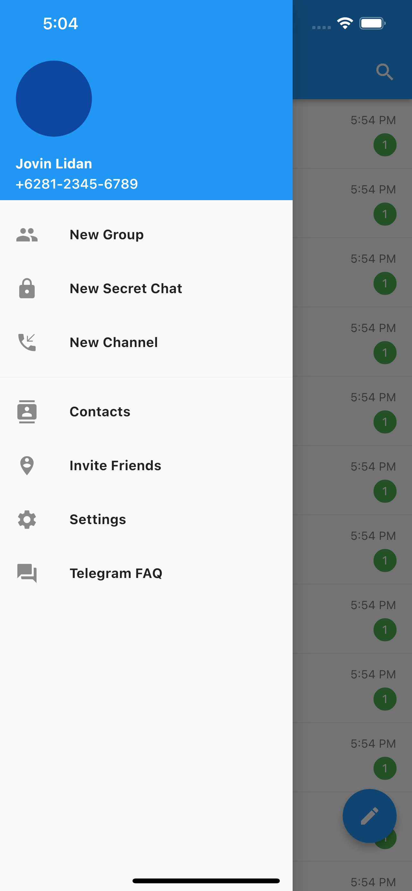

# (12) Platform Widget

## Resume

Dalam materi ini, mempelajari :

1. Platform Widget
2. Material App
3. Cupertino App

### Platform Widget

Dalam mobile apps development didalam flutter, ada 2 jenis platform widget yang dapat digunakan. Masing-masing platform widget merepresentasikan bagaimana UI atau tampilan widget tersebut terlihat pada platformnya masing-masing.
Platform widget sendiri adalah sebagai widget dasar untuk mengemas seluruh widget didalam aplikasi.

2 Platform Widget Tersebut adalah:

- Material App, memiliki tampilan seperti Android
- Cupertino App, memiliki tampilan seperti iOS

### Material App

Widget ini memiliki tampilan dalam sistem operasi Android.
Untuk menggunakan widget ini, harus melakukan import filenya terlebih dahulu:
`import 'package:flutter/material.dart';`

Dalam menggunakan material app, ada constructor `home` , tempat pertama kali widget dimasukkan. Biasanya akan diisi dengan widget `Scaffold`.

Didalam widget Scaffold, terdapat beberapa constructor yaitu :

- `appBar`, untuk memasukkan widget `AppBar`, widget ini akan muncul dibagian paling atas sebuah `Scaffold`.
- `body`, widget ini akan muncul setelah `Appbar` dan berisi konten sebuah halaman
- `drawer`, widget ini untuk membuat sebuah tombol hamburger didalam `AppBar` pada bagian paling kiri. Apabila tombol tersebut ditekan, maka akan muncul kumpulan menu dari sebelah kiri.

  

  

- `bottomNavigationBar`, widget ini akan muncul pada bagian bawah `Scaffold` dan berfungsi sebagai navigasi ke halaman lainnya.

### Cupertino App

Widget ini memiliki tampilan dalam sistem operasi iOS.
Untuk menggunakan widget ini, harus melakukan import filenya terlebih dahulu:
`import 'package:flutter/cupertino.dart';`

Dalam menggunakan cupertino app, ada constructor `home` , tempat pertama kali widget dimasukkan. Biasanya akan diisi dengan widget `CupertinoPageScaffold` atau `CupertinoTabScaffold`.

Didalam widget CupertinoPageScaffold, terdapat beberapa constructor yaitu :

- `navigationBar`, untuk memasukkan widget `CupertinoNavigationBar`, widget ini akan muncul dibagian paling atas sebuah `CupertinoScaffold`.
- `child`, widget ini akan muncul setelah `CupertinoNavigationBar` dan berisi konten sebuah halaman

## Task

**Soal1:**


**Output:**

##### Android:


##### iOS:




**Penjelasan:**

**Widget (Soal1)**

```dart
class Soal1 extends StatelessWidget {
  const Soal1({Key? key}) : super(key: key);

  @override
  Widget build(BuildContext context) {
    return MaterialApp(
      debugShowCheckedModeBanner: false,
      home: Scaffold(
        appBar: AppBar(
          title: const Text(
            "Telegram",
            style: TextStyle(fontSize: 20),
          ),
          centerTitle: false,
          actions: const [
            Padding(
              padding: EdgeInsets.symmetric(horizontal: 16),
              child: Icon(Icons.search),
            ),
          ],
        ),
        body: const CustomBody(),
        drawer: const CustomDrawer(),
      ),
    );
  }
}
```

Pada widget material app diatas, property debugShowCheckModeBanner untuk menghilangkan banner debug di sudut kanan atas aplikasi.
Constructor home diisi dengan Scaffold, kemudian property appBar diisi dengan AppBar dengan title adalah Widget Text dan style font size 20.
Centertitle = false, untuk mengubah posisi title ke bagian kiri (untuk iOS).
actions diisi dengan icon search, dan diberikkan padding kanan kiri sebesar 16.

Kemudian pada bagian Scaffold, constructor body dan drawer diisi dengan CustomWidget yaitu CustomBody dan CustomDrawer.

**Widget (CustomBody)**

```dart
class CustomBody extends StatelessWidget {
  const CustomBody({Key? key}) : super(key: key);
  @override
  Widget build(BuildContext context) {
    return ListView(
      padding: const EdgeInsets.only(top: 8),
      children: const [
        CustomChat(),
        CustomChat(),
        CustomChat(),
        CustomChat(),
        CustomChat(),
        CustomChat(),
        CustomChat(),
        CustomChat(),
        CustomChat(),
        CustomChat(),
        CustomChat(),
        CustomChat(),
        CustomChat(),
        CustomChat(),
      ],
    );
  }
}
```

Widget diatas akan mengembalikan widget ListView dengan padding top sebesar 8 , dan diisi dengan beberapa widget CustomChat, ListView digunakan agar konten dapat discroll.

**Widget (CustomChat)**

```dart
class CustomChat extends StatelessWidget {
  const CustomChat({Key? key}) : super(key: key);

  @override
  Widget build(BuildContext context) {
    return Column(
      children: [
        ListTile(
          title: Column(
            children: [
              Row(
                mainAxisAlignment: MainAxisAlignment.spaceBetween,
                children: [
                  const Text(
                    "Jovin Lidan",
                    style: TextStyle(
                      color: Colors.black,
                      fontWeight: FontWeight.bold,
                    ),
                  ),
                  Text("5:54 PM", style: TextStyle(fontSize: 12, color: Colors.grey[600]))
                ],
              ),
              const SizedBox(height: 4),
              Row(
                mainAxisAlignment: MainAxisAlignment.spaceBetween,
                children: [
                  Text(
                    "Jovin: Wow, nice🤪🤪",
                    style: TextStyle(color: Colors.grey[600], fontSize: 14),
                  ),
                  const CustomBadges(
                    color: Colors.green,
                    size: 24,
                    child: Text("1", style: TextStyle(color: Colors.white, fontSize: 12)),
                  ),
                ],
              ),
            ],
          ),
          leading: const CircleAvatar(
            backgroundColor: Colors.red,
            radius: 30,
          ),
        ),
        const Divider(),
      ],
    );
  }
}
```

Widget CustomChat diatas mengembalikan Column dengan children ListTile dan Divider. Divider digunakan untuk memunculkan garis horizontal dibagian bawah setiap Widget chat.

Didalam ListTile , constructor title diisi Column dan constructor leading diisi dengan Widget CircleAvatar, CircleAvatar digunakan untuk membentuk lingkaran dengan background berwarna merah dan radius atau besarnya adalah 30.

Didalam constructor title pada ListTile, berisi Column dengan children 2 row dan 1 sizebox. Row pertama berisi text "Jovin Lidan" dan text "5:54 PM" dengan beberapa style pada text masing-masing.Constructor pada row "spaceBetween" untuk membuat jarak antara kedua teks sejauh mungkin.

Kemudian SizedBox digunakan untuk membuat jarak 4px antara kedua baris.Row kedua berisi teks "Jovin: Wow, nice🤪🤪" dan 1 widget CustomBadges.Constructor pada row "spaceBetween" untuk membuat jarak antara kedua teks sejauh mungkin.

**Widget (CustomDrawer)**

```dart

class CustomDrawer extends StatelessWidget {
  const CustomDrawer({Key? key}) : super(key: key);

  @override
  Widget build(BuildContext context) {
    return Drawer(
      child: ListView(
        padding: EdgeInsets.zero,
        children: [
          DrawerHeader(
            decoration: const BoxDecoration(
              color: Colors.blue,
            ),
            child: Column(
              children: [
                Expanded(
                  child: CircleAvatar(
                    backgroundColor: Colors.blue[900],
                    radius: 40,
                  ),
                ),
                const SizedBox(
                  height: 20,
                ),
                const Text(
                  "Jovin Lidan",
                  style: TextStyle(
                    color: Colors.white,
                    fontWeight: FontWeight.bold,
                  ),
                ),
                const SizedBox(
                  height: 4,
                ),
                const Text(
                  "+6281-2345-6789",
                  style: TextStyle(color: Colors.white),
                ),
              ],
              crossAxisAlignment: CrossAxisAlignment.start,
            ),
          ),
          const ListTile(
            title: Text(
              'New Group',
              style: TextStyle(
                fontWeight: FontWeight.bold,
              ),
            ),
            leading: Icon(Icons.people),
          ),
          const ListTile(
            title: Text(
              'New Secret Chat',
              style: TextStyle(
                fontWeight: FontWeight.bold,
              ),
            ),
            leading: Icon(Icons.lock),
          ),
          const ListTile(
            title: Text(
              'New Channel',
              style: TextStyle(
                fontWeight: FontWeight.bold,
              ),
            ),
            leading: Icon(Icons.phone_callback),
          ),
          const Divider(),
          const ListTile(
            title: Text(
              'Contacts',
              style: TextStyle(
                fontWeight: FontWeight.bold,
              ),
            ),
            leading: Icon(Icons.contacts),
          ),
          const ListTile(
            title: Text(
              'Invite Friends',
              style: TextStyle(
                fontWeight: FontWeight.bold,
              ),
            ),
            leading: Icon(Icons.person_pin_circle),
          ),
          const ListTile(
            title: Text(
              'Settings',
              style: TextStyle(
                fontWeight: FontWeight.bold,
              ),
            ),
            leading: Icon(Icons.settings),
          ),
          const ListTile(
            title: Text(
              'Telegram FAQ',
              style: TextStyle(
                fontWeight: FontWeight.bold,
              ),
            ),
            leading: Icon(Icons.question_answer),
          ),
        ],
      ),
    );
  }
}
```

Widget diatas digunakan untuk menampilkan tampilan drawer.Widget yang dikembalikan adalah Drawer, dengan child ListView, dan membuat padding didalam ListView menjadi 0 agar tidak terjadi keanehan pada tampilan yang disebabkan padding default dari ListView.

Pada ListView, childrennya berisi DrawerHeader yang merupakan bagian atas tampilan ketika menu drawer diaktifkan dengan warna background biru diubah menggunakan BoxDecoration.

Didalam DrawerHeader terdapat Column dengan children Expanded yang berisi CircleAvatar agar CircleAvatar tersebut mengambil space atau tempat sebanyak mungkin secara vertikal. Kemudian ada SizedBox untuk memberikan jarak. Selanjutnya ada teks "Jovin Lidan", SizedBox, dan teks berisi nomor telepon. CrossAxisAlignment.start bertujuan agar konten berada dikiri.

setelah DrawerHeader, dibawahnya terdapat beberapa ListTile, dengan title berupa Widget Text dengan beberapa style dan leading berisi Icon masing-masing.

**Widget (CustomBadges)**

```dart
class CustomBadges extends StatelessWidget {
  final Color color;
  final double size;
  final Widget child;
  final Widget? parent;
  const CustomBadges(
      {Key? key, this.color = Colors.black, this.size = 20, required this.child, this.parent})
      : super(key: key);

  @override
  Widget build(BuildContext context) {
    if (parent != null) {
      return Stack(
        clipBehavior: Clip.none,
        children: [
          parent!,
          Positioned(
            top: -(size / 4),
            right: -(size / 4),
            child: Container(
              width: size,
              height: size,
              decoration: BoxDecoration(shape: BoxShape.circle, color: color),
              child: Center(child: child),
            ),
          )
        ],
      );
    }
    return Container(
      width: size,
      height: size,
      decoration: BoxDecoration(shape: BoxShape.circle, color: color),
      child: Center(child: child),
    );
  }
}
```

**Soal2:**


**Output:**

##### Android:


##### iOS:


**Penjelasan:**

**Widget (Soal2)**

```dart
class Soal2 extends StatelessWidget {
  Soal2({Key? key}) : super(key: key);

  final GlobalKey<NavigatorState> key1 = GlobalKey<NavigatorState>();
  final GlobalKey<NavigatorState> key2 = GlobalKey<NavigatorState>();
  final GlobalKey<NavigatorState> key3 = GlobalKey<NavigatorState>();
  final GlobalKey<NavigatorState> key4 = GlobalKey<NavigatorState>();

  Widget handleTabBuilder({required int index, required BuildContext context}) {
    switch (index) {
      case 0:
        return CupertinoTabView(
            navigatorKey: key1,
            builder: (BuildContext context) => const Center(child: Text("Contacts")));
      case 1:
        return CupertinoTabView(
            navigatorKey: key2,
            builder: (BuildContext context) => const Center(child: Text("Calls")));
      case 2:
        return CupertinoTabView(
          navigatorKey: key3,
          builder: (BuildContext context) => const ChatScreen(),
        );
      default:
        return CupertinoTabView(
            navigatorKey: key4,
            builder: (BuildContext context) => const Center(child: Text("Settings")));
    }
  }

  @override
  Widget build(BuildContext context) {
    return CupertinoApp(
      debugShowCheckedModeBanner: false,
      localizationsDelegates: const <LocalizationsDelegate<dynamic>>[
        DefaultMaterialLocalizations.delegate,
        DefaultWidgetsLocalizations.delegate,
        DefaultCupertinoLocalizations.delegate,
      ],
      home: CupertinoTabScaffold(
          tabBar: CupertinoTabBar(
            height: 60,
            items: const [
              BottomNavigationBarItem(
                  icon: Icon(CupertinoIcons.profile_circled), label: "Contacts"),
              BottomNavigationBarItem(icon: Icon(CupertinoIcons.phone_fill), label: "Calls"),
              BottomNavigationBarItem(
                icon: CustomBadges(
                  color: Colors.red,
                  size: 20,
                  child: Text(
                    "9",
                    style: TextStyle(color: CupertinoColors.white, fontSize: 14),
                  ),
                  parent: Icon(CupertinoIcons.chat_bubble_2_fill),
                ),
                label: "Chats",
              ),
              BottomNavigationBarItem(icon: Icon(CupertinoIcons.settings), label: "Settings"),
            ],
          ),
          tabBuilder: (context, index) => handleTabBuilder(index: index, context: context)),
    );
  }
}
```

4 variabel globalkey diatas adalah unique key yang wajib diberikan ke dalam Widget CupertinoTabView untuk menjadi pembeda antara tabview.
handleTabBuilder adalah sebuah fungsi yang akan mengembalikan CupertinoTabView berdasarkan index dari parameter yang diberikan. Constructor parameter index ke 0, 1 dan 3 mengembalikan Widget Center dengan Text masing-masing. Sedangkan index ke 2 mengembalikan widget ChatScreen.

fungsi build mengembalikan CupertinoApp dengan debugShowCheckModeBanner adalah false, dan localizationsDelegates berisi list delegate yang berfungsi agar dapat menggunakan Widget Scaffold didalam CupertinoApp.

Pada Constructor CupertinoApp, home berisi CupertinoTabScaffold untuk menampilkan tabbar yang berada dibagian bawah layar, Didalamnya terdapat constructor tabBar berisi Widget CupertinoTabBar dengan height 60 dan items berisi 4 buah tabbar dengan masing-masing Widget BottomNavigationBarItem. Constructor icon berisi CustomBadges.

Kemudian Didalam CupertinoTabBar, constructor tabBuilder berisi fungsi handleTabBuilder yang mana fungsi tersebut akan mengembalikan widget CupertinoTabView sesuai dengan indexnya.

**Widget (ChatScreen)**

```dart
class ChatScreen extends StatelessWidget {
  const ChatScreen({Key? key}) : super(key: key);

  @override
  Widget build(BuildContext context) {
    return DefaultTabController(
      length: 4,
      initialIndex: 0,
      child: Scaffold(
          appBar: AppBar(
            centerTitle: true,
            backgroundColor: CupertinoColors.tertiarySystemGroupedBackground,
            systemOverlayStyle: SystemUiOverlayStyle.dark,
            elevation: 0.5,
            title: const Text('Chats',
                style: TextStyle(fontWeight: FontWeight.bold, color: CupertinoColors.black)),
            leading: Row(
              children: const [
                Padding(
                  padding: EdgeInsets.only(left: 12),
                  child: Text(
                    'Edit',
                    style: TextStyle(
                      color: CupertinoColors.activeBlue,
                      fontWeight: FontWeight.w600,
                      fontSize: 16,
                    ),
                  ),
                ),
              ],
            ),
            actions: const [
              Padding(
                padding: EdgeInsets.only(right: 12),
                child: Icon(
                  CupertinoIcons.share,
                  size: 24,
                  color: CupertinoColors.activeBlue,
                ),
              ),
            ],
            bottom: PreferredSize(
              preferredSize: const Size(0.0, 80.0),
              child: Column(
                children: [
                  const Padding(
                    padding: EdgeInsets.symmetric(horizontal: 8.0),
                    child: CupertinoSearchTextField(
                        prefixInsets: EdgeInsets.only(
                      left: MediaQuery.of(context).size.width / 2.7,
                    )),
                  ),
                  TabBar(
                    isScrollable: true,
                    labelColor: CupertinoColors.activeBlue,
                    unselectedLabelColor: Colors.grey[500],
                    tabs: const [
                      CustomTabItem(title: "All Chats"),
                      CustomTabItem(
                        title: "Work",
                        showBadge: true,
                      ),
                      CustomTabItem(title: "Unread", showBadge: true),
                      CustomTabItem(title: "Personal", showBadge: true),
                    ],
                  ),
                ],
              ),
            ),
          ),
          body: SafeArea(
            child: Padding(
              padding: const EdgeInsets.only(left: 8, right: 8, top: 8),
              child: SingleChildScrollView(
                child: Column(
                  children: const [
                    CustomChat(),
                    CustomChat(),
                    CustomChat(),
                    CustomChat(),
                    CustomChat(),
                    CustomChat(),
                    CustomChat(),
                    CustomChat(),
                    CustomChat(),
                    CustomChat(),
                    CustomChat(),
                  ],
                ),
              ),
            ),
          )),
    );
  }
}
```

Widget chatscreen diatas mengembalikan Widget DefaultTabController. Widget DefaultTabController berguna dan wajib digunakan agar widget TabBar yang didalamnya dapat berjalan dengan baik. Constructor length(4) menandakan bahwa ada 4 TabBar yang akan dimunculkan, initialIndex sebagai index dari TabBar yang akan ditampilkan pertama kali ketika aplikasi dibuka.

Didalam DefaultTabController terdapat Scaffold sebagai widget yang membentuk halaman ini, kemudian pada pada widget AppBar ,systemOverlayStyle untuk memberikan tema dark atau light pada bagian icon di status bar bagian atas. Elevation (0.5) untuk memberikan garis sedikit pada bagian bawah appbar.

Constructor title diisi dengan Widget text, kemudian leading diisi dengan widget row yang didalamnya terdapat widget padding dengan text sebagai childnya.

Constructor actions diisi dengan padding dengan widget Icon sebagai childnya.

Setelah itu pada Constructor bottom diisi dengan widget PreferredSize dengan width 0 dan height 80.Widget PreferredSize memiliki child yaitu widget column dengan 2 children yaitu Widget CupertinoSearchTextField yang ada didalam Cupertino , constructor prefixInsets untuk memasukkan padding pada sebelah kiri, dan mediaquery dari width untuk mengambil panjang width konten layar. TabBar dengan Constructor isScrollable bernilai true agar tabbar dapat discroll secara horizontal, labelColor untuk memberikan warna biru pada text tabbar yang aktif, unselectedLabelColor untuk warna abu-abu pada text tabbar yang tidak aktif.

Kemudian Constructor tabs berisi 4 buah CustomTabItem yang merupakan widget custom dengan Constructor title untuk menampilkan teks dan showBadge untuk memunculkan badge apabila bernilai true.

Pada Constructor body yang berada didalam Scaffold berisi SafeArea agar widget tidak dioverlap oleh widget BottomNavigationBar yang berada dibawah layar, Widget padding untuk memberikan padding, SingleChildScrollView adalah widget yang membuat agar children dapat discroll secara vertikal, dan ada juga beberapa children dengan widget CustomChat.

**Widget (CustomTabItem)**

```dart
class CustomTabItem extends StatelessWidget {
  final String title;
  final bool showBadge;
  const CustomTabItem({Key? key, required this.title, this.showBadge = false}) : super(key: key);

  @override
  Widget build(BuildContext context) {
    return Tab(
      child: Row(
        children: [
          Text(title, style: const TextStyle(fontSize: 14)),
          const SizedBox(
            width: 4,
          ),
          showBadge
              ? const CustomBadges(
                  color: Colors.blue,
                  child: Text(
                    "2",
                    style:
                        TextStyle(fontWeight: FontWeight.normal, fontSize: 14, color: Colors.white),
                  ),
                )
              : const SizedBox.shrink(),
        ],
      ),
    );
  }
}
```

Widget diatas memiliki variabel title dan showBadge sesuai dengan keguanaan yang sudah dijelaskan diatas.Kemudian widget tersebut mengembalikan Widget Tab untuk keperluan widget TabBar sebagai childrennya, kemudian didalamnya terdapat Row dengan 2 buah Widget, yang satu merupakan Text dan 1 lagi dirender secara kondisional apabila showBadge bernilai true maka kembalikan widget CustomBadges , jika tidak maka kembalikan Widget SizedBox.shrink() yang merupakan widget yang kosong dan tidak berisi apapun serta tidak mengambil ruang pada UI.

**Widget (CustomChat)**

```dart
class CustomChat extends StatelessWidget {
  const CustomChat({Key? key}) : super(key: key);

  @override
  Widget build(BuildContext context) {
    return SizedBox(
      height: 80,
      child: Row(
        mainAxisAlignment: MainAxisAlignment.center,
        children: [
          Container(
            width: 60,
            height: 60,
            decoration: const BoxDecoration(color: Colors.blue, shape: BoxShape.circle),
          ),
          const SizedBox(
            width: 8,
          ),
          Expanded(
            child: Column(
              mainAxisAlignment: MainAxisAlignment.spaceEvenly,
              children: [
                const Divider(height: 0, thickness: 0, color: Colors.white),
                Row(
                  mainAxisAlignment: MainAxisAlignment.spaceBetween,
                  children: [
                    const Text('Reading Week',
                        style: TextStyle(
                          fontWeight: FontWeight.bold,
                          fontSize: 16,
                        )),
                    Text('18:00', style: TextStyle(color: Colors.grey[600])),
                  ],
                ),
                Row(
                  mainAxisAlignment: MainAxisAlignment.spaceBetween,
                  children: [
                    Column(
                      crossAxisAlignment: CrossAxisAlignment.start,
                      children: [
                        const Text(
                          'Hudison',
                          style: TextStyle(
                            fontWeight: FontWeight.w600,
                            fontSize: 14,
                          ),
                        ),
                        Text(
                          'Check this, check this out',
                          style: TextStyle(color: Colors.grey[600]),
                        ),
                      ],
                    ),
                    const CustomBadges(
                      child: Text("8", style: TextStyle(color: Colors.white, fontSize: 12)),
                      color: Colors.blue,
                      size: 20,
                    )
                  ],
                ),
                const Divider(height: 0, thickness: 1.5),
              ],
            ),
          )
        ],
      ),
    );
  }
}
```

Widget diatas adalah widget yang merepresentasikan 1 buah chat, dengan widget SizedBox yang menjadi rootnya dan memiliki height sebesar 80, kemudian didalamnya diisi oleh Row dengan MainAxisnya adalah center.

Kemudian didalamnya berisi 3 buah children Container, SizedBox, dan Expanded.Container sebagai container untuk membuat image berbentuk lingkaran dengan BoxDecoration dan BoxShapenya adalah circle.SizedBox untuk membuat jarak antara Container dengan Expanded.

Expanded akan berisi Column dengan 4 buah children, dengan mainaxisnya merupakan spaceEvenly agar kedua childrenya memiliki jarak satu sama lain yang sama.

Children yang pertama merupakan Divider, dan dibuat setransparan mungkin agar widget yang diantara children ke 1 dan ke 4 tetap berada ditengah setara dengan widget Container yang merupakan lingkaran.

Kemudian children kedua adalah Row dengan 2 buah Widget Text dan Mainaxis adalah spaceBetween agar jarak keduanya sejauh mungkin.

Children ketiga merupakan row dengan 2 buah children yaitu Column dan CustomBadges. Column memiliki 2 buah children yang merupakan 2 buah teks yang crossaxisnya berada di start. Kemudian CustomBadges berisi child widget Text dan beberapa kostumisasi seperti size dan color.

Kemudian Children keempat dari Expanded adalah Divider yang merupakan garis pemisah antara chat, dengan height 0 dan thickness 1.5 (ketebalan).
