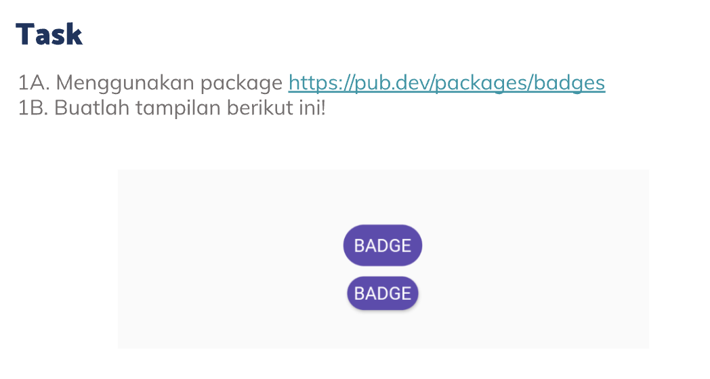
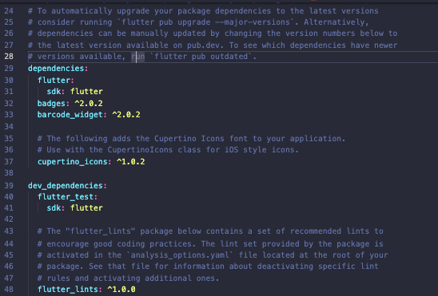
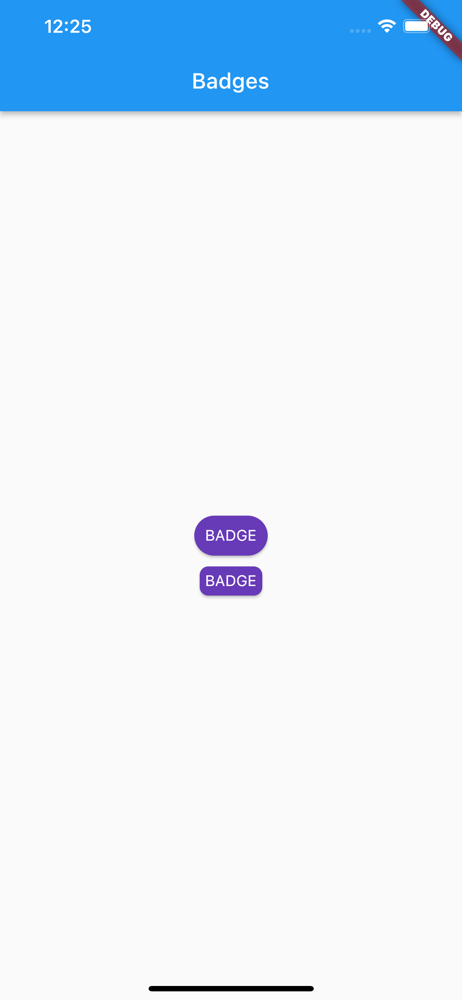
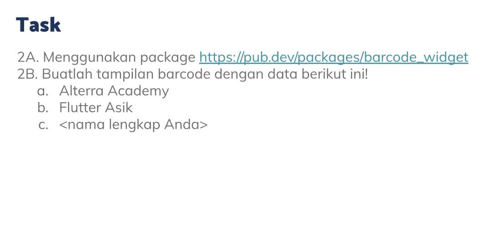
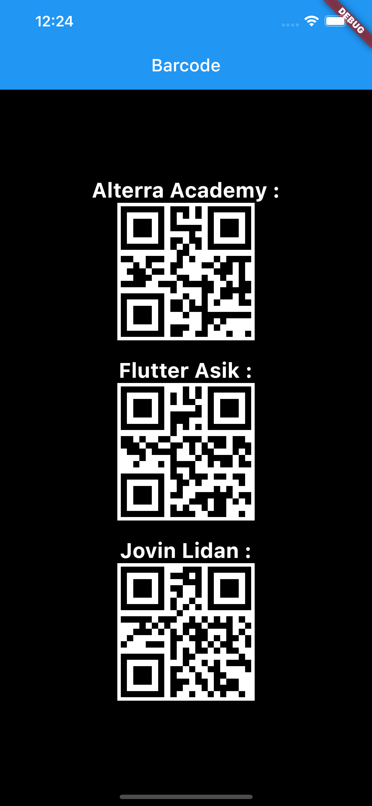

# (13) Flutter Command Line Interface (CLI) and Flutter package management

## Resume

Dalam materi ini, mempelajari :

1. Flutter CLI
2. Perintah CLI
3. Packages dalam Flutter

### Flutter CLI

CLI atau _Command Line Interface_ adalah suatu command yang digunakan untuk berinteraksi dengan Flutter itu sendiri, memodifikasi project flutter dan juga mempermudah dalam proses developing aplikasi flutter.

### Perintah CLI

- `flutter doctor`, untuk mendapatkan informasi mengenai kondisi environment flutter seperti emulator, sdk, dan IDE.
- `flutter create <nama-project>`, untuk membuat project flutter
- `flutter run <nama-file>`, untuk menjalankan project flutterr
- `flutter emulators`, untuk menampilkan list emulator yang tersedia.
- `flutter emulators --launch <emulator>`, untuk menjalankan emulator.
- `flutter channel`, untuk menampilkan flutter channel
- `flutter pub add <nama-package`, untuk menambahkan package ke pubspec.yaml
- `flutter pub get`, untuk mengunduh seluruh package yang ditambahkan didalam pubspec.yaml
- `flutter build <apk / appbundle> `, untuk membuat build berbasis sistem operasi Android
- `flutter build ipa`, untuk membuat build berbasis sistem operasi iOS
- `flutter clean`, untuk mengosongkan project flutter dari file-file package bawaan flutter maupun package yang dimasukkan secara manual.

### Packages dalam Flutter

Package dalam flutter merupakan third-party library yang dibuat oleh developer lain maupun developer flutter itu sendiri, package berisi kode-kode program yang sudah dibuat dan dapat digunakan untuk mempercepat proses development apps.

Kita dapat mencari package di website `pub.dev` kemudian memasukkannya kedalam project dengan menaruh kedalam file pubspec.yaml dibawah dependencies atau dapat menggunakan command `flutter pub add <nama-package`. Setelah itu jalankan command `flutter pub get`.

Cara menggunakan package yaitu dengan cara melakukan import pada bagian atas file `import 'package:<nama-package>';`

## Task

**Soal1:**



**Output:**





**Penjelasan:**

```dart
class Soal1 extends StatelessWidget {
  const Soal1({Key? key}) : super(key: key);

  @override
  Widget build(BuildContext context) {
    return MaterialApp(
        home: Scaffold(
      appBar: AppBar(title: const Text("Badges")),
      body: Center(
        child: Column(
          mainAxisAlignment: MainAxisAlignment.center,
          children: [
            Badge(
              toAnimate: false,
              shape: BadgeShape.square,
              badgeColor: Colors.deepPurple,
              borderRadius: BorderRadius.circular(20),
              padding: const EdgeInsets.symmetric(horizontal: 10, vertical: 10),
              badgeContent: const Text('BADGE', style: TextStyle(color: Colors.white)),
            ),
            const SizedBox(
              height: 10,
            ),
            Badge(
              toAnimate: false,
              shape: BadgeShape.square,
              badgeColor: Colors.deepPurple,
              borderRadius: BorderRadius.circular(8),
              badgeContent: const Text('BADGE', style: TextStyle(color: Colors.white)),
            ),
          ],
        ),
      ),
    ));
  }
}
```

Widget diatas mengembalikan MaterialApp dengan homenya yaitu Scaffold, dan didalam scaffold terdapat appbar berisi AppBar dengan title yaitu widget Text.

Didalam body terdapat widget Center untuk membuat konten berada ditengah, dan memiliki child Column yang mainAxisnya bernilai center.

Kemudian didalam Column terdapat 2 Widget Badge yang dihasilkan dari package badges. Constructor toAnimate diatas untuk menghilangkan animasi saat widget muncul, shape untuk membuat bentuk widget kotak, badgeColor untuk memberikan warna background pada badge, borderRadius untuk mengendalikan radius seluruh corner pada badge, badgeContent menampung widget yang berada didalam badge.

**Soal1:**



**Output:**




**Penjelasan:**

```dart
class Soal2 extends StatelessWidget {
  const Soal2({Key? key}) : super(key: key);

  @override
  Widget build(BuildContext context) {
    return MaterialApp(
      home: Scaffold(
        backgroundColor: Colors.black,
        appBar: AppBar(title: const Text("Barcode")),
        body: Center(
          child: Column(
            mainAxisAlignment: MainAxisAlignment.center,
            children: [
              const Text(
                "Alterra Academy :",
                style: TextStyle(fontWeight: FontWeight.bold, fontSize: 24, color: Colors.white),
              ),
              Container(
                padding: const EdgeInsets.all(4),
                color: Colors.white,
                child: BarcodeWidget(
                  data: "Alterra Academy",
                  barcode: Barcode.qrCode(),
                  width: 150,
                  height: 150,
                  backgroundColor: Colors.white,
                ),
              ),
              const SizedBox(
                height: 20,
              ),
              const Text(
                "Flutter Asik :",
                style: TextStyle(fontWeight: FontWeight.bold, fontSize: 24, color: Colors.white),
              ),
              Container(
                padding: const EdgeInsets.all(4),
                color: Colors.white,
                child: BarcodeWidget(
                  data: "Flutter Asik",
                  barcode: Barcode.qrCode(),
                  width: 150,
                  height: 150,
                  backgroundColor: Colors.white,
                ),
              ),
              const SizedBox(
                height: 20,
              ),
              const Text(
                "Jovin Lidan :",
                style: TextStyle(fontWeight: FontWeight.bold, fontSize: 24, color: Colors.white),
              ),
              Container(
                padding: const EdgeInsets.all(4),
                color: Colors.white,
                child: BarcodeWidget(
                  data: "Jovin Lidan",
                  barcode: Barcode.qrCode(),
                  width: 150,
                  height: 150,
                  backgroundColor: Colors.white,
                ),
              ),
              const SizedBox(
                height: 20,
              ),
            ],
          ),
        ),
      ),
    );
  }
}
```

Widget diatas mengembalikan MaterialApp dengan homenya yaitu Scaffold, dan didalam scaffold terdapat appbar berisi AppBar dengan title yaitu widget Text.

Didalam body terdapat widget Center untuk membuat konten berada ditengah, dan memiliki child Column yang mainAxisnya bernilai center.

Kemudian Column tersebut memiliki 9 children, dengan 3 widget berbeda yaitu widget Container, Text, dan SizedBox.

Widget SizedBox untuk memberikan jarak secara vertikal antara kedua wdiget, Text untuk memunculkan teks, dan Container untuk memunculkan barcode.

Didalam Container terdapat padding 4 diseluruh sisi container dengan backgroundColor putih dan child BarcodeWidget. BarcodeWidget adalah widget yang didapatkan melalui packages dari pub.dev, didalam BarcodeWidget terdapat constructor data, constructor data adalah data yang akan dikembalikan oleh barcode tersebut apabila barcode tersebut discan, constructor barcode berisi tipe barcode yang akan dimunculkan, width dan height sebagai lebar dan panjang barcode , dan backgroundColor sebagai backgroundColor pada barcode.
