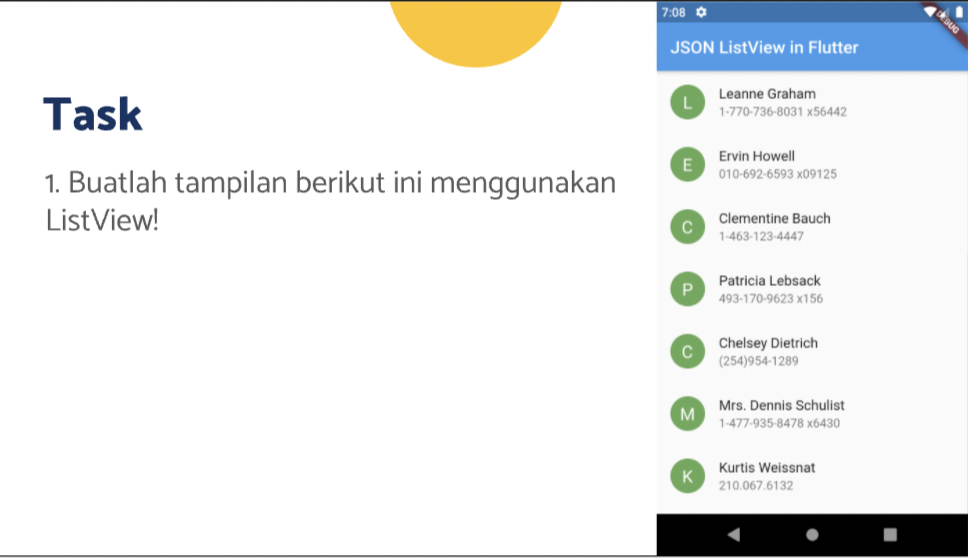
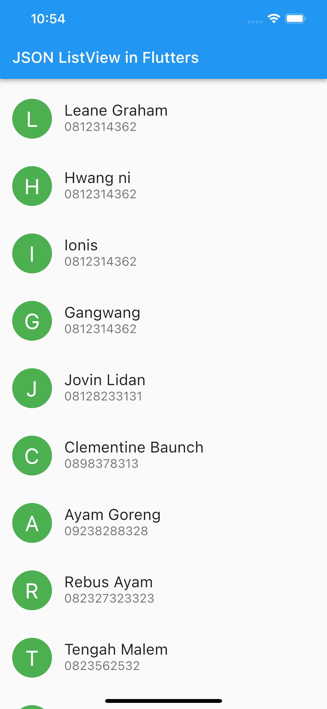
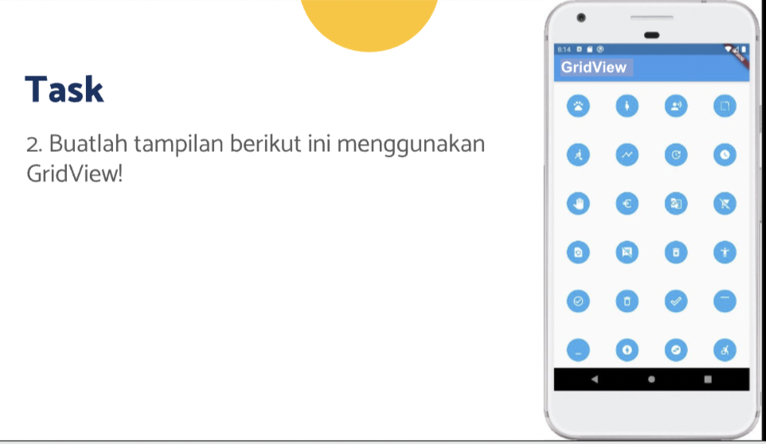
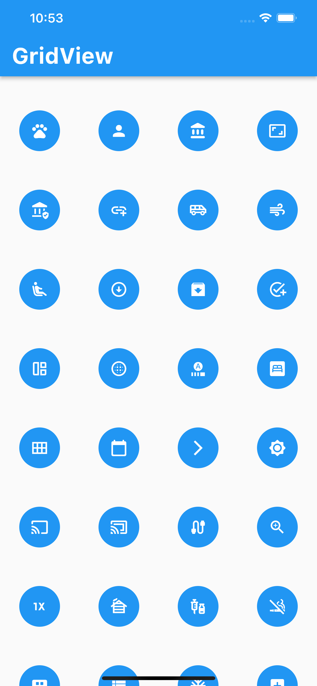

# (14) Flutter Layout

## Resume

Dalam materi ini, mempelajari :

1. Layout dalam Flutter
2. Single child Layout
3. Multi child Layout

### Layout dalam Flutter

Layout adalah kumpulan dari satu atau lebih widget yang membentuk suatu tampilan antarmuka yang dapat langsung dilihat oleh pengguna aplikasi.

Dalam Flutter, Layout terbagi 2 jenis yaitu:

- Single Child Layout , layout yang memiliki 1 anak
- Multi Child Layout, layout yang dapat memiliki lebih dari 1 anak

### Single child Layout

Single child Layout terdiri dari:

- Container, untuk membungkus widget lain, dapat diberikan padding, margin dan decoration
- Center, untuk membungkus widget lain dan mengatur posisi widget ke bagian tengah
- SizedBox, biasanya digunakan untuk memberikan jarak antara 2 widget

### Multi child Layout

Multi child Layout terdiri dari:

- Column, untuk menampilkan beberapa widget dalam bentuk vertikal ke bawah
- Row, untuk menampilkan beberapa widget dalam bentuk horizontal ke kanan
- ListView, sama seperti column dan row, akan tetapi dalam ListView, kita dapat melakukan scrolling apabila widget kita melebihi batas height dari screen
- GridView, sama seperti ListView, dapat discroll , tetapi bedanya pada GridView widget akan ditampilkan berbentuk seperti array2d / gallery dimana widget memiliki row dan column

## Task

**Soal1:**



**Output:**



**Penjelasan:**

---

```dart
class Person {
  String name;
  String phone;

  Person({required this.name, required this.phone});
}
```

Class diatas dibuat sebagai kelas yang akan menampung data setiap card yang ditampilkan dalam listview diatas, class diatas menerima 2 data string melalui constructor dan data tersebut wajib diberikan dalam constructor ketika membuat objek dari class.

---

```dart
class Soal1 extends StatelessWidget {
  Soal1({Key? key}) : super(key: key);

  final List<Person> datas = [
    Person(name: "Leane Graham", phone: "0812314362"),
    Person(name: "Hwang ni", phone: "0812314362"),
    Person(name: "Ionis", phone: "0812314362"),
    Person(name: "Gangwang", phone: "0812314362"),
    Person(name: "Jovin Lidan", phone: "08128233131"),
    Person(name: "Clementine Baunch", phone: "0898378313"),
    Person(name: "Ayam Goreng", phone: "09238288328"),
    Person(name: "Rebus Ayam", phone: "082327323323"),
    Person(name: "Tengah Malem", phone: "0823562532"),
    Person(name: "Jagung", phone: "08234782352"),
    Person(name: "Soul", phone: "028723642134"),
    Person(name: "Singkong", phone: "08234782352"),
    Person(name: "Saranghae", phone: "026423587235"),
  ];

  @override
  Widget build(BuildContext context) {
    return MaterialApp(
      debugShowCheckedModeBanner: false,
      home: Scaffold(
        appBar: AppBar(
          title: const Text("JSON ListView in Flutters"),
          centerTitle: false,
        ),
        body: ListView(
          padding: const EdgeInsets.only(top: 8),
          children: datas.map((person) => CustomCard(person: person)).toList(),
        ),
      ),
    );
  }
}
```

Pada Kode diatas, saya membuat variabel datas dengan tipe data `List<Person>` untuk menampung kumpulan data yang akan dirender kedalam bentuk list.
Kemudian pada bagian build, didalam Scaffold, pada bagian body saya mengembalikan widget ListView agar dapat menampilkan beberapa data sekaligus dalam bentuk list, dan list tersebut dapat discroll secara vertikal. Didalam ListView tersebut terdapat padding top dan children dari hasil mapping datas dengan widget yang dikembalikan adalah `CustomCard` dengan parameter person , kemudian lakukan convert ke List.

---

```dart
class CustomCard extends StatelessWidget {
  final Person person;
  const CustomCard({Key? key, required this.person}) : super(key: key);

  @override
  Widget build(BuildContext context) {
    return ListTile(
      contentPadding: const EdgeInsets.only(left: 16, right: 16, top: 8, bottom: 8),
      leading: CircleAvatar(
        child: Text(
          person.name.characters.first,
          style: const TextStyle(fontSize: 28, color: Colors.white),
        ),
        radius: 26,
        backgroundColor: Colors.green,
      ),
      title: Text(person.name, style: const TextStyle(fontSize: 20)),
      subtitle: Text(person.phone, style: const TextStyle(fontSize: 16)),
      onTap: () {},
    );
  }
}
```

Widget CustomCard diatas menerima constructor dengan tipe data person kemudian mengembalikan widget ListTile dengan beberapa padding, pada constructor leading, mengembalikan widget CircleAvatar dengan child yaitu Text. Didalam Text tersebut berisi `person.name.characters.first` yang berguna untuk mengambil karakter pertama dari nama setiap person dari constructor class CustomCard. radius untuk mengatur ukuran CircleAvatar.
title berisi nama dari person, subtitle berisi nomor telepon dari person dan onTap berisi fungsi kosong.

---

**Soal2:**



**Output:**



**Penjelasan:**

---

```dart
class Soal2 extends StatelessWidget {
  const Soal2({Key? key}) : super(key: key);

  @override
  Widget build(BuildContext context) {
    return MaterialApp(
      debugShowCheckedModeBanner: false,
      home: Scaffold(
        appBar: AppBar(
          title:
              const Text("GridView", style: TextStyle(fontSize: 30, fontWeight: FontWeight.bold)),
          centerTitle: false,
        ),
        body: const CustomGridView(),
      ),
    );
  }
}
```

Widget diatas mengembalikan MaterialApp dan Scaffold dnegan body yaitu CustomGridView.

---

```dart
class CustomGridView extends StatelessWidget {
  final List<Widget> datas = const [
    Icon(Icons.pets, color: Colors.white),
    Icon(Icons.person, color: Colors.white),
    Icon(Icons.account_balance_rounded, color: Colors.white),
    Icon(Icons.aspect_ratio, color: Colors.white),
    Icon(Icons.assured_workload, color: Colors.white),
    Icon(Icons.add_link_outlined, color: Colors.white),
    Icon(Icons.airport_shuttle_outlined, color: Colors.white),
    Icon(Icons.air, color: Colors.white),
    Icon(Icons.airline_seat_recline_extra_rounded, color: Colors.white),
    Icon(Icons.arrow_circle_down, color: Colors.white),
    Icon(Icons.archive_sharp, color: Colors.white),
    Icon(Icons.add_task_sharp, color: Colors.white),
    Icon(Icons.auto_awesome_mosaic_outlined, color: Colors.white),
    Icon(Icons.blur_circular_sharp, color: Colors.white),
    Icon(Icons.autofps_select_outlined, color: Colors.white),
    Icon(Icons.bedroom_parent_rounded, color: Colors.white),
    Icon(Icons.calendar_view_month_sharp, color: Colors.white),
    Icon(Icons.calendar_today_rounded, color: Colors.white),
    Icon(Icons.arrow_forward_ios_outlined, color: Colors.white),
    Icon(Icons.brightness_7_rounded, color: Colors.white),
    Icon(Icons.cast_rounded, color: Colors.white),
    Icon(Icons.cast_connected_outlined, color: Colors.white),
    Icon(Icons.cable_rounded, color: Colors.white),
    Icon(Icons.zoom_in, color: Colors.white),
    Icon(Icons.one_x_mobiledata, color: Colors.white),
    Icon(Icons.cabin, color: Colors.white),
    Icon(Icons.vaccines, color: Colors.white),
    Icon(Icons.vape_free_outlined, color: Colors.white),
    Icon(Icons.view_comfy_alt_rounded, color: Colors.white),
    Icon(Icons.view_list_sharp, color: Colors.white),
    Icon(Icons.ac_unit_outlined, color: Colors.white),
    Icon(Icons.add_box, color: Colors.white),
  ];
  const CustomGridView({Key? key}) : super(key: key);

  @override
  Widget build(BuildContext context) {
    return GridView.count(
      padding: const EdgeInsets.only(top: 20),
      crossAxisCount: 4,
      children: datas.map((e) => CustomIcon(widget: e)).toList(),
    );
  }
}
```

Pada class diatas ,saya membuat variabel datas dengan tipe `List<Widget>` yang berisi sekumpulan widget icon yang akan dirender didalam fungsi build.
Didalam fungsi build, saya mengembalikan Widget GridView dengan crossAxisCount bernilai 4 yang berarti didalam gridview tersebut pada setiap baris akan ada 4 kolom, dan children yang berisi hasil mapping dari variabel datas yang mengembalikan widget CustomIcon dengan constructor widget diisi setiap widget dari mapping kemudian konversi ke List.

---

```dart
class CustomIcon extends StatelessWidget {
  final Widget widget;
  const CustomIcon({Key? key, required this.widget}) : super(key: key);

  @override
  Widget build(BuildContext context) {
    return Container(
      margin: const EdgeInsets.all(26),
      child: widget,
      decoration: BoxDecoration(
        borderRadius: BorderRadius.circular(100),
        color: Colors.blue,
      ),
    );
  }
}
```

Widget diatas mengembalikan container dengan margin 26 untuk mengecilkan lingkaran setiap widget dan decoration yang berguna untuk mengubah bentuk container menjadi lingkaran dan mengubah backgroundColornya dengan warna biru.
