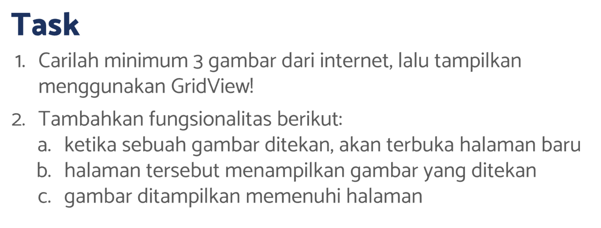
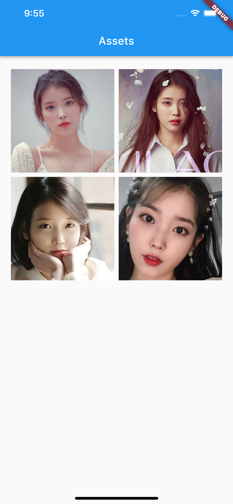

# (15) Assets

## Resume

Dalam materi ini, mempelajari :

1. Assets
2. Image
3. Font

### Assets

Assets dapat berupa icon, image , file json, file font , video dan lainnya. Untuk dapat menggunakan asset di flutter maka kita harus memasukkan nama directory kedalam section `assets` didalam pubspec.yaml.
Contoh :

- `<nama-directory>/<nama-asset>`, untuk memasukkan asset tertentu
- `<nama-directory>/`, untuk memasukkan seluruh asset yang ada di directory tertentu

### Image

Dalam flutter, image yang didukung berformat JPEG, WebP, GIF , PNG, BMP, dan WBMP.Ada 2 sumber yang dapat kita gunakan sebagai image yaitu melalui asset , dan melalui network (internet).

Syntax untuk menampilkan Image :

- Image, dengan constructor image diisi oleh AssetImage maupun NetworkImage dengan masing-masing constructor pertama diisi dengan url image.
- Image.asset atau Image.network dengan constructor pertama diisi dengan url image.

### Font

Font digunakan untuk mengubah bentuk teks font dalam aplikasi.Cara memasukkan font yaitu dengan cara memasukkannya kedalam pubspec.yaml pada bagian `fonts`. Kemudian pada bagian widget di constructor fontFamily masukkan nama family yang diberikan di pubspec.yaml

Kita juga dapat menggunakan font dari package yaitu dengan package `google_fonts` kemudian GoogleFonts tersebut dapat digunakan sebagai widget.contoh :
`GoogleFonts.rowdies(fontSize: 16),`

## Task

**Soal1 dan Soal2:**

**Output:**

<a href="screenshots/Hasil-Play.mp4" title="Link Title">Output Video</a>

**Penjelasan:**
