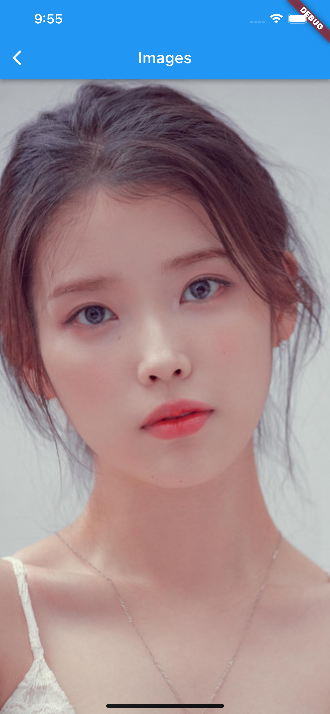

# (15) Assets

## Resume

Dalam materi ini, mempelajari :

1. Assets
2. Image
3. Font

### Assets

Assets dapat berupa icon, image , file json, file font , video dan lainnya. Untuk dapat menggunakan asset di flutter maka kita harus memasukkan nama directory kedalam section `assets` didalam pubspec.yaml.
Contoh :

- `<nama-directory>/<nama-asset>`, untuk memasukkan asset tertentu
- `<nama-directory>/`, untuk memasukkan seluruh asset yang ada di directory tertentu

### Image

Dalam flutter, image yang didukung berformat JPEG, WebP, GIF , PNG, BMP, dan WBMP.Ada 2 sumber yang dapat kita gunakan sebagai image yaitu melalui asset , dan melalui network (internet).

Syntax untuk menampilkan Image :

- Image, dengan constructor image diisi oleh AssetImage maupun NetworkImage dengan masing-masing constructor pertama diisi dengan url image.
- Image.asset atau Image.network dengan constructor pertama diisi dengan url image.

### Font

Font digunakan untuk mengubah bentuk teks font dalam aplikasi.Cara memasukkan font yaitu dengan cara memasukkannya kedalam pubspec.yaml pada bagian `fonts`. Kemudian pada bagian widget di constructor fontFamily masukkan nama family yang diberikan di pubspec.yaml

Kita juga dapat menggunakan font dari package yaitu dengan package `google_fonts` kemudian GoogleFonts tersebut dapat digunakan sebagai widget.contoh :
`GoogleFonts.rowdies(fontSize: 16),`

## Task

**Soal1 dan Soal2:**


**Output:**




<a href="screenshots/Hasil-Play.mp4" title="Link Title">Output Video</a>

**Penjelasan:**

```dart
class Soal1danSoal2 extends StatelessWidget {
  const Soal1danSoal2({Key? key}) : super(key: key);

  @override
  Widget build(BuildContext context) {
    return MaterialApp(
      initialRoute: '/',
      routes: {
        '/': (context) =>
            Scaffold(appBar: AppBar(title: const Text("Assets")), body: const CustomGridView()),
        ImageScreen.imageScreenName: (context) => const ImageScreen()
      },
    );
  }
}
```

Widget diatas berisi MaterialApp dengan initialRoute : '/' yang berarti ketika aplikasi pertama kali dibuka, route yang akan dituju adalah '/' . Constructor routes berisi sekumpulan routes didalam aplikasi, Routes '/' berisi Scaffold dengan body CustomGridView, sedangkan untuk routes imageScreenName yang merupakan constant yang diimport dari file `image_screen.dart` berisi widget ImageScreen.

---

```dart
class CustomGridView extends StatelessWidget {
  const CustomGridView({Key? key}) : super(key: key);

  final List<String> datas = const [
    'https://i.scdn.co/image/ab6761610000e5eb006ff3c0136a71bfb9928d34',
    'https://awsimages.detik.net.id/community/media/visual/2021/03/09/iu-comeback-dengan-lilac_43.jpeg?w=700&q=90',
    'https://cdn0-production-images-kly.akamaized.net/RJLVAGFYIdVNsWTDOazXMlFODak=/1x24:702x419/469x260/filters:quality(75):strip_icc():format(webp)/kly-media-production/medias/2284563/original/053190300_1531929684-2.jpg',
    'https://media.suara.com/pictures/970x544/2020/05/08/70693-iuinstagram.jpg'
  ];

  @override
  Widget build(BuildContext context) {
    return Container(
      margin: const EdgeInsets.symmetric(horizontal: 16, vertical: 20),
      child: GridView.count(
        crossAxisCount: 2,
        children: datas.map((data) => CustomGridCard(uri: data)).toList(),
      ),
    );
  }
}
```

Widget diatas berisi List dari string yang merupakan url dari images. Kemudian pada fungsi build mengembalikan widget Container dengan margin horizontal 16 dan vertikal 20. Kemudian GridView dengan column (crossAxisCount) 2 dan children berisi hasil mapping dari list string diatas dengan widget CustomGridCard yang dikembalikan sebagai `List<Widget>`

---

```dart
class CustomGridCard extends StatelessWidget {
  final String uri;
  const CustomGridCard({Key? key, required this.uri}) : super(key: key);

  void onNavigateImageScreen(BuildContext context) {
    Navigator.pushNamed(
      context,
      ImageScreen.imageScreenName,
      arguments: ImageScreenProps(uri: uri),
    );
  }

  @override
  Widget build(BuildContext context) {
    return InkWell(
      child: Container(
        margin: const EdgeInsets.all(4),
        child: Hero(
          child: Image.network(uri, fit: BoxFit.cover),
          tag: uri,
        ),
      ),
      onTap: () => onNavigateImageScreen(context),
    );
  }
}
```

Widget diatas menerima constructor dengan parameter uri (url images) dan mengembalikan Widget InkWell sebagai cara untuk menerima gesture onTap dari user.
kemudian Didalam Container berisi Widget Hero yang berguna sebagai animasi ketika berpindah halaman.Tampilan akan memiliki animasi yang berfokus ke 1 images dengan tag yang sama selagi halaman berpindah ketika image ditap.
Kemudian child Hero berisi Image.network dengan fit cover agar images memenuhi seluruh ruang di berikan.

Kemudian constructor onTap berisi fungsi onNavigateImageScreen dengan parameter context. fungsi onNavigateImageScreen berisi method Navigator.pushNamed dengan 3 parameter, parameter pertama berisi context dari parameter fungsi. Kemudian parameter kedua berisi nama routes, dan ketiga berisi arguments yang ingin di passing ke screen yang akan dituju.

---

```dart
class ImageScreenProps {
  final String uri;

  ImageScreenProps({required this.uri});
}
```

Class diatas sebagai class yang akan diberikan kedalam argument ketika berpindah screen.

---

```dart
class ImageScreen extends StatelessWidget {
  static const imageScreenName = "/images";

  const ImageScreen({Key? key}) : super(key: key);

  @override
  Widget build(BuildContext context) {
    final args = ModalRoute.of(context)!.settings.arguments as ImageScreenProps;
    return Scaffold(
      appBar: AppBar(title: const Text("Images")),
      body: Hero(
        child: Image.network(
          args.uri,
          fit: BoxFit.cover,
          height: double.infinity,
          width: double.infinity,
          alignment: Alignment.center,
        ),
        tag: args.uri,
      ),
    );
  }
}
```

class diatas berisi halaman baru yang akan muncul ketika gambar ditap, widget diatas mengembalikan widget Hero dengan tag yang sama dengan image di page sebelumnya, width dan height memiliki nilai double.infinity agar gambar memenuhi halaman.

variabel static diatas dapat digunakan meskipun class tidak dibuat objeknya, kemudian variabel args berisi arguments yang diterima ketika screen ini di push.
