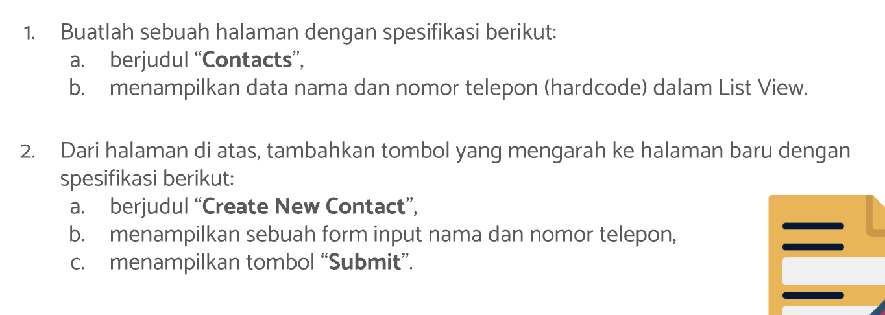
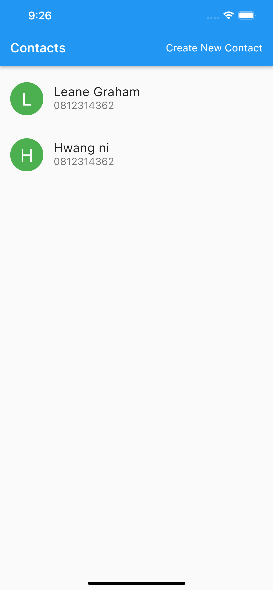
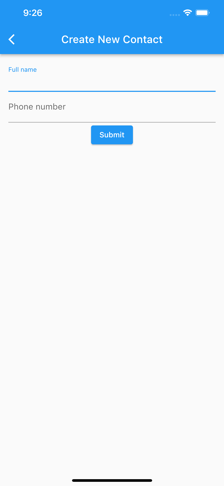
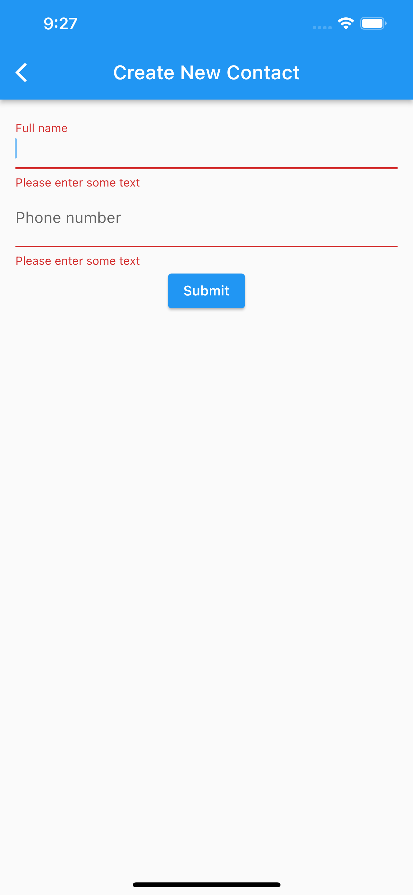
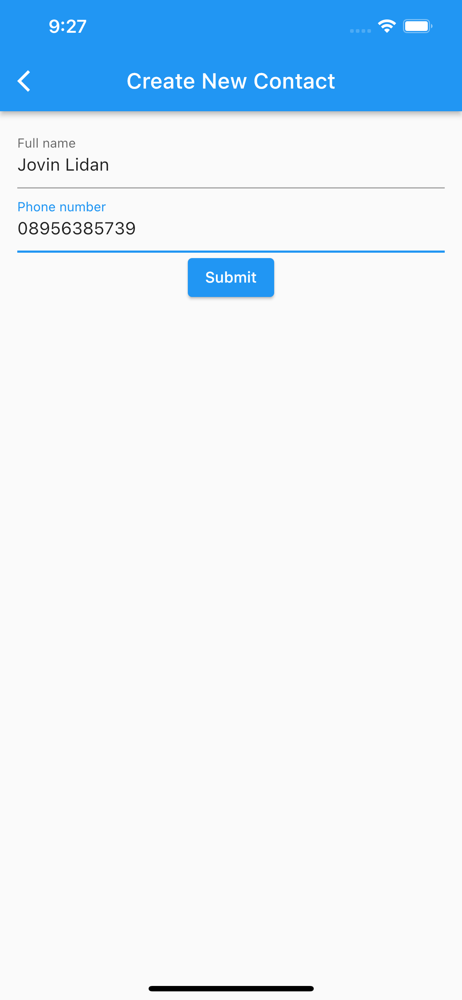
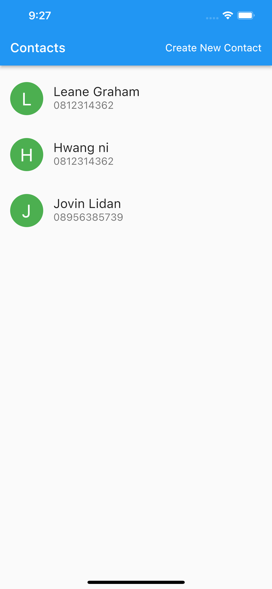

# (16) Form Input Button

## Resume

Dalam materi ini, mempelajari :

1. Form
2. Input
3. Button

### Form

Form dalam flutter berguna untuk menerima inputan dari user, dengan menggunakan form kita dapat mengelompokkan beberapa inputan menjadi satu kesatuan yang disebut dengan Form.
Form juga memudahkan kita menerapkan sistem validasi input dari user.Seluruh form kita dikendalikan menggunakan suatu key yang didapatkan dengan cara :
`var _formKey = GlobalKey<FormState>();`

Kita dapat melakukan validasi pada form kita dengan memanggil fungsi :
`_formKey.currentState!.validate()`

Widget Form :

```dart
Form(
    key : _formKey,
    child : //berisi widget inputan
)
```

### Input

Ada beberapa widget input dalam flutter , yaitu:

- TextField, menerima inputan berupa string
  ```dart
  var controller = TextEditingController();
  TextField(
      controller : controller,
  )
  ```
- Radio, menerima inputan berupa boolean
  ```dart
  var val = "";
  Radio<String>(
      value : "Flutter",
      groupValue: val,
      onChanged: (String? value){
          setState((){
              val = value?? ''
          });
      },
  );
  ```
- Checkbox, menerima inputan berupa opsi, data yang dikembalikan dapat berbentuk array
  ```dart
  var val = true;
  Checkbox(
      value : val,
      onChanged: (bool? value){
          setState((){
              val = value ?? true;
          });
      },
  );
  ```
- Dropdown, menerima inputan berupa opsi, hanya saja pada Dropdown hanya akan terdapat 1 data yang dikembalikan

  ```dart
  var val = 0;

  DropdownButton(
      value : val,
      onChanged: (int? value){
          setState((){
              val = value??0;
          });
      },
      items: cons[
          DropdownMenuItem(
              value:0,
              child:Text("Select..."),
          ),
          DropdownMenuItem(
              value:1,
              child:Text("One..."),
          ),
      ],
  );
  ```

### Button

Dalam Form, Button biasanya digunakan untuk melakukan submit atau save. Ada beberapa jenis button, yaitu :

- ElevatedButton, button yang memiliki warna background
  ```dart
  ElevatedButton(
      child : const Text("Save"),
      onPressed: (){}
  )
  ```
- IconButton, button yang hanya menampilkan icon
  ```dart
  IconButton(
      icon : const Icon(Icons.contact_mail),
      onPressed: (){}
  )
  ```

## Task

**Soal1 dan Soal2:**



**Output:**







**Penjelasan:**

```dart
class Person {
  String name;
  String phone;

  Person({required this.name, required this.phone});
}
```

Class diatas dibuat sebagai kelas yang akan menampung data setiap card yang ditampilkan dalam listview diatas, class diatas menerima 2 data string melalui constructor dan data tersebut wajib diberikan dalam constructor ketika membuat objek dari class.

---

```dart
class Soal1Soal2 extends StatelessWidget {
  const Soal1Soal2({Key? key}) : super(key: key);

  @override
  Widget build(BuildContext context) {
    return MaterialApp(
      initialRoute: '/',
      routes: {
        '/': (context) => const CustomBody(),
        NewContactScreen.newContactScreenName: (context) => const NewContactScreen()
      },
      debugShowCheckedModeBanner: false,
    );
  }
}
```

Widget diatas berisi MaterialApp dengan initialRoute : '/' yang berarti ketika aplikasi pertama kali dibuka, route yang akan dituju adalah '/' . Constructor routes berisi sekumpulan routes didalam aplikasi, Routes '/' berisi CustomBody, sedangkan untuk routes newContactScreenName yang merupakan constant yang diimport dari file `new_contact_screen.dart` berisi widget NewContactScreen.

---

```dart
class CustomCard extends StatelessWidget {
  final Person person;
  const CustomCard({Key? key, required this.person}) : super(key: key);

  @override
  Widget build(BuildContext context) {
    return ListTile(
      contentPadding: const EdgeInsets.only(left: 16, right: 16, top: 8, bottom: 8),
      leading: CircleAvatar(
        child: Text(
          person.name.characters.first,
          style: const TextStyle(fontSize: 28, color: Colors.white),
        ),
        radius: 26,
        backgroundColor: Colors.green,
      ),
      title: Text(person.name, style: const TextStyle(fontSize: 20)),
      subtitle: Text(person.phone, style: const TextStyle(fontSize: 16)),
      onTap: () {},
    );
  }
}
```

Widget CustomCard diatas menerima constructor dengan tipe data person kemudian mengembalikan widget ListTile dengan beberapa padding, pada constructor leading, mengembalikan widget CircleAvatar dengan child yaitu Text. Didalam Text tersebut berisi `person.name.characters.first` yang berguna untuk mengambil karakter pertama dari nama setiap person dari constructor class CustomCard. radius untuk mengatur ukuran CircleAvatar.
title berisi nama dari person, subtitle berisi nomor telepon dari person dan onTap berisi fungsi kosong.

---

```dart
class CustomBody extends StatefulWidget {
  const CustomBody({Key? key}) : super(key: key);

  @override
  State<CustomBody> createState() => _CustomBodyState();
}

class _CustomBodyState extends State<CustomBody> {
  List<Person> datas = [
    Person(name: "Leane Graham", phone: "0812314362"),
    Person(name: "Hwang ni", phone: "0812314362"),
  ];

  Future<void> onNavigateNewContactScreen(BuildContext context) async {
    Person? res = await Navigator.pushNamed(
      context,
      NewContactScreen.newContactScreenName,
    ) as Person?;
    if (res != null) {
      setState(() {
        datas = [...datas, res];
      });
    }
  }

  @override
  Widget build(BuildContext context) {
    return Scaffold(
      appBar: AppBar(
        title: const Text(
          "Contacts",
          style: TextStyle(fontSize: 20),
        ),
        centerTitle: false,
        actions: [
          Container(
            margin: const EdgeInsets.symmetric(horizontal: 16),
            child: InkWell(
              child: const Center(
                child: Text(
                  "Create New Contact",
                  style: TextStyle(
                    color: Colors.white,
                    fontSize: 16,
                  ),
                ),
              ),
              onTap: () => onNavigateNewContactScreen(context),
            ),
          )
        ],
      ),
      body: ListView(
        padding: const EdgeInsets.only(top: 8),
        children: datas.map((person) => CustomCard(person: person)).toList(),
      ),
    );
  }
}
```

Widget diatas merupakan stateful widget, berisi list dari data Person untuk merender tampilan CustomCard. Kemudian pada bagian fungsi build, mengembalikan Widget Scaffold dengan actions berisi inkwell untuk menerima inputan tap dari user. Pada onTap memanggil fungsi onNavigateNewContactScreen dengan mengirim parameter context

Kemudian pada bagian body, mengembalikan ListView dengan childrennya merupakan hasil mapping dari datas.

Pada fungsi onNavigateNewContactScreen, berisi kode untuk mengambil hasil add contact dari page newcontact. await Navigator.pushNamed digunakan untuk menunggu user melakukan pop pada screen NewContact. kemudian melakukan validasi apabila ada dikembalikan class Person, maka masukkan class tersebut kedalam datas dengan setState dan spread operator.

---

```dart
class NewContactScreen extends StatefulWidget {
  static const newContactScreenName = "/new-contact";

  const NewContactScreen({Key? key}) : super(key: key);

  @override
  State<NewContactScreen> createState() => _NewContactScreenState();
}

class _NewContactScreenState extends State<NewContactScreen> {
  final _formKey = GlobalKey<FormState>();
  String? fullName;
  String? phoneNumber;

  void handleSubmit() {
    if (_formKey.currentState!.validate()) {
      _formKey.currentState!.save();
      Navigator.pop(context, Person(name: fullName!, phone: phoneNumber!));
    }
  }

  @override
  Widget build(BuildContext context) {
    return Scaffold(
      appBar: AppBar(title: const Text("Create New Contact")),
      body: Container(
        margin: const EdgeInsets.symmetric(horizontal: 16, vertical: 12),
        child: Form(
          key: _formKey,
          child: Column(children: [
            TextFormField(
              autovalidateMode: AutovalidateMode.onUserInteraction,
              onSaved: ((newValue) => fullName = newValue),
              validator: (value) {
                if (value == null || value.isEmpty) {
                  return 'Please enter some text';
                }
                return null;
              },
              decoration: const InputDecoration(labelText: 'Full name'),
            ),
            TextFormField(
              autovalidateMode: AutovalidateMode.onUserInteraction,
              onSaved: ((newValue) => phoneNumber = newValue),
              keyboardType: TextInputType.phone,
              validator: (value) {
                if (value == null || value.isEmpty) {
                  return 'Please enter some text';
                }
                return null;
              },
              decoration: const InputDecoration(labelText: 'Phone number'),
            ),
            ElevatedButton(
              onPressed: handleSubmit,
              child: const Text("Submit"),
            )
          ]),
        ),
      ),
    );
  }
}
```

Widget diatas adalah stateful widget, dimana dalam widget tersebut berisi form key dengan nama variabel \_formKey, kemudian fullName dan phoneNumber sebagai variabel untuk menerima inputan.variabel static berguna sebagai nilai constanta path dari screen yang dapat dipanggil tanpa membuat objek dari class.

fungsi handleSubmit berfungsi untuk melakukan checking apabila form sudah valid maka lakukan save , fungsi save yang dipanggil didalam handleSubmit berfungsi untuk memanggil fungsi `onSaved` pada setiap widget, setelah itu lakukan pop untuk kembali ke halaman sebelumnya dengan mengirimkan data Person yang ditaruh pada parameter kedua dari fungsi Navigator.pop.

Dalam fungsi build mengembalikan halaman baru dengan Form sebagai child, didalam Form terdapat TextFormField , autovalidateMode.onUserInteraction berguna untuk melakukan validasi inputan setiap user malakukan typing pada field. onSaved merupakan fungsi untuk memasukkan nilai ke variabel yang sudah dibuat.validator berguna sebagai validasi inputan, decoration berisi InputDecoration berguna untuk menampilkan labelText pada field.

Setelah itu ElevatedButton berguna untuk memanggil fungsi handleSubmit.
