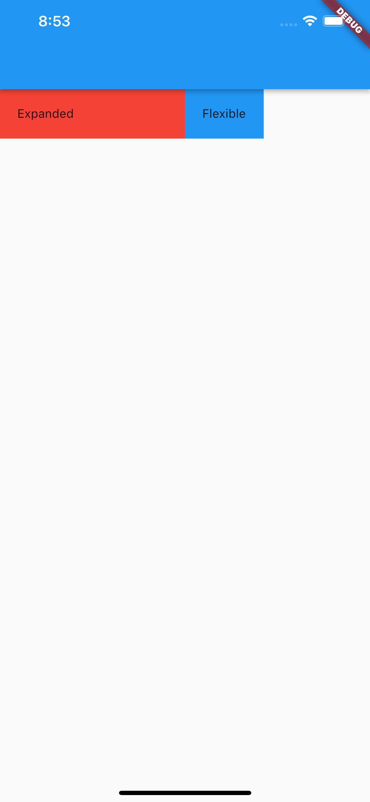

# (16) Form Input Button

## Resume

Dalam materi ini, mempelajari :

1. Row dan Column
2. Expanded dan Flexible
3. Date Picker, Color Picker, dan File Picker

### Row dan Column

Row adalah widget yang digunakan untuk menampilkan lebih dari 1 widget secara horizontal dari kiri ke kanan

Column adalah widget yang digunkan untuk menampilkan lebih dari 1 widget secara vertikal dari atas ke bawah

MainAxis:

- Row = horizontal
- Column = vertikal

CrossAxis:

- Row = vertikal
- Column = horizontal

Dalam row dan column ada beberapa properti yaitu:

- MainAxisSize, berapa banyak ruang yang akan ditempati oleh main axis.
  - `max` untuk menempati seluruh ruang
  - `min` untuk sebesar children didalamnya
- MainAxisAlignment mengatur posisi children berdasarkan mainaxisnya
  - `start` , untuk posisi diawal
  - `end`, untuk posisi diakhir
  - `center`, untuk posisi ditengah
  - `spaceBetween`, untuk jarak setiap children sejauh mungkin
  - `spaceEvenly`, jarak setiap children sama besarnya dengan jarak border dengan children pertama dan children terakhir
  - `spaceAround`, jarak setiap children sama tetapi jarak border dengan children pertama dan children terakhir tidak sama
- CrossAxisAlignment mengatur posisi children berdasarkan crossaxisnya
  - `start` , untuk posisi diawal
  - `end`, untuk posisi diakhir
  - `center`, untuk posisi ditengah
  - `stretch`, untuk membuat childrennya stretch dari posisi awal ke posisi akhir
  - `baseline`, jika childrennya berisi teks dengan ukuran yang berbeda , maka children akan di posisikan sejajar dengah pixel paling bawah setiap huruf pada teks meskipun berbeda ukurannya

### Expanded dan Flexible

**Expanded**
Widget yang akan mengambil seluruh ruang kosong yang tersedia dari parent widget row dan column.
Kita dapat mengatur ukurannya menggunakan properti flex , properti flex memiliki nilai default FlexFit.tight

**Flexible**
Widget yang akan memiliki ukuran sesuai dengan children dan bersifat flexible terhadap parent widget row dan column.
Kita dapat mengatur ukurannya menggunakan properti flex , properti flex memiliki nilai default FlexFit.loose

Implementasi Expanded dan Flexible

```dart
Row(
    children: [
    Expanded(
        child: Container(
        padding: EdgeInsets.all(20),
        color: Colors.red,
        child: Text("Expanded"),
        ),
    ),
    Flexible(
        child: Container(
        padding: EdgeInsets.all(20),
        color: Colors.blue,
        child: Text("Flexible"),
        ),
    ),
    ],
);
```



### Date Picker, Color Picker, dan File Picker

Date Picker adalah widget yang digunakan untuk menerima inputan berupa date dari user.
Implementasinya menggunakan fungsi `showDatePicker`.

```dart
 void handlePickDate(BuildContext context) async {
    DateTime? res = await showDatePicker(
        context: context,
        initialDate: DateTime.now(),
        firstDate: DateTime(1990),
        lastDate: DateTime(DateTime.now().year + 1000));
    if (res != null) {
      setState(() {
        formValue.date = res;
      });
    }
  }
```

Color Picker adalah widget yang digunakan untuk menerima inputan berupa warna dari user.
Implementasinya menggunakan package `flutter_colorpicker` dari `pub.dev`

```dart
void handlePickColor(BuildContext context) {
    showDialog(
        context: context,
        builder: (context) {
          return AlertDialog(
            title: const Text("Pick Color"),
            content: ColorPicker(
              pickerColor: formValue.color ?? Colors.red,
              onColorChanged: (color) => setState(() {
                formValue.color = color;
              }),
            ),
            actions: [
              TextButton(
                onPressed: () => Navigator.pop(context),
                child: const Text("Cancel"),
              ),
              TextButton(
                onPressed: () {
                  if (formValue.color == null) {
                    setState(() {
                      formValue.color = Colors.red;
                    });
                  }
                  Navigator.pop(context);
                },
                child: const Text("Save"),
              )
            ],
          );
        });
  }
```

File Picker adalah widget yang digunakan untuk menerima inputan berupa file (image, video, document) dari user.
Implementasinya menggunakan package `file_picker` dari `pub.dev`

```dart
void handlePickFile() async {
    FilePickerResult? res = await FilePicker.platform.pickFiles(
      type: FileType.image,
    );
    if (res != null) {
      File file = File(res.files.single.path!);
      setState(() {
        formValue.file = file.path;
      });
    }
  }
```

## Task

**Soal1 dan Soal2:**


**Output:**

**Screen Pertama**


**Screen Kedua**


**Penjelasan:**

```dart
class LabelWidget extends StatelessWidget {
  final String label;
  const LabelWidget({Key? key, required this.label}) : super(key: key);

  @override
  Widget build(BuildContext context) {
    return Container(
      margin: const EdgeInsets.only(top: 20),
      child: Text(
        label,
        style: const TextStyle(
          color: Colors.black,
          fontWeight: FontWeight.bold,
          height: 0.5,
        ),
      ),
    );
  }
}
```

Widget diatas digunakan untuk menampilkan label setiap inputan.

---

```dart
class MyApp extends StatelessWidget {
  const MyApp({Key? key}) : super(key: key);

  @override
  Widget build(BuildContext context) {
    return MaterialApp(
      initialRoute: '/',
      routes: {
        '/': (context) => const CreatePostScreen(),
        PreviewPostScreen.previewPostScreenName: (context) => const PreviewPostScreen()
      },
      debugShowCheckedModeBanner: false,
    );
  }
}
```

Kode diatas digunakan untuk inisialisasi route antar page

---

```dart
class FormData {
  File? file;
  Color? color;
  DateTime? date;
  String? caption;

  bool isValid() {
    return (file != null) && color != null && date != null && (caption?.isNotEmpty ?? false);
  }
}
```

Class diatas berguna sebagai state untuk menyimpan hasil form. isValid sebagai validasi form

---

```dart
class CreatePostScreen extends StatelessWidget {
  const CreatePostScreen({Key? key}) : super(key: key);

  @override
  Widget build(BuildContext context) {
    return Scaffold(
      appBar: AppBar(
        title: const Text("Create Post"),
        centerTitle: false,
        backgroundColor: const Color.fromRGBO(21, 84, 246, 1),
      ),
      drawer: const CustomDrawer(),
      body: const SingleChildScrollView(child: FormWidget()),
    );
  }
}
```

Widget diatas membentuk halaman baru, SingleChildScrollView berguna agar halaman dapat di scroll.

---

```dart
final _formKey = GlobalKey<FormState>();
  // Map<String, dynamic> formValue = {};

FormData formValue = FormData();
```

\_formKey sebagai key dari form, formValue sebagai variabel penyimpan state dari form

---

```dart
  void handlePickFile() async {
    FilePickerResult? res = await FilePicker.platform.pickFiles(
      type: FileType.image,
    );
    if (res != null) {
      File file = File(res.files.single.path!);
      setState(() {
        formValue.file = file;
      });
    }
  }
```

Kode diatas untuk membuka file picker dengan tipe image, jika res != null yang artinya file berhasil di pick, maka setState ke dalam formValue.

---

```dart
void handlePickDate(BuildContext context) async {
    DateTime? res = await showDatePicker(
        context: context,
        initialDate: DateTime.now(),
        firstDate: DateTime(1990),
        lastDate: DateTime(DateTime.now().year + 1000));
    if (res != null) {
      setState(() {
        formValue.date = res;
      });
    }
  }
```

Kode diatas sebagai date picker, jika date berhasil dipick maka setState ke dalam formValue

---

```dart
void handlePickColor(BuildContext context) {
    showDialog(
        context: context,
        builder: (context) {
          return AlertDialog(
            title: const Text("Pick Color"),
            content: ColorPicker(
              pickerColor: formValue.color ?? Colors.red,
              onColorChanged: (color) => setState(() {
                formValue.color = color;
              }),
            ),
            actions: [
              TextButton(
                onPressed: () => Navigator.pop(context),
                child: const Text("Cancel"),
              ),
              TextButton(
                onPressed: () {
                  if (formValue.color == null) {
                    setState(() {
                      formValue.color = Colors.red;
                    });
                  }
                  Navigator.pop(context);
                },
                child: const Text("Save"),
              )
            ],
          );
        });
  }
```

Kode diatas untuk membuka color picker, menggunakan alert dialog untuk memunculkan dialog dan didalamnya ada ColorPicker dengan pickerColor default red, onColorChanged untuk mengubah state color, actions berisi textButton yang akan menutup dialog.

---

```dart
  void onNavigatePreviewPostScreen(context) {
    Navigator.pushNamed(context, PreviewPostScreen.previewPostScreenName, arguments: formValue);
  }
```

Kode diatas untuk navigasi ke halaman PreviewPostScreen dengan arguments berisi formValue

---

```dart

  @override
  Widget build(BuildContext context) {
    return Container(
      padding: const EdgeInsets.only(top: 20, left: 24, right: 24),
      width: double.infinity,
      child: Form(
        key: _formKey,
        child: Column(
          crossAxisAlignment: CrossAxisAlignment.stretch,
          children: [
            const LabelWidget(label: "Cover"),
            ElevatedButton(
              onPressed: handlePickFile,
              child: Text(
                formValue.file != null
                    ? "Ubah File (${formValue.file?.path.split('/')[(formValue.file?.path.split('/').length)! - 1]})"
                    : "Pilih File",
              ),
              style: ElevatedButton.styleFrom(
                primary: Colors.grey,
              ),
            ),
            const LabelWidget(label: "Publish At"),
            Container(
              margin: const EdgeInsets.only(top: 4),
              child: InkWell(
                onTap: () => handlePickDate(context),
                child: Container(
                  padding: const EdgeInsets.all(8),
                  decoration: BoxDecoration(
                    border: Border.all(
                      color: Colors.black45,
                    ),
                    borderRadius: const BorderRadius.all(Radius.circular(5)),
                  ),
                  child: Text(
                    formValue.date != null
                        ? DateFormat('dd/MM/yyyy').format(formValue.date!)
                        : 'dd/mm/yyyy',
                    style: TextStyle(color: formValue.date != null ? Colors.black : Colors.black45),
                  ),
                ),
              ),
            ),
            const LabelWidget(label: "Color Theme"),
            Container(
              margin: const EdgeInsets.only(top: 4),
              child: InkWell(
                onTap: () => handlePickColor(context),
                child: Container(
                  padding: const EdgeInsets.all(8),
                  decoration: BoxDecoration(
                    border: Border.all(
                      color: Colors.black45,
                    ),
                    borderRadius: const BorderRadius.all(Radius.circular(5)),
                  ),
                  child: IntrinsicHeight(
                    child: Row(
                      children: [
                        Expanded(
                          child: Text(
                            formValue.color != null
                                ? '#${formValue.color?.value.toRadixString(16).substring(2, 8).toString().toUpperCase()}'
                                : 'Pick a color',
                            style: TextStyle(
                                color: formValue.color != null ? Colors.black : Colors.black45),
                          ),
                        ),
                        AspectRatio(
                          aspectRatio: 1,
                          child: Container(
                            color: formValue.color,
                          ),
                        ),
                      ],
                    ),
                  ),
                ),
              ),
            ),
            const LabelWidget(label: "Caption"),
            const SizedBox(
              height: 4,
            ),
            TextFormField(
              minLines: 10,
              maxLines: 10,
              onChanged: (val) => setState(() {
                formValue.caption = val;
              }),
              decoration: const InputDecoration(
                  enabledBorder: OutlineInputBorder(
                    borderSide: BorderSide(
                      color: Colors.black45,
                    ),
                  ),
                  focusedBorder: OutlineInputBorder(
                    borderSide: BorderSide(
                      color: Colors.black45,
                    ),
                  ),
                  contentPadding: EdgeInsets.all(8)),
            ),
            Container(
              margin: const EdgeInsets.only(top: 28),
              alignment: Alignment.center,
              child: ElevatedButton(
                onPressed: formValue.isValid() ? () => onNavigatePreviewPostScreen(context) : null,
                style: ElevatedButton.styleFrom(
                  padding: const EdgeInsets.symmetric(horizontal: 40, vertical: 8),
                  primary: const Color.fromRGBO(21, 84, 246, 1),
                ),
                child: const Text("Simpan"),
              ),
            )
          ],
        ),
      ),
    );
  }
}
```

Kode diatas membuat Form baru dengan key yang sudah dibuat, dan beberapa styling.
`'#${formValue.color?.value.toRadixString(16).substring(2, 8).toString().toUpperCase()}'` berguna untuk mendapatkan hex value dari color.

---

```dart
Navigator.of(context).popUntil(ModalRoute.withName('/'));
```

Kode diatas untuk melakukan pop navigasi atau keluarkan navigasi yang ada distack hingga navigasi sekarang memiliki nama '/'

---

```dart
AspectRatio(
    aspectRatio: 16 / 8,
    child: Image.file(data.file!, fit: BoxFit.cover),
),
```

Kode diatas agar image didalamnya memiliki rasio 16/8 dan fit cover.
