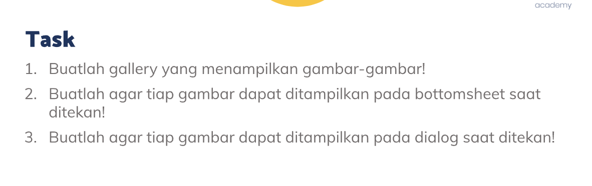
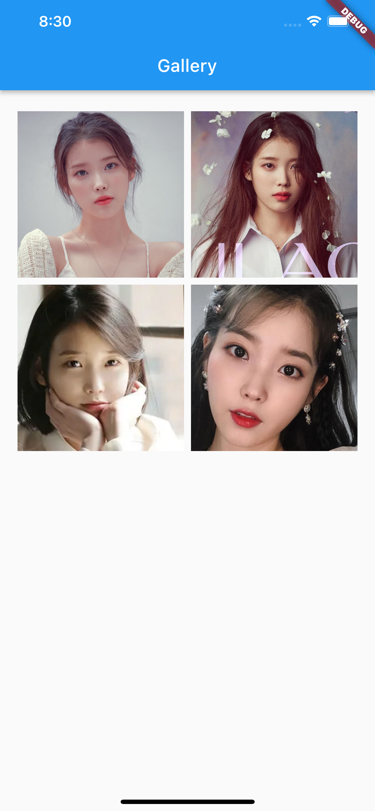
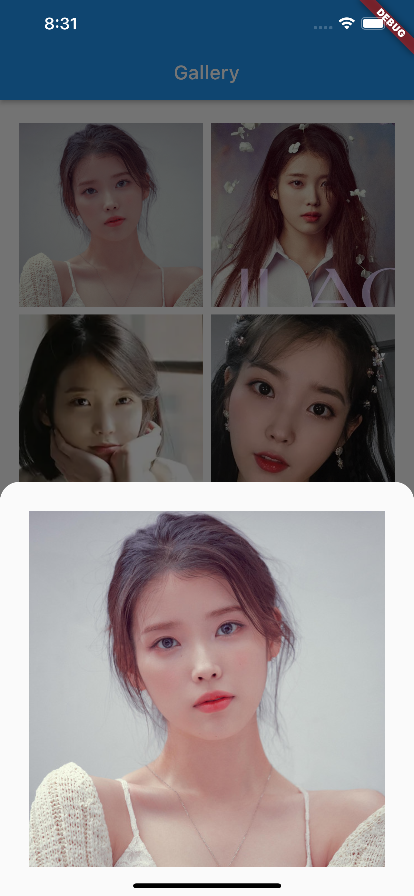
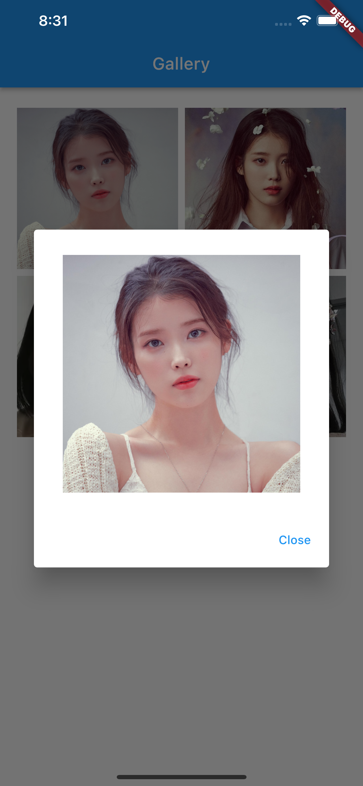
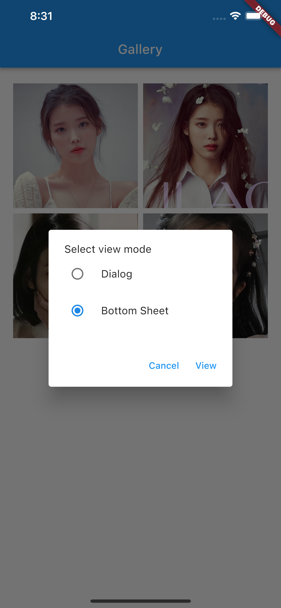

# (18) Dialog Bottom Sheet

## Resume

Dalam materi ini, mempelajari :

1. Pop up widgets
2. Bottom Sheet Widget
3. Alert Dialog Widget

### Pop up widgets

Dalam flutter ada banyak widget yang bersifat popup dan overlay diatas widget lainnya. Salah satu dari widget tersebut adalah bottom sheet dan alert dialog.
Kedua widget tersebut banyak digunakan untuk memunculkan pilihan, informasi yang bersifat penting dan bertujuan untuk mengalihkan perhatian user ke widget tersebut, oleh karena itu widget tersebut bersifat mengoverlay widget lainnya.

### Bottom Sheet Widget

Bottom sheet merupakan suatu tampilan yang muncul dari bawah layar dan menimpa seluruh tampilan yang sedang tampil.

```dart
showModalBottomSheet(
      context: context,
      shape: const RoundedRectangleBorder(
        borderRadius: BorderRadius.vertical(
          top: Radius.circular(20),
        ),
      ),
      builder: (context) => Container(
        padding: const EdgeInsets.all(30),
        child: Image.network(
          widget.uri,
        ),
      ),
 );
```

Untuk memunculkan bottom sheet kita harus memanggil fungsi showModalBottomSheet. Pada Bottom sheet, membutuhkan BuildContext, dan builder yang berisi content dari bottom sheet.

### Alert Dialog Widget

Bottom sheet merupakan suatu tampilan yang muncul melayang dan biasanya pada bagian tengah layar serta menimpa seluruh tampilan yang sedang tampil.

```dart
showDialog(
      context: context,
      builder: (context) => AlertDialog(
        content: Container(
          padding: const EdgeInsets.only(top: 10, left: 10, right: 10),
          child: Image.network(
            widget.uri,
          ),
        ),
        actions: [
          Row(
            mainAxisAlignment: MainAxisAlignment.end,
            children: [
              TextButton(
                onPressed: () => Navigator.pop(context),
                child: const Text("Close"),
              ),
            ],
          )
        ],
      ),
    );
```

Untuk memunculkan alert dialog, kita harus memanggil fungsi showDialog dengan memberikan BuildContext, dan builder yang berisi content.

## Task

**Soal1, Soal2 ,dan Soal3:**



**Output:**






**Penjelasan:**

```dart
class CustomBody extends StatelessWidget {
  const CustomBody({Key? key}) : super(key: key);

  final List<String> datas = const [
    'https://i.scdn.co/image/ab6761610000e5eb006ff3c0136a71bfb9928d34',
    'https://awsimages.detik.net.id/community/media/visual/2021/03/09/iu-comeback-dengan-lilac_43.jpeg?w=700&q=90',
    'https://cdn0-production-images-kly.akamaized.net/RJLVAGFYIdVNsWTDOazXMlFODak=/1x24:702x419/469x260/filters:quality(75):strip_icc():format(webp)/kly-media-production/medias/2284563/original/053190300_1531929684-2.jpg',
    'https://media.suara.com/pictures/970x544/2020/05/08/70693-iuinstagram.jpg'
  ];

  @override
  Widget build(BuildContext context) {
    return Container(
      margin: const EdgeInsets.symmetric(horizontal: 16, vertical: 20),
      child: GridView.count(
        crossAxisCount: 2,
        children: datas.map((data) => CustomGridCard(uri: data)).toList(),
      ),
    );
  }
}
```

Kode diatas berisi Gridview yang merender kumpulan string yang merupakan url gambar dan mengembalikan CustomGridCard

---

```dart
enum RadioOption { dialog, bottomSheet }
```

Enum diatas digunakan pada penggunaan radio button

---

```dart
  void handleOpenBottomSheet(BuildContext context) {
    showModalBottomSheet(
      context: context,
      shape: const RoundedRectangleBorder(
        borderRadius: BorderRadius.vertical(
          top: Radius.circular(20),
        ),
      ),
      builder: (context) => Container(
        padding: const EdgeInsets.all(30),
        child: Image.network(
          widget.uri,
        ),
      ),
    );
  }
```

Kode program diatas merupakan fungsi yang jika diklik akan menampilkan bottom sheet, content dari bottom sheet ditaruh didalam builder yang akan menghasilkan image dari network, dan uri diambil dari widget.uri yang berasal dari kelas statenya.

---

```dart
void handleOpenDialog(BuildContext context) {
    showDialog(
      context: context,
      builder: (context) => AlertDialog(
        content: Container(
          padding: const EdgeInsets.only(top: 10, left: 10, right: 10),
          child: Image.network(
            widget.uri,
          ),
        ),
        actions: [
          Row(
            mainAxisAlignment: MainAxisAlignment.end,
            children: [
              TextButton(
                onPressed: () => Navigator.pop(context),
                child: const Text("Close"),
              ),
            ],
          )
        ],
      ),
    );
  }
```

Kode program diatas merupakan fungsi yang jika diklik akan menampilkan alert dialog, content dari alert dialog diatas ditaruh didalam builder yang akan menghasilkan image dari network, dan uri diambil dari widget.uri yang berasal dari kelas statenya. Kemudian ada actions yang berupa button "Close" untuk menutup alert dialog

---

```dart
void handleShowImage(BuildContext context) {
    showDialog(
      context: context,
      builder: (context) => AlertDialog(
        content: StatefulBuilder(
          builder: (BuildContext context, StateSetter setState) => Column(
            mainAxisSize: MainAxisSize.min,
            crossAxisAlignment: CrossAxisAlignment.start,
            children: [
              const Text("Select view mode"),
              RadioListTile(
                contentPadding: EdgeInsets.zero,
                title: const Text('Dialog'),
                value: RadioOption.dialog,
                groupValue: option,
                onChanged: (RadioOption? value) {
                  setState(() {
                    option = value ?? RadioOption.dialog;
                  });
                },
              ),
              RadioListTile(
                contentPadding: EdgeInsets.zero,
                title: const Text('Bottom Sheet'),
                value: RadioOption.bottomSheet,
                groupValue: option,
                onChanged: (RadioOption? value) {
                  setState(() {
                    option = value ?? RadioOption.bottomSheet;
                  });
                },
              ),
            ],
          ),
        ),
        actions: [
          Row(
            mainAxisAlignment: MainAxisAlignment.end,
            children: [
              TextButton(
                onPressed: () => Navigator.pop(context),
                child: const Text("Cancel"),
              ),
              TextButton(
                onPressed: () {
                  Navigator.pop(context);
                  switch (option) {
                    case RadioOption.bottomSheet:
                      return handleOpenBottomSheet(context);
                    case RadioOption.dialog:
                      return handleOpenDialog(context);
                  }
                },
                child: const Text("View"),
              ),
            ],
          )
        ],
      ),
    );
  }
```

Kode program diatas merupakan fungsi yang jika diklik akan menampilkan alert dialog, content dari alert dialog diatas ditaruh didalam builder yang akan menghasilkan stateful builder, stateful builder akan menghasilkan context dan fungsi setState yang digunakan untuk melakukan perubahan atau mentrigger perubahan melalui setState agar fungsi dirender kembali setiap terjadi perubahan state didalam alert dialog. Kemudian berisi RadioListTile dengan enum yang diatas. Apabila tombol view yang ada di bagian action ditekan , maka akan menjalankan salah satu fungsi antara `handleOpenBottomSheet` atau `handleOpenDialog` sesuai dengan radio yang sedang dipilih.
