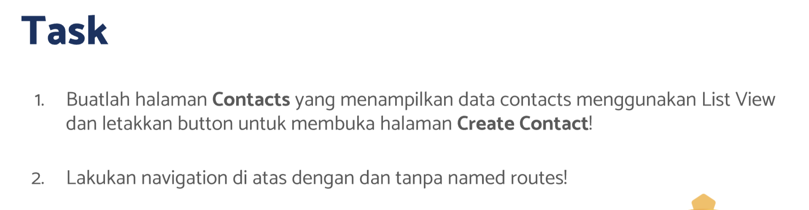
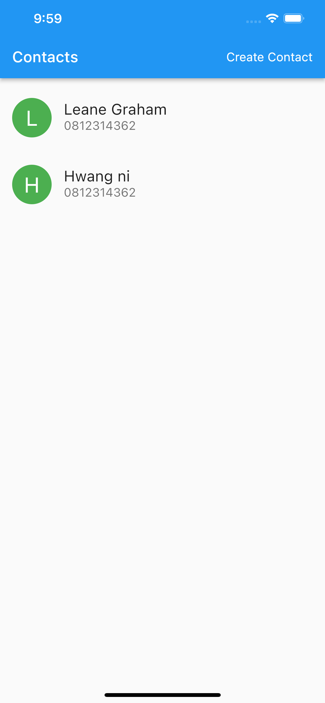
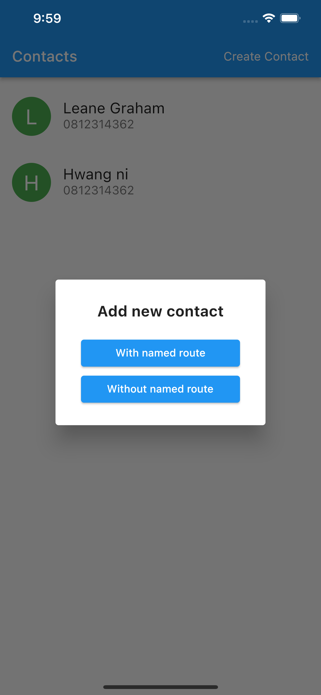
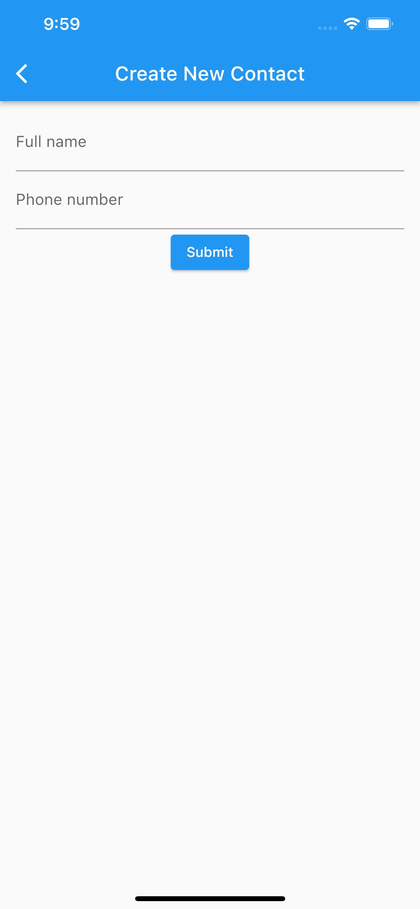
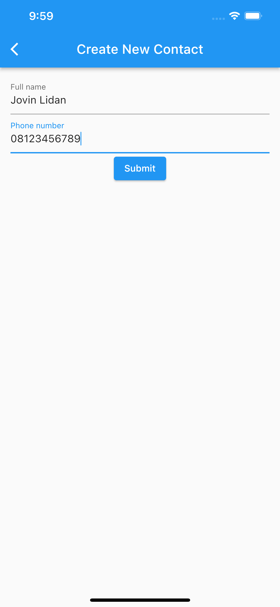
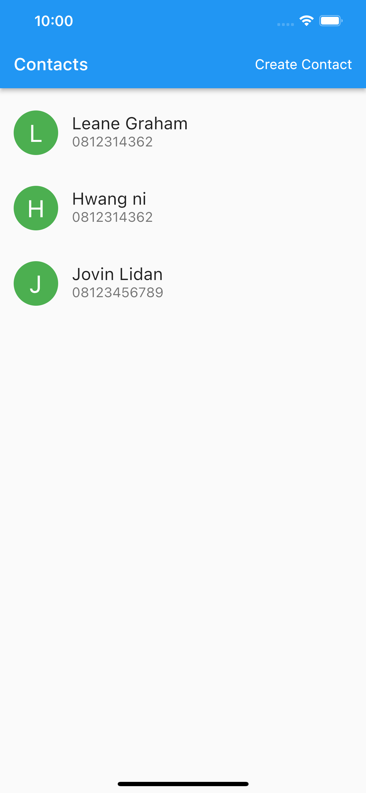

# (19) Flutter Navigation

## Resume

Dalam materi ini, mempelajari :

1. Navigation dalam flutter
2. Navigation tanpa named route
3. Navigation dengan named route

### Navigation dalam flutter

Navigation adalah suatu fitur dalam flutter yang berfungsi untuk berpindah dari satu halaman ke halaman lainnya. Kita dapat mengirimkan data kehalaman lain dan kita juga dapat menerima data dari halaman lain. Data yang diterima dapat berupa String, int, boolean, Map, List bahkan Class. Dalam Navigation , halaman-halaman yang dipush akan dimasukkan kedalam sebuah stack. Stack adalah sebuah struktur data yang bersifat FILO (First In Last Out). Halaman akan dimasukkan tumpuk kebawah seperti sebuah tumpukkan piring, Jika dilakukan pop maka piring paling atas akan di keluarkan terlebih dahulu. Halaman yang pertama masuk adalah screen yang terakhir keluar.

Ada dua cara melakukan navigasi dalam flutter :

- Navigation tanpa named route
- Navigation dengan named route

### Navigation tanpa named route

Untuk melakukan navigasi tanpa named route, kita dapat menggunakan fungsi `Navigation.push()`, dan `Navigation.pop()` untuk kembali kehalaman sebelumnya.

Navigasi ke halaman NewContactScreen

```dart
await Navigator.push(context, MaterialPageRoute(builder: (_) => const NewContactScreen()));
```

Mengambil data dari halaman berikutnya:

```dart
Person? res = await Navigator.push(context, MaterialPageRoute(builder: (_) => const NewContactScreen())) as Person?;
```

Mengirim data ke halaman berikutnya :

```dart
Person? res = await Navigator.push(context, MaterialPageRoute(builder: (_) => const NewContactScreen(data : "data disini"))) as Person?;
```

### Navigation dengan named route.

Untuk melakukan navigasi dengan named route, kita dapat menggunakan fungsi `Navigation.pushNamed()`, dan `Navigation.pop()` untuk kembali kehalaman sebelumnya.

Sebelum itu kita perlu memodifikasi sedikit pada bagian MaterialApp dengan menambahkan nama route kita berserta widget yang ditujunya.

```dart
 MaterialApp(
      initialRoute: '/',
      routes: {
        '/': (context) => const CustomBody(),
        NewContactScreen.newContactScreenName: (context) => const NewContactScreen()
      },
      debugShowCheckedModeBanner: false,
    );
```

Navigasi ke halaman NewContactScreen

```dart
Navigator.pushNamed(context, NewContactScreen.newContactScreenName);
```

Mengambil data dari halaman berikutnya:

```dart
Person? res = await Navigator.pushNamed(context, NewContactScreen.newContactScreenName) as Person?;
```

Mengirim data ke halaman berikutnya :

```dart
Person? res = await Navigator.pushNamed(context, NewContactScreen.newContactScreenName, arguments: "Taruh data disini") as Person?;
```

## Task

**Soal1 dan Soal2:**



**Output:**







**Penjelasan:**

```dart
class Person {
  String name;
  String phone;

  Person({required this.name, required this.phone});
}
```

Class diatas dibuat sebagai kelas yang akan menampung data setiap card yang ditampilkan dalam listview diatas, class diatas menerima 2 data string melalui constructor dan data tersebut wajib diberikan dalam constructor ketika membuat objek dari class.

---

```dart
class Soal1Soal2 extends StatelessWidget {
  const Soal1Soal2({Key? key}) : super(key: key);

  @override
  Widget build(BuildContext context) {
    return MaterialApp(
      initialRoute: '/',
      routes: {
        '/': (context) => const CustomBody(),
        NewContactScreen.newContactScreenName: (context) => const NewContactScreen()
      },
      debugShowCheckedModeBanner: false,
    );
  }
}
```

Widget diatas berisi MaterialApp dengan initialRoute : '/' yang berarti ketika aplikasi pertama kali dibuka, route yang akan dituju adalah '/' . Constructor routes berisi sekumpulan routes didalam aplikasi, Routes '/' berisi CustomBody, sedangkan untuk routes newContactScreenName yang merupakan constant yang diimport dari file `new_contact_screen.dart` berisi widget NewContactScreen.

---

```dart
class CustomCard extends StatelessWidget {
  final Person person;
  const CustomCard({Key? key, required this.person}) : super(key: key);

  @override
  Widget build(BuildContext context) {
    return ListTile(
      contentPadding: const EdgeInsets.only(left: 16, right: 16, top: 8, bottom: 8),
      leading: CircleAvatar(
        child: Text(
          person.name.characters.first,
          style: const TextStyle(fontSize: 28, color: Colors.white),
        ),
        radius: 26,
        backgroundColor: Colors.green,
      ),
      title: Text(person.name, style: const TextStyle(fontSize: 20)),
      subtitle: Text(person.phone, style: const TextStyle(fontSize: 16)),
      onTap: () {},
    );
  }
}
```

Widget CustomCard diatas menerima constructor dengan tipe data person kemudian mengembalikan widget ListTile dengan beberapa padding, pada constructor leading, mengembalikan widget CircleAvatar dengan child yaitu Text. Didalam Text tersebut berisi `person.name.characters.first` yang berguna untuk mengambil karakter pertama dari nama setiap person dari constructor class CustomCard. radius untuk mengatur ukuran CircleAvatar.
title berisi nama dari person, subtitle berisi nomor telepon dari person dan onTap berisi fungsi kosong.

---

```dart
class NewContactScreen extends StatefulWidget {
  static const newContactScreenName = "/new-contact";

  const NewContactScreen({Key? key}) : super(key: key);

  @override
  State<NewContactScreen> createState() => _NewContactScreenState();
}

class _NewContactScreenState extends State<NewContactScreen> {
  final _formKey = GlobalKey<FormState>();
  String? fullName;
  String? phoneNumber;

  void handleSubmit() {
    if (_formKey.currentState!.validate()) {
      _formKey.currentState!.save();
      Navigator.pop(context, Person(name: fullName!, phone: phoneNumber!));
    }
  }

  @override
  Widget build(BuildContext context) {
    return Scaffold(
      appBar: AppBar(title: const Text("Create New Contact")),
      body: Container(
        margin: const EdgeInsets.symmetric(horizontal: 16, vertical: 12),
        child: Form(
          key: _formKey,
          child: Column(children: [
            TextFormField(
              autovalidateMode: AutovalidateMode.onUserInteraction,
              onSaved: ((newValue) => fullName = newValue),
              validator: (value) {
                if (value == null || value.isEmpty) {
                  return 'Please enter some text';
                }
                return null;
              },
              decoration: const InputDecoration(labelText: 'Full name'),
            ),
            TextFormField(
              autovalidateMode: AutovalidateMode.onUserInteraction,
              onSaved: ((newValue) => phoneNumber = newValue),
              keyboardType: TextInputType.phone,
              validator: (value) {
                if (value == null || value.isEmpty) {
                  return 'Please enter some text';
                }
                return null;
              },
              decoration: const InputDecoration(labelText: 'Phone number'),
            ),
            ElevatedButton(
              onPressed: handleSubmit,
              child: const Text("Submit"),
            )
          ]),
        ),
      ),
    );
  }
}
```

Widget diatas adalah stateful widget, dimana dalam widget tersebut berisi form key dengan nama variabel \_formKey, kemudian fullName dan phoneNumber sebagai variabel untuk menerima inputan.variabel static berguna sebagai nilai constanta path dari screen yang dapat dipanggil tanpa membuat objek dari class.

fungsi handleSubmit berfungsi untuk melakukan checking apabila form sudah valid maka lakukan save , fungsi save yang dipanggil didalam handleSubmit berfungsi untuk memanggil fungsi `onSaved` pada setiap widget, setelah itu lakukan pop untuk kembali ke halaman sebelumnya dengan mengirimkan data Person yang ditaruh pada parameter kedua dari fungsi Navigator.pop.

Dalam fungsi build mengembalikan halaman baru dengan Form sebagai child, didalam Form terdapat TextFormField , autovalidateMode.onUserInteraction berguna untuk melakukan validasi inputan setiap user malakukan typing pada field. onSaved merupakan fungsi untuk memasukkan nilai ke variabel yang sudah dibuat.validator berguna sebagai validasi inputan, decoration berisi InputDecoration berguna untuk menampilkan labelText pada field.

Setelah itu ElevatedButton berguna untuk memanggil fungsi handleSubmit.

---

```dart
Future<void> onNavigateNewContactScreenWithNamed(BuildContext context) async {
    Navigator.pop(context);
    Person? res = await Navigator.pushNamed(
      context,
      NewContactScreen.newContactScreenName,
    ) as Person?;
    if (res != null) {
      setState(() {
        datas = [...datas, res];
      });
    }
  }
```

Navigator pop untuk menutup dialog.
Fungsi diatas digunakan untuk navigasi ke halaman NewContactScreen dengan named route. Dimana name nya diperoleh dari static variabel di class NewContactScreen, setelah itu masukkan hasilnya kedalam state

---

```dart
Future<void> onNavigateNewContactScreenWithoutNamed(BuildContext context) async {
    Navigator.pop(context);
    Person? res =
        await Navigator.push(context, MaterialPageRoute(builder: (_) => const NewContactScreen()))
            as Person?;

    if (res != null) {
      setState(() {
        datas = [...datas, res];
      });
    }
  }
```

Navigator pop untuk menutup dialog.
Fungsi diatas digunakan untuk navigasi ke halaman NewContactScreen tanpa named route. Dimana menggunakan widget MaterialPageRoute dengan builder diisi dengan screen yang ingin dituju. setelah itu masukkan hasilnya kedalam state

```dart
void handleOpenDialog(BuildContext context) {
    showDialog(
      context: context,
      builder: (context) => AlertDialog(
        content: Container(
          padding: const EdgeInsets.only(top: 10, left: 10, right: 10),
          child: Column(
            mainAxisSize: MainAxisSize.min,
            crossAxisAlignment: CrossAxisAlignment.stretch,
            children: [
              const Text(
                "Add new contact",
                textAlign: TextAlign.center,
                style: TextStyle(fontWeight: FontWeight.bold, fontSize: 20),
              ),
              const SizedBox(
                height: 20,
              ),
              ElevatedButton(
                onPressed: () => onNavigateNewContactScreenWithNamed(context),
                child: const Text("With named route"),
              ),
              ElevatedButton(
                onPressed: () => onNavigateNewContactScreenWithoutNamed(context),
                child: const Text("Without named route"),
              ),
            ],
          ),
        ),
      ),
    );
  }
```

Fungsi diatas digunakan untuk membuka dan menampilkan alert dialog yang memunculkan 2 buah button dan 1 text. 2 buah button berisi pilihan yang akan memanggil fungsi navigasi dengan named route dan navigasi tanpa named route.
