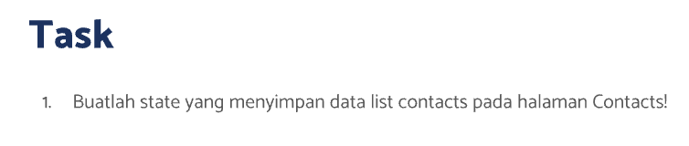
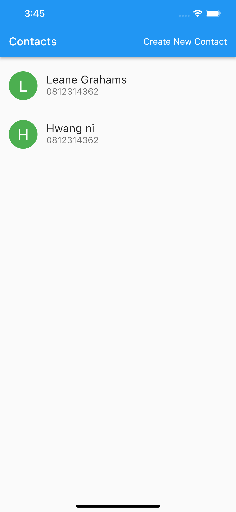
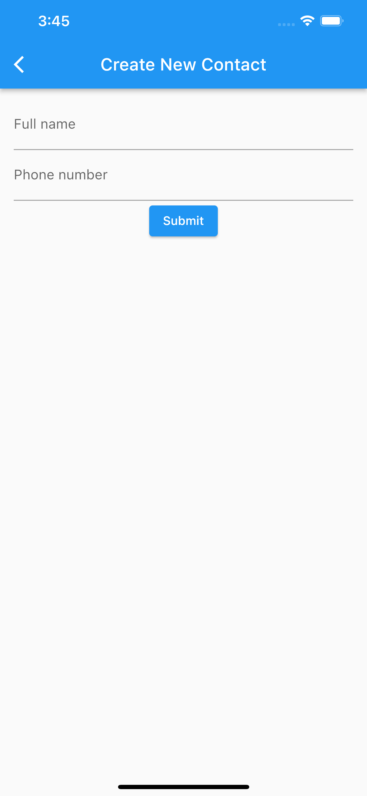
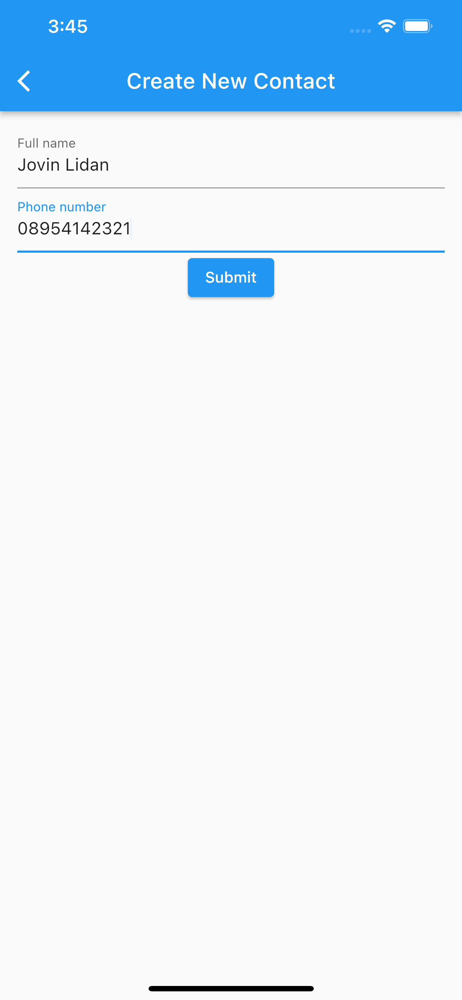
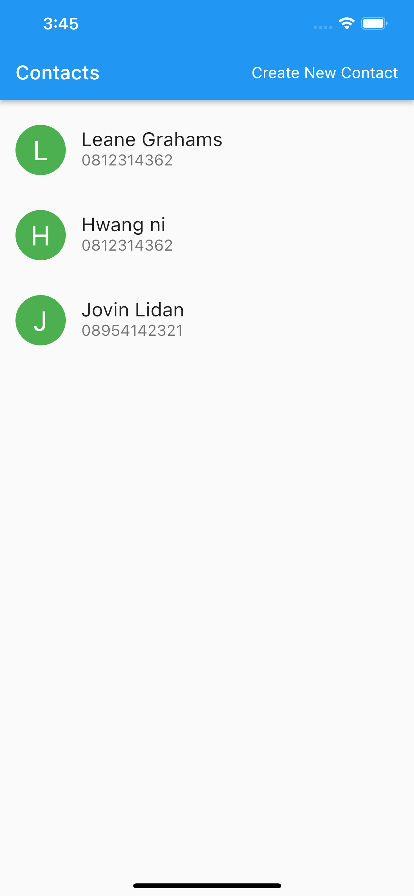
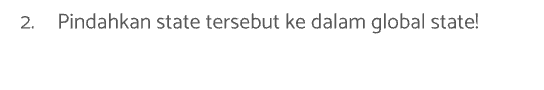

# (20) Flutter State Management (Provider)

## Resume

Dalam materi ini, mempelajari :

1. State
2. Global State (Provider)
3. Implementasi Provider

### State

State dalam flutter merupakan suatu data yang dapat berubah seiring waktu ketika user sedang melakukan interaksi dengan widget maupun tidak. Ketika data berubah, maka UI atau tampilan widget juga akan berubah untuk menyesuaikan dengan data yang ada. Seluruh perubahan tersebut hanya dapat terjadi pada StatefulWidget.

Dengan menggunakan StatefulWidget dan mendefinisikan variabel didalam class widget, kita dapat melakukan perubahan tampilan. Akan tetapi, ada kekurangan dengan cara tersebut, yaitu dimana data hanya dapat digunakan oleh class Widget tersebut, jika ingin widget lain mendapatkan data yang sama , maka kita harus melakukan drilling kebawah setiap widget dengan passing data ke masing-masing constructor widget class satu per satu. Hal tersebut dapat membuat kode kita menjadi jelek dan sulit dibaca serta diupdate.Tetapi, ada solusi untuk mengatasi hal tersebut, yaitu dengan menggunakan Global State.

### Global State (Provider)

Global state merupakan sebuah state yang tersedia secara global. Biasanya kita mendefinisikan global state pada bagian sebelum Scaffold tiap page. Dengan menggunakan Provider kita dapat menggunakan variabel secara global diwidget manapun selama widget tersebut berada didalam Provider widget. Dengan menggunakan Provider, kita dapat melakukan trigger pada beberapa widget saja untuk melakukan rebuild UI ketika widget berubah, sehingga aplikasi tidak perlu merebuild seluruh tampilan jika hanya satu atau 2 buah tampilan widget yang berubah. Salah satu package yang dapat kita gunakan untuk menggunakan Global State adalah Provider.

### Implementasi Provider

Untuk menggunakan Provider kita harus menginstall package Provider yang dapat diperoleh dari [https://pub.dev/packages/provider](https://pub.dev/packages/provider)

Class dari Provider harus memiliki `with ChangeNotifier`

```dart
class ContactProvider with ChangeNotifier {
  List<Person> _contacts = [
    Person(name: "Leane Grahams", phone: "0812314362"),
    Person(name: "Hwang ni", phone: "0812314362"),
  ];

  List<Person> get contacts => _contacts;

  set contacts(List<Person> val) {
    _contacts = val;
    notifyListeners();
  }
}
```

Untuk melakukan rebuild ketika variabel berubah, kita perlu memanggil fungsi `notifyListeners` didalam set. Setelah itu kita harus membungkus Scaffold kita dengan `ChangeNotifierProvider` dengan constructor create diisi dengan class yang sudah dibuat diatas.

Untuk mengambil nilai kita dapat menggunakan `context.watch<ContactProvider>().contacts`, fungsi watch akan melihat dan menunggu perubahan yang terjadi pada contacts dan merebuild widget kembali.

Kita juga dapat menggunakan widget `Consumer` yang akan berisi parameter builder, parameter builder akan mengembalikan 3 nilai yaitu context, data dan child. Dimana data berisi global state yang dapat kita gunakan variabelnya.

## Task

**Soal1:**



**Output:**






**Penjelasan:**

```dart
class Person {
  String name;
  String phone;

  Person({required this.name, required this.phone});
}
```

Class diatas dibuat sebagai kelas yang akan menampung data setiap card yang ditampilkan dalam listview diatas, class diatas menerima 2 data string melalui constructor dan data tersebut wajib diberikan dalam constructor ketika membuat objek dari class.

---

```dart
class Soal1Soal2 extends StatelessWidget {
  const Soal1Soal2({Key? key}) : super(key: key);

  @override
  Widget build(BuildContext context) {
    return MaterialApp(
      initialRoute: '/',
      routes: {
        '/': (context) => const CustomBody(),
        NewContactScreen.newContactScreenName: (context) => const NewContactScreen()
      },
      debugShowCheckedModeBanner: false,
    );
  }
}
```

Widget diatas berisi MaterialApp dengan initialRoute : '/' yang berarti ketika aplikasi pertama kali dibuka, route yang akan dituju adalah '/' . Constructor routes berisi sekumpulan routes didalam aplikasi, Routes '/' berisi CustomBody, sedangkan untuk routes newContactScreenName yang merupakan constant yang diimport dari file `new_contact_screen.dart` berisi widget NewContactScreen.

---

```dart
class CustomCard extends StatelessWidget {
  final Person person;
  const CustomCard({Key? key, required this.person}) : super(key: key);

  @override
  Widget build(BuildContext context) {
    return ListTile(
      contentPadding: const EdgeInsets.only(left: 16, right: 16, top: 8, bottom: 8),
      leading: CircleAvatar(
        child: Text(
          person.name.characters.first,
          style: const TextStyle(fontSize: 28, color: Colors.white),
        ),
        radius: 26,
        backgroundColor: Colors.green,
      ),
      title: Text(person.name, style: const TextStyle(fontSize: 20)),
      subtitle: Text(person.phone, style: const TextStyle(fontSize: 16)),
      onTap: () {},
    );
  }
}
```

Widget CustomCard diatas menerima constructor dengan tipe data person kemudian mengembalikan widget ListTile dengan beberapa padding, pada constructor leading, mengembalikan widget CircleAvatar dengan child yaitu Text. Didalam Text tersebut berisi `person.name.characters.first` yang berguna untuk mengambil karakter pertama dari nama setiap person dari constructor class CustomCard. radius untuk mengatur ukuran CircleAvatar.
title berisi nama dari person, subtitle berisi nomor telepon dari person dan onTap berisi fungsi kosong.

---

```dart
class CustomBody extends StatefulWidget {
  const CustomBody({Key? key}) : super(key: key);

  @override
  State<CustomBody> createState() => _CustomBodyState();
}

class _CustomBodyState extends State<CustomBody> {
  List<Person> datas = [
    Person(name: "Leane Graham", phone: "0812314362"),
    Person(name: "Hwang ni", phone: "0812314362"),
  ];

  Future<void> onNavigateNewContactScreen(BuildContext context) async {
    Person? res = await Navigator.pushNamed(
      context,
      NewContactScreen.newContactScreenName,
    ) as Person?;
    if (res != null) {
      setState(() {
        datas = [...datas, res];
      });
    }
  }

  @override
  Widget build(BuildContext context) {
    return Scaffold(
      appBar: AppBar(
        title: const Text(
          "Contacts",
          style: TextStyle(fontSize: 20),
        ),
        centerTitle: false,
        actions: [
          Container(
            margin: const EdgeInsets.symmetric(horizontal: 16),
            child: InkWell(
              child: const Center(
                child: Text(
                  "Create New Contact",
                  style: TextStyle(
                    color: Colors.white,
                    fontSize: 16,
                  ),
                ),
              ),
              onTap: () => onNavigateNewContactScreen(context),
            ),
          )
        ],
      ),
      body: ListView(
        padding: const EdgeInsets.only(top: 8),
        children: datas.map((person) => CustomCard(person: person)).toList(),
      ),
    );
  }
}
```

Widget diatas merupakan stateful widget, berisi list dari data Person untuk merender tampilan CustomCard. Kemudian pada bagian fungsi build, mengembalikan Widget Scaffold dengan actions berisi inkwell untuk menerima inputan tap dari user. Pada onTap memanggil fungsi onNavigateNewContactScreen dengan mengirim parameter context

Kemudian pada bagian body, mengembalikan ListView dengan childrennya merupakan hasil mapping dari datas.

Pada fungsi onNavigateNewContactScreen, berisi kode untuk mengambil hasil add contact dari page newcontact. await Navigator.pushNamed digunakan untuk menunggu user melakukan pop pada screen NewContact. kemudian melakukan validasi apabila ada dikembalikan class Person, maka masukkan class tersebut kedalam datas dengan setState dan spread operator.

---

```dart
class NewContactScreen extends StatefulWidget {
  static const newContactScreenName = "/new-contact";

  const NewContactScreen({Key? key}) : super(key: key);

  @override
  State<NewContactScreen> createState() => _NewContactScreenState();
}

class _NewContactScreenState extends State<NewContactScreen> {
  final _formKey = GlobalKey<FormState>();
  String? fullName;
  String? phoneNumber;

  void handleSubmit() {
    if (_formKey.currentState!.validate()) {
      _formKey.currentState!.save();
      Navigator.pop(context, Person(name: fullName!, phone: phoneNumber!));
    }
  }

  @override
  Widget build(BuildContext context) {
    return Scaffold(
      appBar: AppBar(title: const Text("Create New Contact")),
      body: Container(
        margin: const EdgeInsets.symmetric(horizontal: 16, vertical: 12),
        child: Form(
          key: _formKey,
          child: Column(children: [
            TextFormField(
              autovalidateMode: AutovalidateMode.onUserInteraction,
              onSaved: ((newValue) => fullName = newValue),
              validator: (value) {
                if (value == null || value.isEmpty) {
                  return 'Please enter some text';
                }
                return null;
              },
              decoration: const InputDecoration(labelText: 'Full name'),
            ),
            TextFormField(
              autovalidateMode: AutovalidateMode.onUserInteraction,
              onSaved: ((newValue) => phoneNumber = newValue),
              keyboardType: TextInputType.phone,
              validator: (value) {
                if (value == null || value.isEmpty) {
                  return 'Please enter some text';
                }
                return null;
              },
              decoration: const InputDecoration(labelText: 'Phone number'),
            ),
            ElevatedButton(
              onPressed: handleSubmit,
              child: const Text("Submit"),
            )
          ]),
        ),
      ),
    );
  }
}
```

Widget diatas adalah stateful widget, dimana dalam widget tersebut berisi form key dengan nama variabel \_formKey, kemudian fullName dan phoneNumber sebagai variabel untuk menerima inputan.variabel static berguna sebagai nilai constanta path dari screen yang dapat dipanggil tanpa membuat objek dari class.

fungsi handleSubmit berfungsi untuk melakukan checking apabila form sudah valid maka lakukan save , fungsi save yang dipanggil didalam handleSubmit berfungsi untuk memanggil fungsi `onSaved` pada setiap widget, setelah itu lakukan pop untuk kembali ke halaman sebelumnya dengan mengirimkan data Person yang ditaruh pada parameter kedua dari fungsi Navigator.pop.

Dalam fungsi build mengembalikan halaman baru dengan Form sebagai child, didalam Form terdapat TextFormField , autovalidateMode.onUserInteraction berguna untuk melakukan validasi inputan setiap user malakukan typing pada field. onSaved merupakan fungsi untuk memasukkan nilai ke variabel yang sudah dibuat.validator berguna sebagai validasi inputan, decoration berisi InputDecoration berguna untuk menampilkan labelText pada field.

Setelah itu ElevatedButton berguna untuk memanggil fungsi handleSubmit.

---

**Soal2:**



**Output:**


**Penjelasan:**

```dart
class ContactProvider with ChangeNotifier {
  List<Person> _contacts = [
    Person(name: "Leane Grahams", phone: "0812314362"),
    Person(name: "Hwang ni", phone: "0812314362"),
  ];

  List<Person> get contacts => _contacts;

  set contacts(List<Person> val) {
    _contacts = val;
    notifyListeners();
  }
}
```

Kode diatas berisi class dari provider yang memiliki `with ChangeNotifier` yang menyimpan global state, kemudian ada 1 variabel \_contacts yang bersifat private dengan set dan get. Didalam set dipanggil notifyListeners untuk melakukan trigger rerender ketika data berubah.

---

```dart
routes: {
    '/': (context) => ChangeNotifierProvider<ContactProvider>(
            create: (_) => ContactProvider(),
            child: const CustomBody(),
        ),
    NewContactScreen.newContactScreenName: (context) => const NewContactScreen()
      },
```

Path '/' diatas mengembalikan ChangeNotifierProvider dengan class nya adalah ContactProvider yang sudah kita buat diatas.

---

```dart
Future<void> onNavigateNewContactScreen(BuildContext context, ContactProvider data) async {
    Person? res = await Navigator.pushNamed(
      context,
      NewContactScreen.newContactScreenName,
    ) as Person?;
    if (res != null) {
      data.contacts = [...data.contacts, res];
    }
  }
```

Fungsi diatas akan menerima sebuah reference dari ContactProvider dimana fungsi set pada contacts akan mentrigger rerender ketika data.contacts diubah isinya.

```dart
Consumer<ContactProvider>(
    builder: (_, data, __) => InkWell(
    child: const Center(
        child: Text(
        "Create New Contact",
        style: TextStyle(
            color: Colors.white,
            fontSize: 16,
        ),
        ),
    ),
    onTap: () => onNavigateNewContactScreen(context, data),
    ),
),
```

Kode diatas berisi widget Consumer dimana buildernya akan mengembalikan context, data, dan child. Data yang dikembalikan merupakan data dari global state dan digunakan pada pemanggilan fungsi onNavigateNewContactScreen.

---

```dart
context.watch<ContactProvider>().contacts
```

Kode diatas mengambil variabel contacts dan menunggu setiap perubahan yang terjadi pada contacts kemudian melakukan rerender pada widget apabila terjadi perubahan
