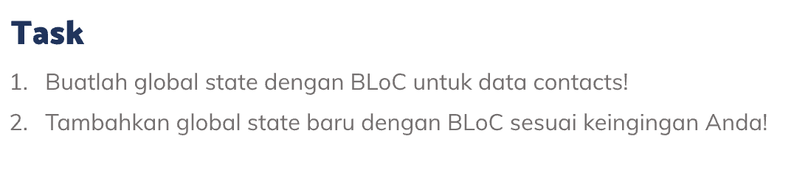
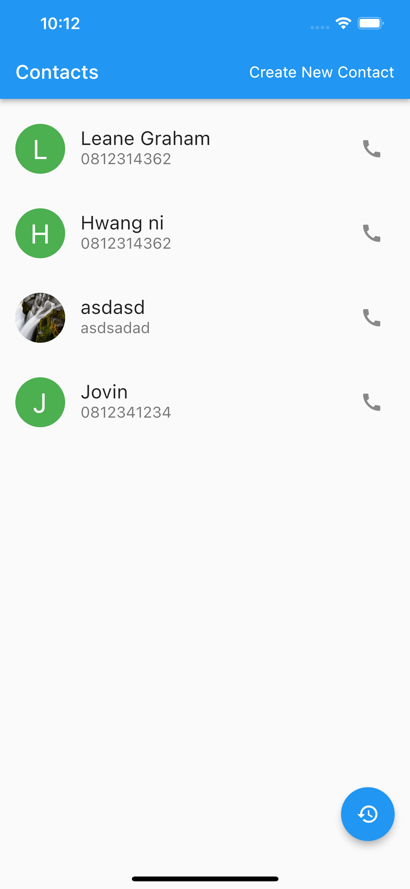
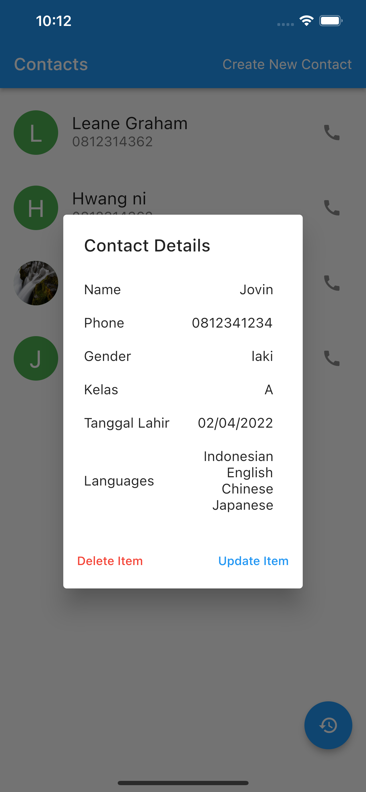
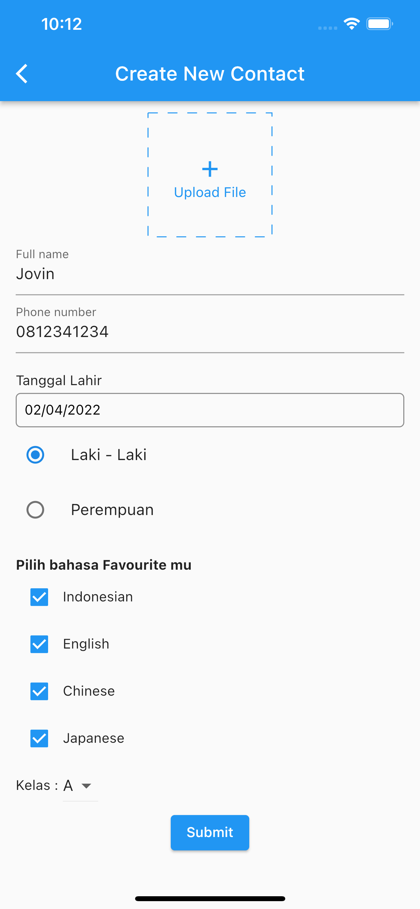
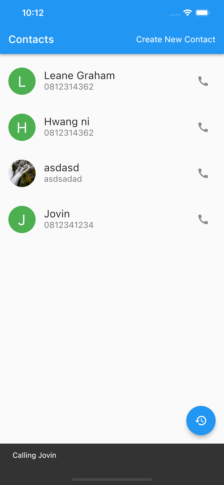
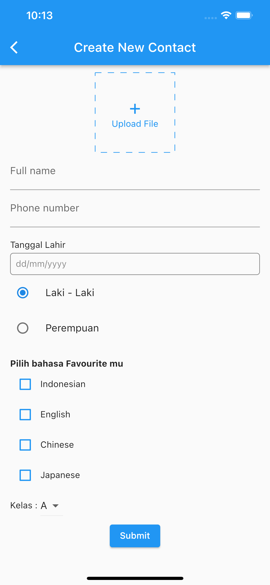
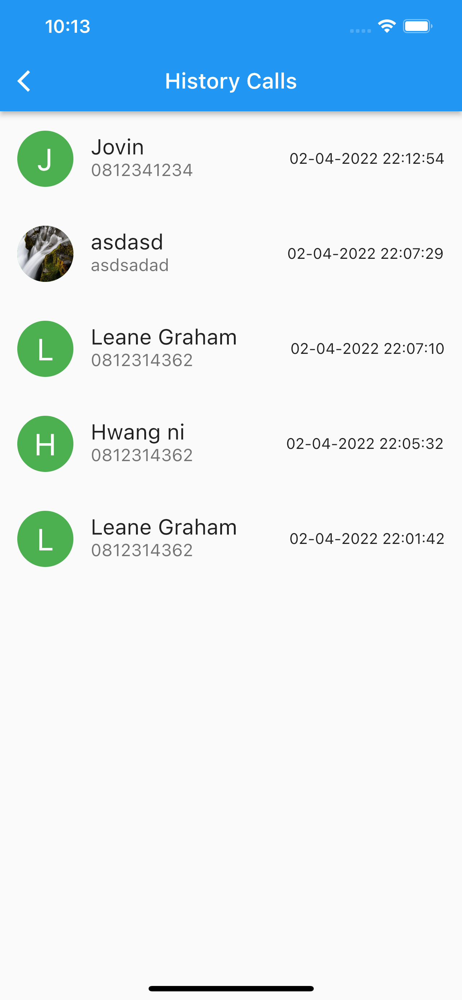

# (21) Flutter State Management (BLoC)

## Resume

Dalam materi ini, mempelajari :

1. Declarative UI
2. Provider
3. Bloc

### Declarative UI

Tampilan yang dibangun oleh flutter disesuaikan dengan keadaan state terbaru.

- Ephemeral State, tidak ada bagian lain pada widget tree yang membutuhkan untuk mengakses data widgetnya. Biasanya akan menggunakan setState
- App State, ketika ada bagian lain yang membutuhkan akses ke data state widget. Biasanya akan menggunakan Provider atau Bloc

### Provider

Lakukan instalasi package `provider` dari pub.dev

Class untuk menggunakan provider :

- ChangeNotifierProvider, sebagai provider
- MultiProvider, untuk menggunakan lebih dari 1 provider
- Consumer untuk mengambil data provider
- ChangeNotifier untuk menggunakan fungsi notifyListeners

### BLoC

Pada BLoC kita memisahkan bussiness logic dengan UI

Cara Kerja Bloc :

- Event sebagai input
- Bloc sebagai pemroses
- State sebagai output

## Task

**Soal1 dan Soal2:**



**Output:**








**Penjelasan:**

---

**Penjelasan Bloc**

```dart
class ContactBloc extends Bloc<ContactEvent, ContactState> {
  ContactBloc() : super(ContactInitial()) {
    // on<ContactEvent>((event, emit) => emit(ContactInitial()));

    // kalau panggil add contact otomatis contact event ke trigger
    on<AddContact>((event, emit) {
      List<Person> temp = [event.person];
      emit(AddContactState([
        ...state.data,
        ...temp,
      ]));
    });

    on<UpdateContact>((event, emit) {
      List<Person> temp = [...state.data];
      temp[event.idx] = event.person;
      emit(UpdateContactState(temp));
    });

    on<DeleteContact>(((event, emit) {
      List<Person> temp = [...state.data];
      temp.removeAt(event.idx);
      emit(DeleteContactState(temp));
    }));
  }
}
```

Class diatas adalah class bloc yang didalamnya berisi eventlistener terhadap beberapa event dari class event. Event AddContact berisi kode yang menambahkan dua buah array menggunakan spread operator. Event berisi object dari class AddContact, emit untuk melakukan emit class state

onUpdateContact berisi kode dimana mengubah data yang sudah ada pada index yang diberikan dari constructor UpdateContact kemudian emit state UpdateContactState

onDeleteContact berisi kode dimana menghapus data state pada index tertentu yang dimana index tersebut didapatkan dari constructor DeleteContact

---

```dart
abstract class ContactEvent extends Equatable {
  const ContactEvent();

  @override
  List<Object?> get props => [];
}

class AddContact extends ContactEvent {
  Person person;

  AddContact(this.person);
  @override
  List<Object?> get props => [person];
}

class UpdateContact extends ContactEvent {
  int idx;
  Person person;

  UpdateContact(this.person, this.idx);
  @override
  List<Object?> get props => [person, idx];
}

class DeleteContact extends ContactEvent {
  int idx;
  DeleteContact(this.idx);
  @override
  List<Object?> get props => [idx];
}
```

Equatable digunakan untuk komparasi antara dua class dimana variabel yang diisi didalam props merupakan variabel yang akan dikomparasi ketika class dikomparasi dengan class lainnya yang berbeda constructornya.

Class diatas berisi sejumlah event yang akan menjadi input dari widget ketika ada data yang ingin diubah.

Masing-masing class mengextends ContactEvent. AddContact menerima Person sebagai inputan. UpdateContact menerima index dan Person sebagai inputan. DeleteContact menerima idx sebagai inputan

---

```dart
abstract class ContactState extends Equatable {
  List<Person> data = [];
  ContactState(this.data);
  @override
  List<Object?> get props => [data];
}

class ContactInitial extends ContactState {
  ContactInitial()
      : super([
          Person(
              name: "Leane Graham",
              phone: "0812314362",
              gender: RadioOption.laki,
              languages: [],
              kelas: "A",
              date: DateTime.now()),
          Person(
              name: "Hwang ni",
              phone: "0812314362",
              gender: RadioOption.laki,
              languages: [],
              kelas: "B",
              date: DateTime.now()),
        ]);
  @override
  List<Object?> get props => [];
}

class AddContactState extends ContactState {
  final List<Person> newData;
  AddContactState(this.newData) : super(newData);
  @override
  List<Object?> get props => [data];
}

class UpdateContactState extends ContactState {
  final List<Person> newData;
  UpdateContactState(this.newData) : super(newData);
  @override
  List<Object?> get props => [data];
}

class DeleteContactState extends ContactState {
  final List<Person> newData;
  DeleteContactState(this.newData) : super(newData);
  @override
  List<Object?> get props => [data];
}
```

Equatable digunakan untuk komparasi antara dua class dimana variabel yang diisi didalam props merupakan variabel yang akan dikomparasi ketika class dikomparasi dengan class lainnya yang berbeda constructornya.

ContactState berisi state kita pada awalnya.ContactInitial merupakan class yang akan dijalankan diawal.

AddContactState berisi constructor List<Person> dan nilai dari constructor tersebut akan menimpa nilai dari class ContactState menggunakan operator super pada constructornya

UpdateContactState berisi constructor List<Person> dan nilai dari constructor tersebut akan menimpa nilai dari class ContactState menggunakan operator super pada constructornya

DeleteContactState berisi constructor List<Person> dan nilai dari constructor tersebut akan menimpa nilai dari class ContactState menggunakan operator super pada constructornya

---

```dart
class HistoryBloc extends Bloc<HistoryEvent, HistoryState> {
  HistoryBloc() : super(HistoryInitial()) {
    // on<HistoryEvent>((event, emit) {

    // });
    on<AddHistory>((event, emit) {
      List<HistoryCall> temp = [event.history];
      emit(AddHistoryState([
        ...temp,
        ...state.data,
      ]));
    });
  }
}
```

Class diatas adalah class bloc yang didalamnya berisi eventlistener terhadap AddHistory event dari class event. Event AddHistory berisi kode yang menambahkan dua buah array menggunakan spread operator. Event berisi object dari class AddHistory, emit untuk melakukan emit class state

---

```dart
abstract class HistoryEvent extends Equatable {
  const HistoryEvent();

  @override
  List<Object?> get props => [];
}

class AddHistory extends HistoryEvent {
  HistoryCall history;

  AddHistory(this.history);
  @override
  List<Object?> get props => [history];
}
```

Equatable digunakan untuk komparasi antara dua class dimana variabel yang diisi didalam props merupakan variabel yang akan dikomparasi ketika class dikomparasi dengan class lainnya yang berbeda constructornya.

Class diatas berisi sejumlah event yang akan menjadi input dari widget ketika ada data yang ingin diubah.

Masing-masing class mengextends HistoryEvent. AddHistory menerima Person sebagai inputan.

---

```dart
abstract class HistoryState extends Equatable {
  List<HistoryCall> data = [];

  HistoryState(this.data);
  @override
  List<Object?> get props => [data];
}

class HistoryInitial extends HistoryState {
  HistoryInitial() : super([]);
  @override
  List<Object?> get props => [];
}

class AddHistoryState extends HistoryState {
  final List<HistoryCall> newData;
  AddHistoryState(this.newData) : super(newData);
  @override
  List<Object?> get props => [data];
}
```

Equatable digunakan untuk komparasi antara dua class dimana variabel yang diisi didalam props merupakan variabel yang akan dikomparasi ketika class dikomparasi dengan class lainnya yang berbeda constructornya.

HistoryState berisi state kita pada awalnya.HistoryInitial merupakan class yang akan dijalankan diawal.

AddHistoryState berisi constructor List<HistoryCall> dan nilai dari constructor tersebut akan menimpa nilai dari class HistoryState menggunakan operator super pada constructornya

---

```dart
class HistoryCall extends Person {
  Person person;
  DateTime timestamp;
  HistoryCall({required this.person, required this.timestamp})
      : super(
            date: person.date,
            gender: person.gender,
            kelas: person.kelas,
            languages: person.languages,
            name: person.name,
            phone: person.phone,
            file: person.file);
}
```

HistoryCall diatas adalah model yang digunakan untuk menyimpan data historycall, timestamp digunakan untuk menyimpan waktu call.

```dart

class HistoryScreen extends StatelessWidget {
  static const historyScreenName = "/history";

  const HistoryScreen({Key? key}) : super(key: key);

  @override
  Widget build(BuildContext context) {
    return Scaffold(
      appBar: AppBar(title: const Text("History Calls")),
      body: BlocBuilder<HistoryBloc, HistoryState>(
        builder: (context, state) => ListView.builder(
          itemBuilder: (context, index) => CustomCard(history: state.data[index]),
          itemCount: state.data.length,
        ),
      ),
    );
  }
}
```

BlocBuilder diatas untuk mendapatkan state dari bloc yang berisi data dari bloc

---

```dart
void main() {
  runApp(
    MultiBlocProvider(
      providers: [
        BlocProvider<ContactBloc>(create: (context) => ContactBloc()),
        BlocProvider<HistoryBloc>(create: (context) => HistoryBloc()),
      ],
      child: const Soal1Soal2(),
    ),
  );
}
```

MultiBlocProvider diatas digunakan untuk menggunakan 2 bloc provider pada waktu bersamaan. Didalamnya terdapat 2 providers yaitu masing masing BlocProvider dengan create ContactBloc dan HistoryBloc

---

```dart
void handleCall(BuildContext context) {
    HistoryCall history = HistoryCall(person: person, timestamp: DateTime.now());
    ScaffoldMessenger.of(context).showSnackBar(SnackBar(content: Text("Calling ${person.name}")));
    BlocProvider.of<HistoryBloc>(context).add(AddHistory(history));
}
```

Pada kode diatas saya membuat sebuah history baru ketika tombol call ditekan. Dimana pada kode diatas saya mengambil datetime terbaru kemudian memunculkan snackbar, setelah itu memasukkan event AddHistory dengan constructor diisi variabel history yang sudah dibuat.

---

```dart
Future<void> onNavigateNewContactScreen(BuildContext context, Person? person, int? idx) async {
    Map<String, dynamic>? data = await Navigator.pushNamed(
      context,
      NewContactScreen.newContactScreenName,
      arguments: person != null
          ? {
              'person': person,
              'idx': idx,
            }
          : null,
    ) as Map<String, dynamic>?;
    if (data != null && data['person'] != null) {
      Person p = data['person'] as Person;
      if (data['idx'] == null) {
        BlocProvider.of<ContactBloc>(context).add(AddContact(p));
      } else {
        BlocProvider.of<ContactBloc>(context).add(UpdateContact(p, data['idx']));
      }
    }
  }
```

Pada kode diatas saya mengambil nilai kembalian dari navigator pushnamed, yang merupakan map dengan 2 key yaitu person dan idx. Key idx bersifat optional, apabila tidak disertakan idx maka data tersebut adalah data baru kemudian saya memanggil fungsi add dengan AddContact event. Apabila terdapat idx maka data tersebut merupakan data yang sudah ada kemudian saya memanggil event UpdateContact dengan constructor diisi person dan idx.

---

```dart
BlocBuilder<ContactBloc, ContactState>(
        builder: (context, state) => ListView.builder(
          itemBuilder: (context, index) => CustomCard(
            person: state.data[index],
            onDelete: () => BlocProvider.of<ContactBloc>(context).add(DeleteContact(index)),
            onUpdate: () => onNavigateNewContactScreen(context, state.data[index], index),
          ),
          padding: const EdgeInsets.only(top: 8),
          itemCount: state.data.length,
        ),
      ),
```

BlocBuilder diatas digunakan untuk mendapatkan state dari bloc kemudian pada onDelete dilakukan pemanggilan event DeleteContact dengan constructor berisi index yang diperoleh dari ListView.builder
