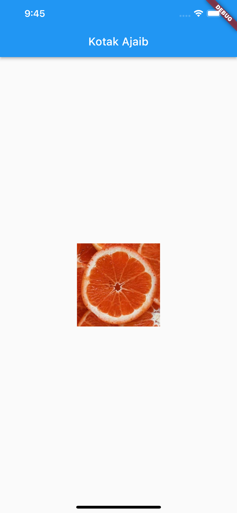

# (22) Flutter Animation

## Resume

Dalam materi ini, mempelajari :

1. Animation
2. Transition
3. Implementasi Animation dan Transition

### Animation

Animasi adalah suatu cara untuk membuat aplikasi kita menjadi tampak lebih hidup dan lebih nyaman untuk dinikmati oleh user. Dengan menggunakan animation , perubahan state atau UI dalam aplikasi akan tampak memiliki animasi dan tidak langsung berubah ke state yang diberikan. Kita dapat merubah ukuran, warna , rotasi dari sebuah container menggunakan animation

### Transition

Transisi adalah animasi yang muncul ketika proses perpindahan halaman terjadi. Transisi dapat digunakan pada fungsi Navigator.push dan Navigator.pop . Apabila kita menggunakan transisi pada Navigator.push maka secara otomatis Navigator.pop juga akan memiliki transisi yang sama hanya berbeda jika push animasi dimulai dari start ke end, jika pop animasi dimulai dari end ke start.

Transisi yang sering digunakan adalah:

- FadeTransition
- ScaleTransition

### Implementasi Animation dan Transition

**Animation**

```dart
AnimatedContainer(
    width: isBig ? 250 : 150,
    height: isBig ? 250 : 150,
    color: isBig ? Colors.blue : Colors.red,
    duration: const Duration(milliseconds: 500),
),
```

Kita dapat menggunakan animasi dengan menggunakan AnimatedContainer, AnimatedContainer adalah widget yang mirip seperti widget Container tetapi kita dapat menggunakan animasi pada widget ini.

**Transition**

```dart
Navigator.of(context).push(
    PageRouteBuilder(
        pageBuilder: (context,animation, secondaryAnimation){
            return const ScreenSecond();
        },
        transitionsBuilder: (context, animation, secondaryAnimation, child){
            final tween = Tween(begin: const Offset(0, 1), end : Offset.zero);
            return FadeTransition(
                position : animation.drive(tween),
                child:child,
            );
        },
    ),
);
```

Untuk menggunakan transisi, kita dapat menggunakan PageRouteBuilder didalamnya kita dapat mengatur animasi kita menggunakan jenis transisi yang mana, seperti FadeTransition. Dengan Tween kita dapat mengatur offset perubahan dari start menuju ke end.

## Task

**Soal1:**


**Output:**




_Pada Folder Screenshots terdapat video hasil_

**Penjelasan:**

```dart
GestureDetector(
    onTap: () => setState(() => isBig = !isBig),
    child: AnimatedContainer(
        width: isBig ? 250 : 150,
        height: isBig ? 250 : 150,
        color: isBig ? Colors.blue : Colors.red,
        duration: const Duration(milliseconds: 500),
    ),
    ),
```

Pada kode diatas saya membuat sebuah state boolean isBig untuk menentukan bentuk container apakah besar atau kecil.
Jika GestureDetector di tap maka akan mengubah nilai dari isBig ke negasi dari nilai tersebut. Secara otomatis apabila ada width atau height atau color yang berubah maka AnimatedContainer akan merubah property tersebut dengan animasi.

---

**Soal2:**


**Output:**


_Pada Folder Screenshots terdapat video hasil_

**Penjelasan:**

```dart
return MaterialApp(
      initialRoute: '/',
      routes: {
        '/': (context) => const CustomBody(),
        // NewContactScreen.newContactScreenName: (context) => const NewContactScreen(),
        HistoryScreen.historyScreenName: (context) => const HistoryScreen()
      },
      debugShowCheckedModeBanner: false,
      onGenerateRoute: (settings) {
        if (settings.name == NewContactScreen.newContactScreenName) {
          return PageRouteBuilder(
            settings: settings,
            pageBuilder: (_, __, ___) => const NewContactScreen(),
            transitionsBuilder: (_, animation, __, child) {
              final tween = Tween(begin: const Offset(1, 1), end: Offset.zero);
              return SlideTransition(
                position: animation.drive(tween),
                child: child,
              );
            },
          );
        }
        return null;
      },
    );
```

onGenerateRoute adalah fungsi yang mengembalikan sebuah PageRouteBuilder untuk dapat menggunakan Transisi, diatas saya menggunakan SlideTransition dimana transisi dimulai dari offset x dan y ke (1, 1) dan diakhiri pada offset x dan y ke (0, 0).

Pada bagian routes, saya menghilangkan route menuju newContactScreen karena route sudah diatasi pada bagian onGenerateRoute.

onGenerateRoute saya gunakan karena route yang saya pakai bersifat named dan menggunakan pushNamed. Sehingga pada bagian pushNamed kita tidak perlu merubah kode apapun lagi, seluruh proses transisi diatur pada onGenerateRoute.
