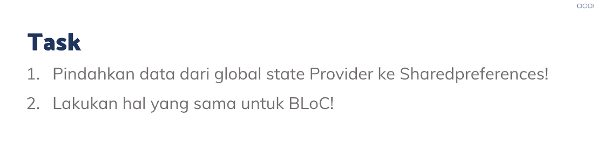
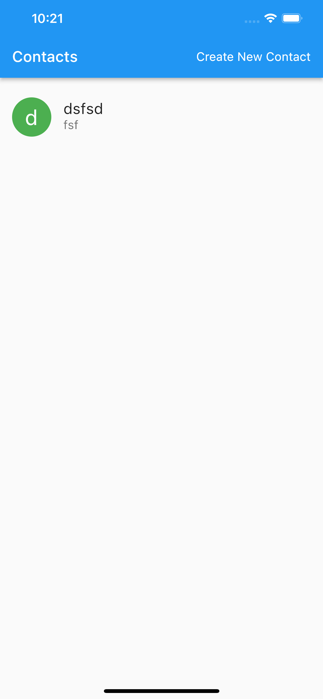
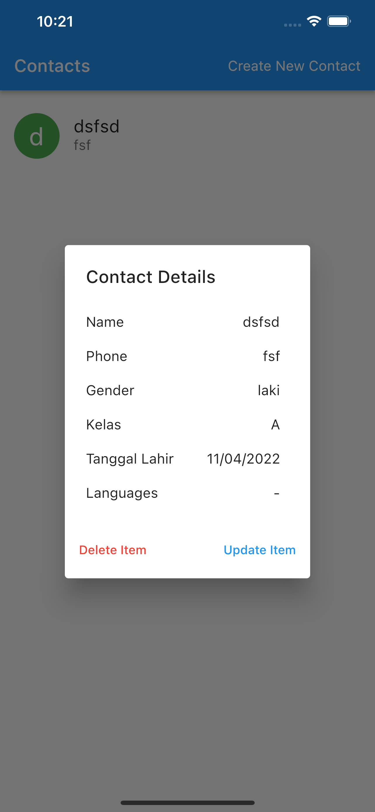
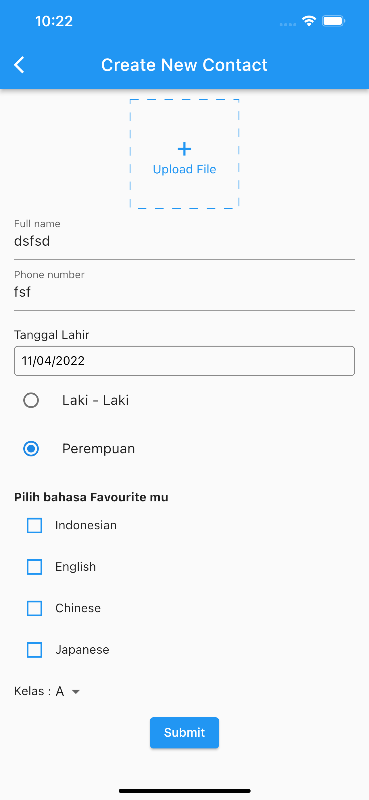
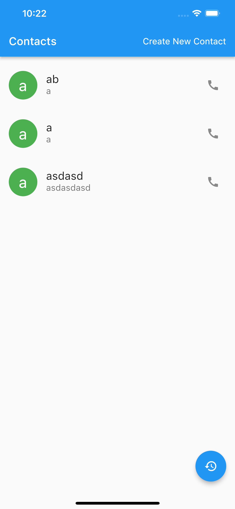
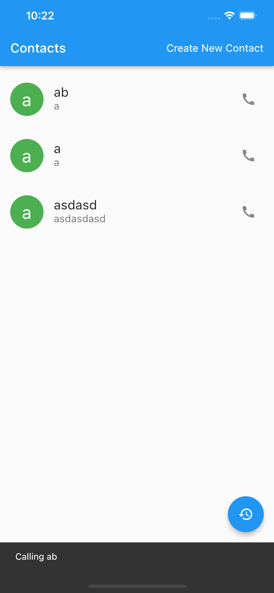
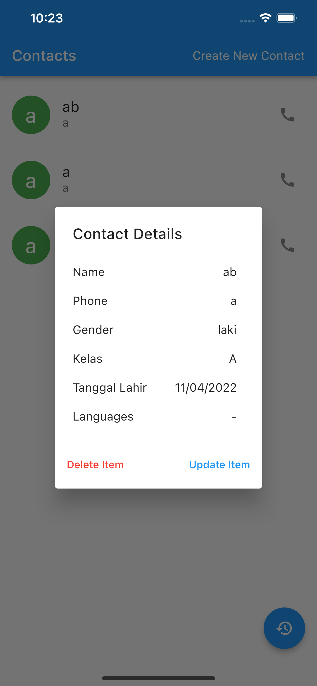
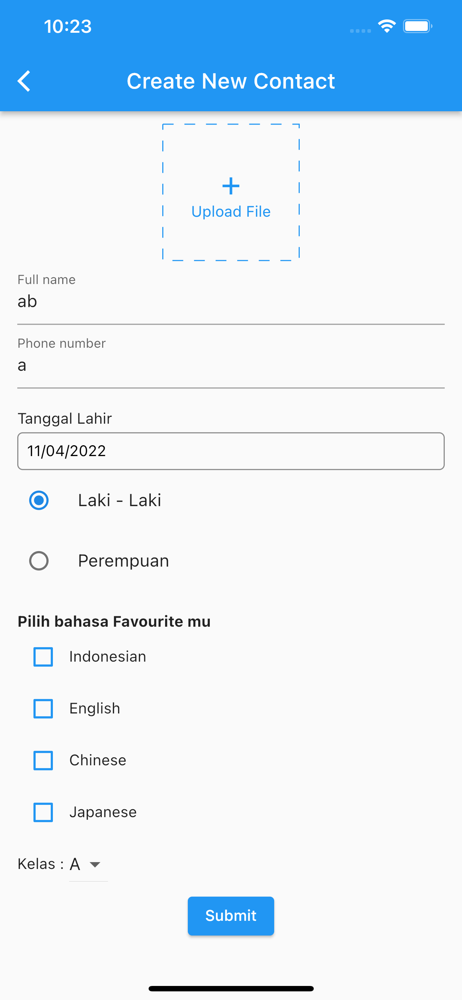
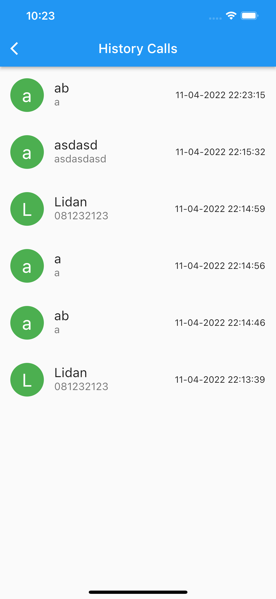

# (23) Storage

## Resume

Dalam materi ini, mempelajari :

1. Penyimpanan Lokal
2. Shared Preferences
3. Local Database (SQLite)

### Penyimpanan Lokal

Pada materi sebelumnya telah dipelajari mengenai state management, state management merupakan suatu cara untuk mempertahankan state pada aplikasi kita, salah satunya kita dapat menggunakan Provider dan BLoC yang bersifat global state. Akan tetapi state yang di simpan menggunakan Provider dan BLoC tetap akan hilang ketika aplikasi ditutup dan dijalankan kembali. Oleh karena itu , disinilah Penyimpanan lokal berguna.

Dengan Penyimpanan lokal, kita dapat mempertahankan state / data dari aplikasi kita bahkan ketika aplikasi kita tutup dan kita jalankan kembali selama data internal dari aplikasi tersebut tidak dihapus ataupun aplikasi tersebut tidak di uninstall.

Ada 2 Jenis Penyimpanan lokal, yaitu:

- Shared Preferences
- Local database (SQLite)

### Shared Preferences

SharedPreferences bersifat key value ketika menyimpan data kita, kita membutuhkan key untuk mengambil data tersebut kembali dan juga membutuhkan key ketika ingin menyimpan suatu data. Key bersifat unik untuk setiap data berbeda yang ingin disimpan. Tipe data yang dapat disimpan adalah bool , int, String, List<String>.

Untuk menggunakan SharedPreferences kita harus menginstall packagenya terlebih dahulu dari pub.dev bernama `shared_preferences`. kemudian inisialisasi objek dari class SharedPreferences dengan menggambil instansi nya dengan cara `getInstance`. Dengan objek tersebut kita sudah dapat menggunakan seluruh fungsi yang disediakan oleh sharedpreferences.

```dart
  Future<SharedPreferences> _prefs;

  @override
  void initState(){
    _prefs = SharedPreferences.getInstance();
  }

  Future<String?> getData() async {
    SharedPreferences prefs = await _prefs;
    return Future.value(prefs.getString(repoKey));
  }

  Future<void> setData(String data) async {
    SharedPreferences prefs = await _prefs;
    await prefs.setString(repoKey, data);
  }
```

### Local Database (SQLite)

Pada SQLite , data tidak disimpan secara key value melainkan sesuai dengan database pada umumnya. Kita dapat menggunakan query seperti biasa jika menggunakan SQLite dan melakukan operasi CRUD (Create Read Update Delete)

Untuk menggunakan SQLite kita harus menginstall package `sqflite` dan `path` dari pub.dev. Kemudian kita dapat mengakses database menggunakan openDatabse dengan onCreate berisi query sql. Untuk melakukan insert dapat menggunakan perintah `insert` dengan parameter pertama adalah nama tabel dan parameter kedua berisi map dari suatu model. Untuk mengambil data dari table dapat menggunakan `query`. Kita juga dapat menambahkan beberapa parameter yang bersifat optional seperti where, whereArgs. Untuk update mirip seperti insert hanya saja sintaks nya adalah `update` dan untuk delete menggunakan `delete` dengan parameter pertama adalah nama tabel, dan sisa parameter bersifat optional.

Membuka database

```dart
var db = await openDatabase('jovin.db');
```

Menutup database

```dart
await db.close();
```

Melakukan query

```dart
Database database = await openDatabase(path, version: 1,
    onCreate: (Database db, int version) async {
  await db.execute(
      'CREATE TABLE Jovin (nim INTEGER PRIMARY KEY, name TEXT, umur INTEGER, beratbadan REAL)');
});
```

## Task

**Soal1:**



**Output:**





**Penjelasan:**

```dart
class Repositories {
  String repoKey;
  bool isLoading = false;
  late Future<SharedPreferences> _prefs;

  Repositories({required this.repoKey}) {
    _prefs = SharedPreferences.getInstance();
  }

  Future<String?> getData() async {
    isLoading = true;
    SharedPreferences prefs = await _prefs;
    // Uncomment kode dibawah untuk melihat loading effect lebih lama
    // await Future.delayed(const Duration(seconds: 2));
    isLoading = false;
    return Future.value(prefs.getString(repoKey));
  }

  Future<void> setData(String data) async {
    SharedPreferences prefs = await _prefs;
    await prefs.setString(repoKey, data);
  }
}
```

Pada kode diatas ,saya membuat sebuah kelas baru yaitu repositories yang berfungsi untuk melakukan inisialisasi dan semua yang berhubungan dengan sharedpreferences. Pada constructor dilakukan inisialisasi instansi dari sharedpreferences dengan parameter key sebagai key dari sharedpreferences yang ingin diambil.
Fungsi getData berfungsi untuk mengambil data berdasarkan key yang diberikan pada saat inisialiasi. Fungsi ini mengembalikan Future.value doikarenakan fungsi bersifat async dan data yang dikembalikan harus bersifat Future.

Fungsi setData untuk mengeset data ke sharedpreferences dengan key yang sudah diberikan saat inisialisasi class.

---

```dart
import 'dart:convert';
import 'dart:io';

enum RadioOption { laki, perempuan }

class Person {
  String name;
  String phone;
  dynamic file;
  RadioOption gender;
  List<String> languages;
  String kelas;
  DateTime date;

  Person(
      {required this.name,
      required this.phone,
      this.file,
      required this.gender,
      required this.languages,
      required this.kelas,
      required this.date});

  factory Person.fromJson(Map<String, dynamic> jsonData) {
    return Person(
      name: jsonData['name'],
      phone: jsonData['phone'],
      file:
          jsonData['file'] is String ? File.fromUri(Uri.parse(jsonData['file'])) : jsonData['file'],
      gender: RadioOption.values[jsonData['gender']],
      languages: List.from(jsonData['languages']),
      kelas: jsonData['kelas'],
      date: DateTime.parse(jsonData['date']),
    );
  }

  static Map<String, dynamic> toMap(Person person) => {
        'name': person.name,
        'phone': person.phone,
        'file': person.file?.uri.toString(),
        'gender': person.gender.index,
        'languages': person.languages,
        'kelas': person.kelas,
        'date': person.date.toString(),
      };

  static String encode(List<Person> persons) => json.encode(
        persons.map<Map<String, dynamic>>((person) => Person.toMap(person)).toList(),
      );
  static String encodeOne(Person person) => json.encode(Person.toMap(person));

  static List<Person> decode(String persons) =>
      (json.decode(persons) as List<dynamic>).map<Person>((item) => Person.fromJson(item)).toList();

  static Person decodeOne(String person) => Person.fromJson(json.decode(person) as dynamic);
}

class HistoryCall extends Person {
  Person person;
  DateTime timestamp;
  HistoryCall({required this.person, required this.timestamp})
      : super(
            date: person.date,
            gender: person.gender,
            kelas: person.kelas,
            languages: person.languages,
            name: person.name,
            phone: person.phone,
            file: person.file);

  factory HistoryCall.fromJson(Map<String, dynamic> jsonData) {
    return HistoryCall(
      person: Person.decodeOne(jsonData['person']),
      timestamp: DateTime.parse(jsonData['timestamp']),
    );
  }

  static Map<String, dynamic> toMap(HistoryCall history) => {
        'person': Person.encodeOne(history.person),
        'timestamp': history.timestamp.toString(),
      };

  static String encode(List<HistoryCall> histories) => json.encode(
        histories.map<Map<String, dynamic>>((history) => HistoryCall.toMap(history)).toList(),
      );

  static List<HistoryCall> decode(String histories) => (json.decode(histories) as List<dynamic>)
      .map<HistoryCall>((item) => HistoryCall.fromJson(item))
      .toList();
}
```

Kode diatas berisi sejumlah model. Untuk setiap model, saya menambahkan fungsi decode, decodeOne (Person), encode, encodeOne (Person), toMap, fromJson. Untuk encode akan mengubah List<Person> ke string, dan decode bersifat sebaliknya.

Untuk encodeOne, dan decodeOne sama seperti decode dan encode tetapi hanya untuk data tunggal seperti Person saja.

toMap akan mengkonversi data dari class ke map, dan fromJson sebaliknya dari json ke class.

---

```dart
class ContactProvider with ChangeNotifier {
  Repositories repo = Repositories(repoKey: "personsProvider");
  ContactProvider() {
    init();
  }

  List<Person> _contacts = [];

  List<Person> get contacts => _contacts;

  bool get isLoading => repo.isLoading;

  set contacts(List<Person> val) {
    _contacts = val;
    updatePreferences(val);
    notifyListeners();
  }

  void updatePreferences(List<Person> val) async {
    await repo.setData(Person.encode(val));
  }

  void init() async {
    String? personsStr = await repo.getData();
    if (personsStr != null) {
      contacts = Person.decode(personsStr);
    }
  }
}
```

Pada kode diatas saya membuat objek dari Repositories kemudian memanggil init pada constructor. Dimana init berisi kode untuk mengambil data Person dari sharedpreferences. Kemudian data tersebut yang awalnya string di decode menjadi List dari Person.

Kemudian pada bagian getter setter contacts, tepatnya pada bagian setnya , saya memanggil sebuah fungsi updatePreferences dimana fungsi tersebut berfungsi untuk mengeset data ke sharedpreferences dengan data hasil encode.Kemudian memanggil notifyListeners untuk mengupdate UI.

---

```dart
Consumer<ContactProvider>(
          builder: (_, data, __) => !data.isLoading
              ? ListView.builder(
                  itemBuilder: (ctx, index) => CustomCard(
                    person: data.contacts[index],
                    onDelete: () {
                      List<Person> temp = [...data.contacts];
                      temp.removeAt(index);
                      data.contacts = temp;
                    },
                    onUpdate: () =>
                        onNavigateNewContactScreen(context, data, data.contacts[index], index),
                  ),
                  padding: const EdgeInsets.only(top: 8),
                  itemCount: context.watch<ContactProvider>().contacts.length,
                )
              : const Center(
                  child: LoadingIndicator(indicatorType: Indicator.ballClipRotatePulse),
                )),
    );

```

Kode diatas melakukan ternary operasi untuk mengecek apabila data loading maka tampilkan LoadingIndicator jika tidak maka tampilkan ListView.

---

**Soal2:**


**Output:**







**Penjelasan:**

```dart
class Repositories {
  String repoKey;
  bool isLoading = false;
  late Future<SharedPreferences> _prefs;

  Repositories({required this.repoKey}) {
    _prefs = SharedPreferences.getInstance();
  }

  Future<String?> getData() async {
    isLoading = true;
    SharedPreferences prefs = await _prefs;
    // Uncomment kode dibawah untuk melihat loading effect lebih lama
    // await Future.delayed(const Duration(seconds: 2));
    isLoading = false;
    return Future.value(prefs.getString(repoKey));
  }

  Future<void> setData(String data) async {
    SharedPreferences prefs = await _prefs;
    await prefs.setString(repoKey, data);
  }
}
```

Pada kode diatas ,saya membuat sebuah kelas baru yaitu repositories yang berfungsi untuk melakukan inisialisasi dan semua yang berhubungan dengan sharedpreferences. Pada constructor dilakukan inisialisasi instansi dari sharedpreferences dengan parameter key sebagai key dari sharedpreferences yang ingin diambil.
Fungsi getData berfungsi untuk mengambil data berdasarkan key yang diberikan pada saat inisialiasi. Fungsi ini mengembalikan Future.value doikarenakan fungsi bersifat async dan data yang dikembalikan harus bersifat Future.

Fungsi setData untuk mengeset data ke sharedpreferences dengan key yang sudah diberikan saat inisialisasi class.

---

```dart
import 'dart:convert';
import 'dart:io';

enum RadioOption { laki, perempuan }

class Person {
  String name;
  String phone;
  dynamic file;
  RadioOption gender;
  List<String> languages;
  String kelas;
  DateTime date;

  Person(
      {required this.name,
      required this.phone,
      this.file,
      required this.gender,
      required this.languages,
      required this.kelas,
      required this.date});

  factory Person.fromJson(Map<String, dynamic> jsonData) {
    return Person(
      name: jsonData['name'],
      phone: jsonData['phone'],
      file:
          jsonData['file'] is String ? File.fromUri(Uri.parse(jsonData['file'])) : jsonData['file'],
      gender: RadioOption.values[jsonData['gender']],
      languages: List.from(jsonData['languages']),
      kelas: jsonData['kelas'],
      date: DateTime.parse(jsonData['date']),
    );
  }

  static Map<String, dynamic> toMap(Person person) => {
        'name': person.name,
        'phone': person.phone,
        'file': person.file?.uri.toString(),
        'gender': person.gender.index,
        'languages': person.languages,
        'kelas': person.kelas,
        'date': person.date.toString(),
      };

  static String encode(List<Person> persons) => json.encode(
        persons.map<Map<String, dynamic>>((person) => Person.toMap(person)).toList(),
      );
  static String encodeOne(Person person) => json.encode(Person.toMap(person));

  static List<Person> decode(String persons) =>
      (json.decode(persons) as List<dynamic>).map<Person>((item) => Person.fromJson(item)).toList();

  static Person decodeOne(String person) => Person.fromJson(json.decode(person) as dynamic);
}

class HistoryCall extends Person {
  Person person;
  DateTime timestamp;
  HistoryCall({required this.person, required this.timestamp})
      : super(
            date: person.date,
            gender: person.gender,
            kelas: person.kelas,
            languages: person.languages,
            name: person.name,
            phone: person.phone,
            file: person.file);

  factory HistoryCall.fromJson(Map<String, dynamic> jsonData) {
    return HistoryCall(
      person: Person.decodeOne(jsonData['person']),
      timestamp: DateTime.parse(jsonData['timestamp']),
    );
  }

  static Map<String, dynamic> toMap(HistoryCall history) => {
        'person': Person.encodeOne(history.person),
        'timestamp': history.timestamp.toString(),
      };

  static String encode(List<HistoryCall> histories) => json.encode(
        histories.map<Map<String, dynamic>>((history) => HistoryCall.toMap(history)).toList(),
      );

  static List<HistoryCall> decode(String histories) => (json.decode(histories) as List<dynamic>)
      .map<HistoryCall>((item) => HistoryCall.fromJson(item))
      .toList();
}
```

Kode diatas berisi sejumlah model. Untuk setiap model, saya menambahkan fungsi decode, decodeOne (Person), encode, encodeOne (Person), toMap, fromJson. Untuk encode akan mengubah List<Person> ke string, dan decode bersifat sebaliknya.

Untuk encodeOne, dan decodeOne sama seperti decode dan encode tetapi hanya untuk data tunggal seperti Person saja.

toMap akan mengkonversi data dari class ke map, dan fromJson sebaliknya dari json ke class.

---

```dart
 on<InitContact>(
      (event, emit) async {
        emit(ContactLoading());
        String? personStr = await repo.getData();
        if (personStr != null) {
          return emit(AddContactState(Person.decode(personStr)));
        }
        emit(ContactInitial());
      },
    );
```

Kode diatas akan dijalankan pertama kali dan berfungsi untuk mengambil data dari sharedpreferences. Apabila ada data maka akan dimasukkan kedalam sharedpreferences. Jika tidak ada maka akan emit ContactInitial.

---

```dart
    on<AddContact>((event, emit) {
      List<Person> temp = [...state.data, event.person];

      repo.setData(Person.encode(temp));
      emit(AddContactState(temp));
    });

    on<UpdateContact>((event, emit) {
      List<Person> temp = [...state.data];
      temp[event.idx] = event.person;
      repo.setData(Person.encode(temp));
      emit(UpdateContactState(temp));
    });

    on<DeleteContact>(((event, emit) {
      List<Person> temp = [...state.data];
      temp.removeAt(event.idx);
      repo.setData(Person.encode(temp));
      emit(DeleteContactState(temp));
    }));
```

Pada kode diatas setiap ada perubahan data, maka akan diset ke sharedpreferences.

---

```dart
on<InitHistory>(
      (event, emit) async {
        emit(HistoryLoading());
        String? historiesStr = await repo.getData();
        if (historiesStr != null) {
          return emit(AddHistoryState(HistoryCall.decode(historiesStr)));
        }
        emit(HistoryInitial());
      },
    );
```

Kode diatas akan dijalankan pertama kali dan berfungsi untuk mengambil data dari sharedpreferences. Apabila ada data maka akan dimasukkan kedalam sharedpreferences. Jika tidak ada maka akan emit HistoryInitial.

---

```dart
on<AddHistory>((event, emit) {
      List<HistoryCall> temp = [event.history, ...state.data];
      repo.setData(HistoryCall.encode(temp));
      emit(AddHistoryState(temp));
    });
```

Pada kode diatas setiap ada perubahan data, maka akan diset ke sharedpreferences.

---

```dart
MultiBlocProvider(
      providers: [
        BlocProvider<ContactBloc>(create: (context) => ContactBloc()..add(InitContact())),
        BlocProvider<HistoryBloc>(create: (context) => HistoryBloc()..add(InitHistory())),
      ],
```

Kode diatas untuk memasukkan bloc dan memanggil InitContact serta InitHistory pada awal.

---

```dart
BlocBuilder<ContactBloc, ContactState>(
        builder: (context, state) => state is ContactLoading
            ? const Center(
                child: LoadingIndicator(indicatorType: Indicator.ballClipRotatePulse),
              )
            : ListView.builder(
                itemBuilder: (context, index) => CustomCard(
                  person: state.data[index],
                  onDelete: () => BlocProvider.of<ContactBloc>(context).add(DeleteContact(index)),
                  onUpdate: () => onNavigateNewContactScreen(context, state.data[index], index),
                ),
                padding: const EdgeInsets.only(top: 8),
                itemCount: state.data.length,
              ),
      ),
```

Pada kode diatas jika state merupakan ContactLoading maka tampilkan LoadingIndicator jika tidak tampilkan ListView.

---

```dart
BlocBuilder<HistoryBloc, HistoryState>(
        builder: (context, state) => state is HistoryLoading
            ? const Center(
                child: LoadingIndicator(indicatorType: Indicator.ballClipRotatePulse),
              )
            : ListView.builder(
                itemBuilder: (context, index) => CustomCard(history: state.data[index]),
                itemCount: state.data.length,
              ),
      ),
```

Pada kode diatas jika state merupakan HistoryLoading maka tampilkan LoadingIndicator jika tidak tampilkan ListView.
