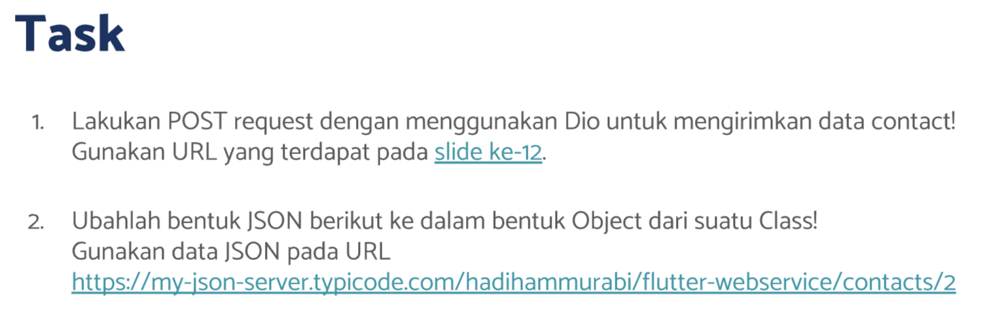
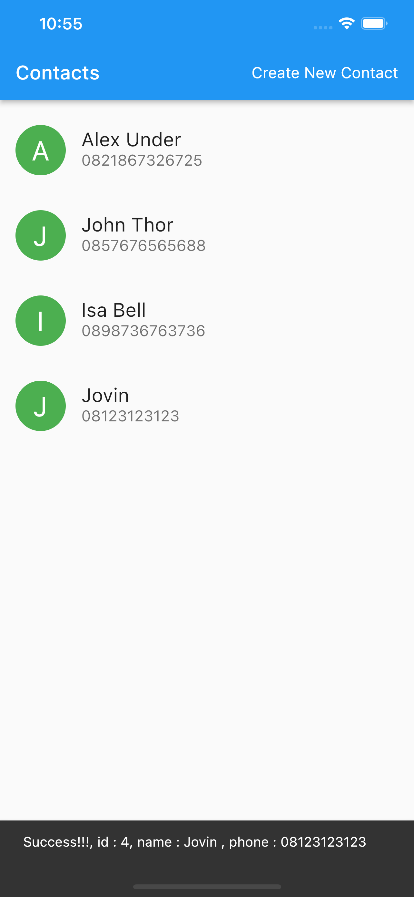
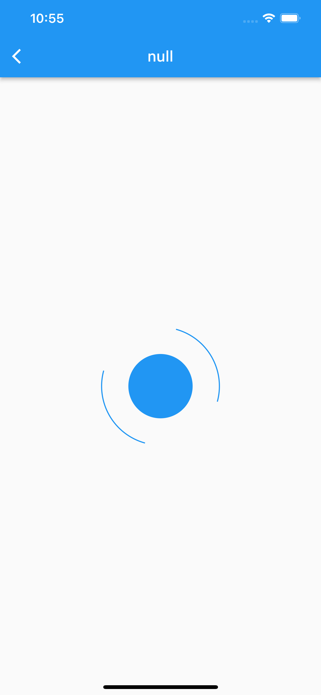
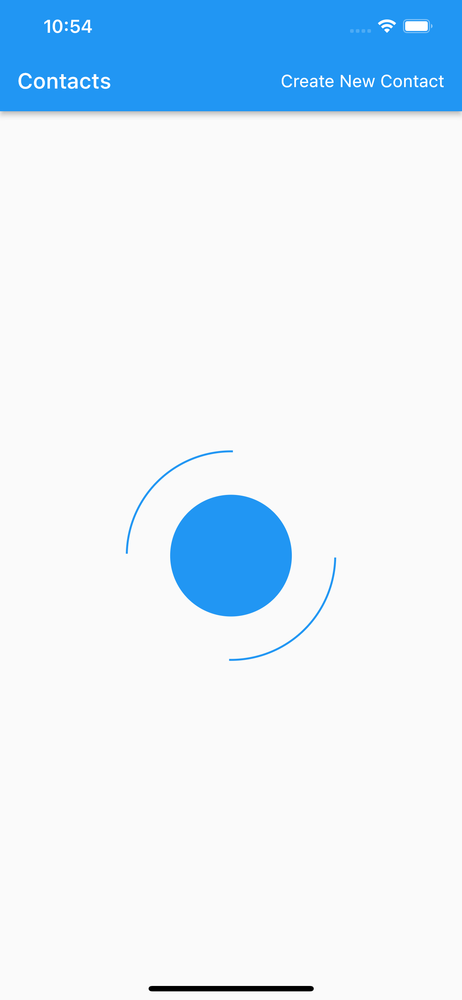

# (24) Introduction REST API - JSON serialization deserialization

## Resume

Dalam materi ini, mempelajari :

1. HTTP & Rest API
2. Dio
3. JSON Serialization & Deserialization

### HTTP & Rest API

REST API adalah sebuah jembatan yang menghubungkan antara Tampilan dengan proses bisnis dengan cara melalui HTTP Request.

HTTP adalah sebuah protokol yang digunakan untuk mengirim data antara client dengan server. Client mengirim request dan server membalas dengan respo

Struktur Request :

- URL
- Method : GET, POST, PUT, PATCH, DELETE
- Header berisi informasi seperti token authentikasi dan lain-lain.
- Body berisi data yang ingin dikirim

Struktur Response :

- Status Code : 200, 404, 400, 500
- Header berisi informasi dari server
- Body berisi data yang sudah diproses oleh server

### Dio

Dio adalah salah satu package yang digunakan untuk berinteraksi dengan Rest API dan berfungsi sebagai HTTP Client.
Untuk menggunakan Dio, kita harus menambahkan package Dio dari pub.dev kemudian menginstallnya kedalam projek kita.

Penggunaan Dio:

```dart
Dio().get("https://jovinlidan/cv").then((response) {
    print(response);
})
```

```dart
Dio().post("https://jovinlidan/cv", data : data).then((response) {
    print(response);
})
```

### JSON Serialization & Deserialization

JSON (Javascript Object Notation) adalah suatu format data yang digunakan untuk mengirimkan data dari client ke server.

Serialization
Cara mengubah data menjadi format JSON dapat menggunakan package `dart:convert` kemudian menggunakan fungsi jsonEncode

Deserialization
Cara mengubah data menjadi format JSON dapat menggunakan package `dart:convert` kemudian menggunakan fungsi jsonDecode

## Task

**Soal1 dan Soal2:**



**Output:**







**Penjelasan:**

```dart
class Repositories {
  static Dio? _dio;

  Repositories._internal() {
    // ignore: prefer_conditional_assignment
    if (_dio == null) {
      // Jika instance belum ada, maka lakukan inisialisasi
      _dio = Dio(
        BaseOptions(
            baseUrl: 'https://my-json-server.typicode.com/hadihammurabi/flutter-webservice/'),
      );
    }
  }
  factory Repositories() {
    return Repositories._internal();
  }

  Future<dynamic>? get({required String url}) async {
    Response<dynamic>? res = await _dio?.get(url);
    return Future.value(res?.data);
  }

  Future<dynamic>? post<T>({required String url, required T data}) async {
    Response<dynamic>? res = await _dio?.post(url, data: data);
    return Future.value(res?.data);
  }
}
```

Class diatas adalah class Repositories yang menggunakan pattern factory agar setiap pemanggilan constructor class tidak membuat object class yang baru. Didalamnya terdapat instansi dio dengan static flag agar tidak membuat dio berulang ulang. Kemudian didalamnya terdapat 2 method http yaitu get dan post. Repositories.\_internal adalah constructor private yang hanya dipanggil oleh class itu dan didalamnya menginisialisasi dio dengan BaseOptions beserta baseUrl (prefixUrl)

---

```dart
class PostContact {
  late Repositories repo;
  PostContact() {
    repo = Repositories();
  }
  Future<dynamic>? post({required Contact contact}) async {
    return await repo.post<Map<String, dynamic>>(url: "contacts", data: Contact.encodeOne(contact));
  }
}
```

Class PostContact diatas untuk melakukan post method , didalamnya berisi fungsi post yang akan mengembalikan hasil pemanggilan post api dengan data dari parameter. `Contact.encodeOne` untuk melakukan encode dari class Contact menjadi `Map<String, json>`

---

```dart
class GetContacts {
  late Repositories _repo;

  GetContacts() {
    _repo = Repositories();
  }
  Future<List<Contact>> get() async {
    List<dynamic> res = await _repo.get(url: "contacts");
    return await Future.value(Contact.decode(res));
  }
}
```

Class GetContacts diatas untuk melakukan get method, didalamnya berisi fungsi get dari Repositories dengan url dan mengembalikan nilainya berupa `List<Contact>` yang didapatkan dari hasil operasi `Contact.decode`.

---

```dart
class GetContact {
  late Repositories _repo;
  late int id;

  GetContact({required this.id}) {
    _repo = Repositories();
  }
  Future<Contact> get() async {
    dynamic res = await _repo.get(url: "contacts/$id");
    return await Future.value(Contact.decodeOne(res));
  }
}
```

Class GetContact diatas untuk melakukan get method, didalamnya berisi fungsi get dari Repositories kemudian mengembalikan Contact dari `Contact.decodeOne`

---

```dart
void contactInit() async {
    try {
      setState(() => isLoading = true);
      isLoading = true;
      getContact = GetContact(id: widget.id);
      Contact newContact = await getContact.get();
      setState(() {
        contact = newContact;
      });
    } catch (e) {
      if (e is DioError) {
        ScaffoldMessenger.of(context).showSnackBar(SnackBar(content: Text(e.message)));
      }
    } finally {
      setState(() => isLoading = false);
    }
  }
```

Fungsi diatas adalah fungsi yang dipanggil dalam initState dimana didalamnya terdapat try catch. Jika operasi get dari object GetContact berhasil maka hasil tersebut akan di set kedalam state. Jika gagal dan error tersebut merupakan object dari DioError maka akan menampilkan Snackbar dengan message error.

---

```dart
void initContacts() async {
    try {
      setState(() => isLoading = true);
      List<Contact> res = await getContacts.get();
      setState(() {
        data = res;
      });
    } catch (e) {
      if (e is DioError) {
        ScaffoldMessenger.of(context).showSnackBar(SnackBar(content: Text(e.message)));
      }
    } finally {
      setState(() => isLoading = false);
    }
  }
```

Fungsi diatas adalah fungsi yang dipanggil dalam initState dimana didalamnya terdapat try catch. Jika operasi get dari object GetContacts berhasil maka hasil tersebut akan di set kedalam state. Jika gagal dan error tersebut merupakan object dari DioError maka akan menampilkan Snackbar dengan message error.

---

```dart
if (res != null) {
      try {
        Map<String, dynamic> postRes = await postContact.post(contact: res);
        ScaffoldMessenger.of(context).showSnackBar(SnackBar(
            content: Text(
                "Success!!!, id : ${postRes['id']}, name : ${postRes['name']} , phone : ${postRes['phone']}")));
        setState(() {
          data = [...data, res];
        });
      } catch (e) {
        if (e is DioError) {
          ScaffoldMessenger.of(context).showSnackBar(SnackBar(content: Text(e.message)));
        }
      }
    }
```

Potongan kode diatas digunakan untuk memanggil post method. Dengan memberikan hasil contact pada bagian res, jika operasi tersebut berhasil maka akan menampilkan snackbar dan hasilnya di append kedalam state. Jika gagal maka akan muncul snackbar yang menampilkan hasil error.
