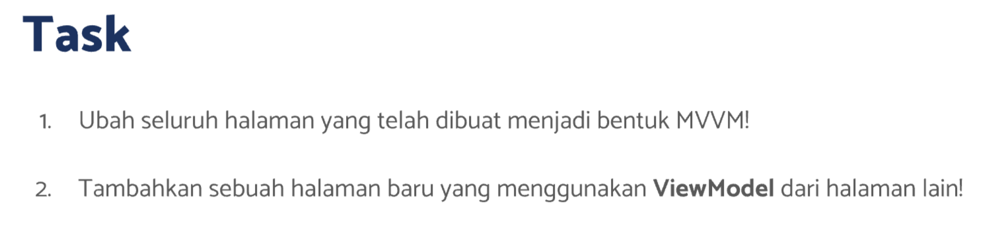
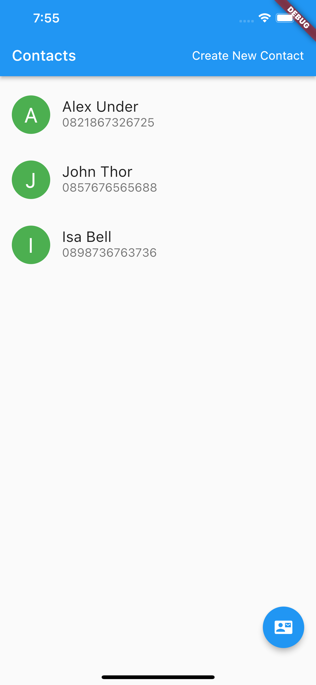
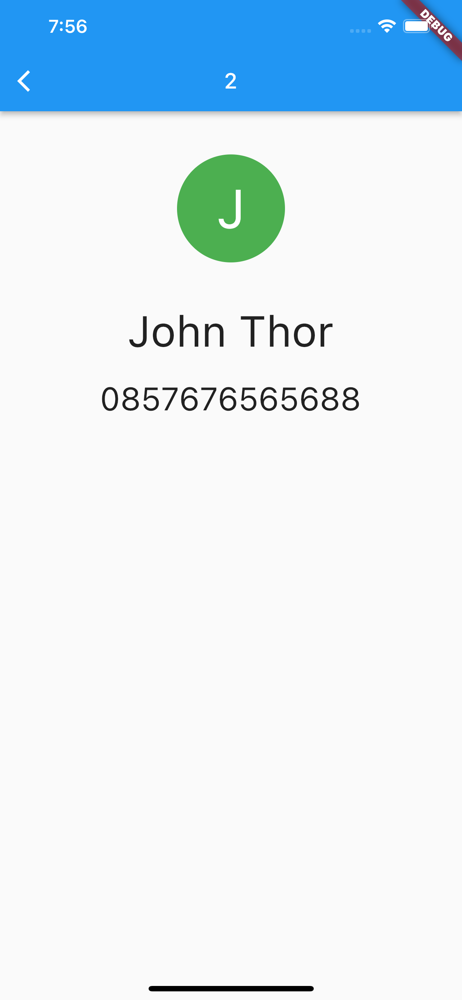
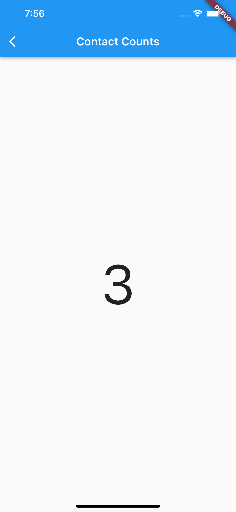
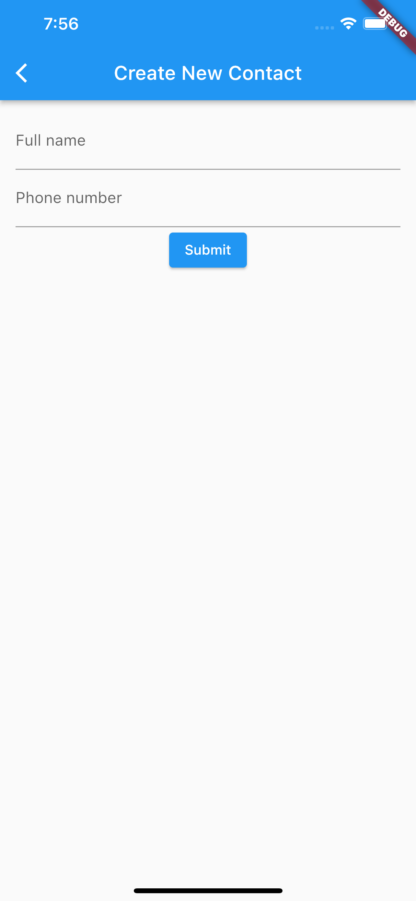
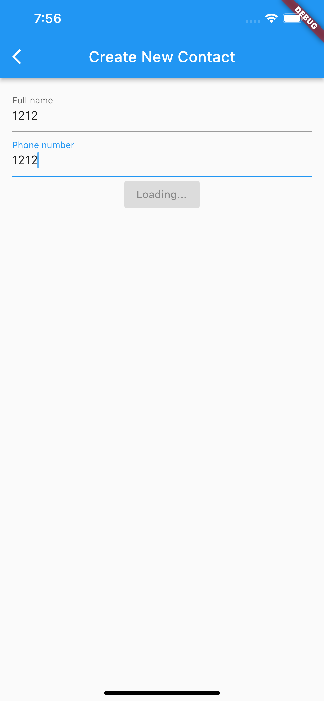
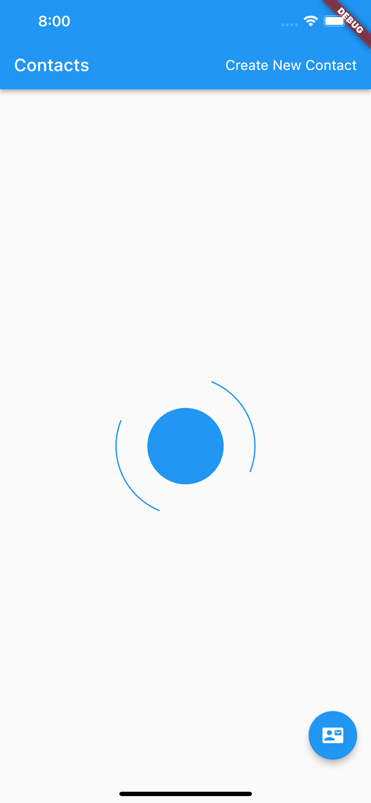

# (25) MVVM Architecture

## Resume

Dalam materi ini, mempelajari :

1. MVVM Architecture
2. Aturan
3. Implementasi

### MVVM Architecture

MVVM adalah sebuah arsitektur dalam dunia pemograman yang memisahkan logic dengan view dan ditaruh kedalam viewmodel.
Dengan menggunakan arsitektur MVVM, kita meminimalisir kode yang sama berulang kali dengan logic yang sudah dibuat pada view model.Logic yang tidak menyatu dengan tampilan membuat aplikasi kita tampak lebih mudah di rawat dan proses testing menjadi lebih mudah

### Aturan

Dalam menggunakan arsitektur MVVM, ada beberapa aturan yang harus dipenuhi , yaitu :

- Pada Folder model, kita harus memisahkan model dengan sumber data dari model tersebut.
- Screen harus ditaruh kedalam folder yang didalamnya berisi view dan viewmodel.
- Dalam model terdapat model dan api. API akan berisi beberapa method rest api seperti get, post, put dan lain-lain. Sedangkan model akan berisi model dari data dan beberapa fungsi untuk mengubah data tersebut ke bentuk json atau pun sebaliknya ke dalam bentuk class modelnya.
- View model merupakan file yang berisi logic yang melakukan kontak ke api yang kita buat dan akan diakses oleh View. Dalam view model akan mengextends ChangeNotifier dikarenakan view yang mengconsume akan bertindak seperti provider.

### Implementasi

File API

```dart
class ContactAPI {
  static Future<List<Contact>> getContacts() async {
    Repositories repo = Repositories();
    final response = await repo.get(url: 'contacts');
    return await Future.value(Contact.decode(response));
  }

  static Future<Contact> getContact({required int id}) async {
    Repositories repo = Repositories();
    final response = await repo.get(url: 'contacts/$id');
    return await Future.value(Contact.decodeOne(response));
  }

  static Future<Contact> postContact({required Contact contact}) async {
    Repositories repo = Repositories();
    final response =
        await repo.post<Map<String, dynamic>>(url: "contacts", data: Contact.encodeOne(contact));
    return await Future.value(Contact.decodeOne(response));
  }
}
```

File Model

```dart
class Contact {
  int id;
  String name;
  String phone;

  Contact({required this.id, required this.name, required this.phone});

  factory Contact.fromJson(Map<String, dynamic> jsonData) {
    return Contact(
      id: jsonData['id'],
      name: jsonData['name'],
      phone: jsonData['phone'],
    );
  }

  static Map<String, dynamic> toMap(Contact person) => {
        'id': person.id,
        'name': person.name,
        'phone': person.phone,
      };

  static String encode(List<Contact> persons) => json.encode(
        persons.map<Map<String, dynamic>>((person) => Contact.toMap(person)).toList(),
      );
  static Map<String, dynamic> encodeOne(Contact person) => Contact.toMap(person);

  static List<Contact> decode(List<dynamic> data) =>
      (data.map<Contact>((item) => Contact.fromJson(item)).toList());

  static Contact decodeOne(dynamic person) => Contact.fromJson(person);
}
```

File View Model

```dart
class ContactsViewModel with ChangeNotifier {
  ApiResponse<List<Contact>> _contacts = ApiResponse(status: ApiStatus.success, data: []);

  ApiResponse<List<Contact>> get contacts => _contacts;

  void changeState(ApiResponse<List<Contact>> state) {
    _contacts = state;
    notifyListeners();
  }

  getAllContacts() async {
    changeState(ApiResponse(status: ApiStatus.loading));
    final __contacts = await ContactAPI.getContacts();
    changeState(ApiResponse(status: ApiStatus.success, data: __contacts));
  }
}
```

File View

```dart

class ContactsScreen extends StatefulWidget {
  const ContactsScreen({Key? key}) : super(key: key);

  @override
  State<ContactsScreen> createState() => _ContactsScreenState();
}

class _ContactsScreenState extends State<ContactsScreen> {
  @override
  void didChangeDependencies() {
    WidgetsBinding.instance!.addPostFrameCallback((timeStamp) {
      Provider.of<ContactsViewModel>(context, listen: false).getAllContacts();
    });
    super.didChangeDependencies();
  }

  Future<void> onNavigateNewContactScreen(BuildContext context) async {
    Navigator.pushNamed(context, '/contact-create');
  }

  @override
  Widget build(BuildContext context) {
    return Scaffold(
      floatingActionButton: FloatingActionButton(
          child: const Icon(Icons.contact_mail),
          onPressed: () => Navigator.pushNamed(context, '/contact-counts')),
      appBar: AppBar(
        title: const Text(
          "Contacts",
          style: TextStyle(fontSize: 20),
        ),
        centerTitle: false,
        actions: [
          Container(
            margin: const EdgeInsets.symmetric(horizontal: 16),
            child: InkWell(
              child: const Center(
                child: Text(
                  "Create New Contact",
                  style: TextStyle(
                    color: Colors.white,
                    fontSize: 16,
                  ),
                ),
              ),
              onTap: () => onNavigateNewContactScreen(context),
            ),
          )
        ],
      ),
      body: Consumer<ContactsViewModel>(
        builder: ((_, value, __) => value.contacts.status == ApiStatus.loading
            ? const Center(
                child: LoadingIndicator(indicatorType: Indicator.ballClipRotatePulse),
              )
            : ListView(
                padding: const EdgeInsets.only(top: 8),
                children: value.contacts.data!.map((e) => CustomCard(person: e)).toList(),
              )),
      ),
    );
  }
}
```

## Task

**Soal1 dan Soal2:**



**Output:**








**Penjelasan:**

```dart
class ContactAPI {
  static Future<List<Contact>> getContacts() async {
    Repositories repo = Repositories();
    final response = await repo.get(url: 'contacts');
    return await Future.value(Contact.decode(response));
  }

  static Future<Contact> getContact({required int id}) async {
    Repositories repo = Repositories();
    final response = await repo.get(url: 'contacts/$id');
    return await Future.value(Contact.decodeOne(response));
  }

  static Future<Contact> postContact({required Contact contact}) async {
    Repositories repo = Repositories();
    final response =
        await repo.post<Map<String, dynamic>>(url: "contacts", data: Contact.encodeOne(contact));
    return await Future.value(Contact.decodeOne(response));
  }
}
```

Kode diatas berisi beberapa fungsi metode getContacts untuk mengambil seluruh contact, getContact untuk mengambil 1 kontak dengan id tertentu dan postContact untuk melakukan post dengan contact sebagai body param.

---

```dart
class Contact {
  int id;
  String name;
  String phone;

  Contact({required this.id, required this.name, required this.phone});

  factory Contact.fromJson(Map<String, dynamic> jsonData) {
    return Contact(
      id: jsonData['id'],
      name: jsonData['name'],
      phone: jsonData['phone'],
    );
  }

  static Map<String, dynamic> toMap(Contact person) => {
        'id': person.id,
        'name': person.name,
        'phone': person.phone,
      };

  static String encode(List<Contact> persons) => json.encode(
        persons.map<Map<String, dynamic>>((person) => Contact.toMap(person)).toList(),
      );
  static Map<String, dynamic> encodeOne(Contact person) => Contact.toMap(person);

  static List<Contact> decode(List<dynamic> data) =>
      (data.map<Contact>((item) => Contact.fromJson(item)).toList());

  static Contact decodeOne(dynamic person) => Contact.fromJson(person);
}
```

Kode diatas adalah model dari Contact.

---

```dart
class ContactsViewModel with ChangeNotifier {
  ApiResponse<List<Contact>> _contacts = ApiResponse(status: ApiStatus.success, data: []);

  ApiResponse<List<Contact>> get contacts => _contacts;

  void changeState(ApiResponse<List<Contact>> state) {
    _contacts = state;
    notifyListeners();
  }

  getAllContacts() async {
    changeState(ApiResponse(status: ApiStatus.loading));
    final __contacts = await ContactAPI.getContacts();
    changeState(ApiResponse(status: ApiStatus.success, data: __contacts));
  }
}
```

Kode diatas adalah view model dengan metode get untuk mengambil seluruh contact

---

```dart
class ContactDetailViewModel with ChangeNotifier {
  ApiResponse<Contact>? _contact = ApiResponse(status: ApiStatus.loading);

  ApiResponse<Contact>? get contact => _contact;

  void changeState(ApiResponse<Contact>? state) {
    _contact = state;
    notifyListeners();
  }

  getContact({required int id}) async {
    changeState(ApiResponse<Contact>(status: ApiStatus.loading));
    final __contact = await ContactAPI.getContact(id: id);
    changeState(ApiResponse<Contact>(status: ApiStatus.success, data: __contact));
  }
}
```

Kode diatas adalah view model dengan metode get untuk mengambil 1 kontak dengan id tertentu.

---

```dart
class ContactCreateViewModel extends ChangeNotifier {
  ApiResponse<Contact>? _contact = ApiResponse(status: ApiStatus.success);

  ApiResponse<Contact>? get contacts => _contact;

  void changeState(ApiResponse<Contact>? state) {
    _contact = state;
    notifyListeners();
  }

  Future<void> postContact({required Contact contact}) async {
    changeState(ApiResponse(status: ApiStatus.loading));
    final __contact = await ContactAPI.postContact(contact: contact);
    changeState(ApiResponse<Contact>(data: __contact, status: ApiStatus.success));
  }
}
```

Kode diatas adalah view model dengan metode post untuk melakukan post dengan contact dari parameter dan dimasukkan ke dalam body param.

---

```dart
class Repositories {
  static Dio? _dio;

  Repositories._internal() {
    // ignore: prefer_conditional_assignment
    if (_dio == null) {
      // Jika instance belum ada, maka lakukan inisialisasi
      _dio = Dio(
        BaseOptions(
            baseUrl: 'https://my-json-server.typicode.com/hadihammurabi/flutter-webservice/'),
      );
    }
  }
  factory Repositories() {
    return Repositories._internal();
  }

  Future<dynamic>? get({required String url}) async {
    Response<dynamic>? res = await _dio?.get(url);
    return Future.value(res?.data);
  }

  Future<dynamic>? post<T>({required String url, required T data}) async {
    Response<dynamic>? res = await _dio?.post(url, data: data);
    return Future.value(res?.data);
  }
}
```

Kode diatas adalah sebuah repositories dengan singleton pattern untuk mengatur config dari Dio.

---

```dart
class ApiResponse<T> {
  late T? data;
  late ApiStatus status;
  late String? message;

  ApiResponse({this.data, required this.status, this.message});
}
```

Kode diatas adalah class yang berfungsi sebagai format data dari setiap view model.

---

```dart
 @override
  void didChangeDependencies() {
    WidgetsBinding.instance!.addPostFrameCallback((timeStamp) {
      Provider.of<ContactsViewModel>(context, listen: false).getAllContacts();
    });
    super.didChangeDependencies();
  }
```

didChangeDependencies diatas akan dipanggil ketika context sudah tersedia dan dapat digunakan, untuk menggunakan provider kita memerlukan context. addPostFrameCallback akan dipanggil setelah frame siap dipanggil dan berfungsi untuk melakukan fetch data untuk mengisi data dari contacts yang ada didalam view model.
