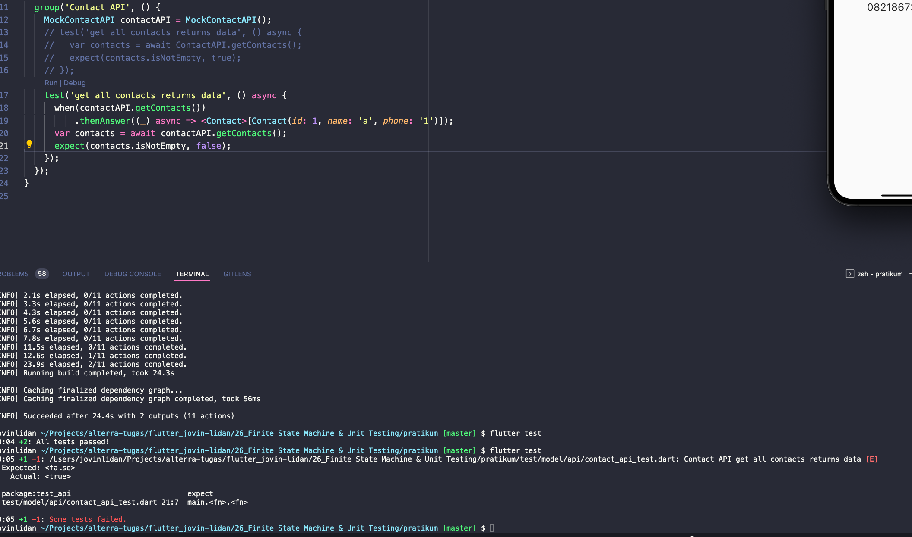

# (26) Finite State Machine & Unit Testing

## Resume

Dalam materi ini, mempelajari :

1. Finite State
2. Testing
3. Mocking

### Finite State

Finite State berisi beberapa state, umumnya adalah loading , idle dan error. Dimana masing-masing state merepresentasikan keadaan dari API yang sedang kita panggil. Biasanya ketiga state ini digunakan pada view model untuk menjelaskan bagaimana keadaan state dari API kita.

Untuk menggunakannya pada widget kita dapat melakukan if atau pengecekan pada enum statenya , jika bernilai loading maka tampilkan tampilan loading , dan juga seterusnya untuk state lainnya.

### Testing

Testing adalah salah satu bagian dalam proses pengembangan suatu aplikasi. Tahap testing adalah tahap mendekati akhir untuk melakukan validasi apakah aplikasi yang kita bangun sudah sesuai dengan yang kita inginkan dan dapat berjalan dengan baik.Selain sebagai validasi, testing dapat digunakan sebagai dokumentasi.

Dalam flutter, untuk melakukan testing kita perlu menambahkan dependencies test pada bagian dev_dependencies. Kemudian buat file dengan format \*\_api_test.dart.
Didalam file tersebut tambahkan fungsi main yang berisi :

```dart
test('get all contacts returns data', () async {
    var contacts = await ContactAPI.getAllContacts();
    expect(contacts.isNotEmpty, true);
});
```

Setelah itu jalankan test dengan command `flutter test`.

Jika nilai contacts yang diambil dari api diatas kosong, maka testing akan berujung pada kegagalan karena kita mengharapkan hasil isNotEmpty bernilai true.

Untuk mengelompokkan beberapa test dapat menggunakan `group` :

```dart
  group('Contact API', () {
    test('get all contacts returns data', () async {
        var contacts = await ContactAPI.getAllContacts();
        expect(contacts.isNotEmpty, true);
    });
  });
```

### Mocking

Mocking adalah sebuah cara untuk melakukan testing, akan tetapi jika kita menggunakan testing dengan cara seperti diatas. Apabila terjadi kesalahan pada API atau server, maka testing kita tidak akan berjalan dan akan menghambat proses pengujian aplikasi. Oleh karena itu, pada Mocking, kita membuat sendiri duplikat atau blueprint dari data yang akan dikembalikan oleh api.

Untuk melakukan mocking, kita perlu menambahkan package `mockito` dan `build_runner` pada bagian dev_dependencies.

Seluruh fungsi static pada class api harus diubah menjadi non-static agar proses mocking dapat berjalan.

Kemudian massukan anotasi seperti:

```dart
@GenerateMocks([ContactAPI])
void main() {
  group('Contact API', () {
    MockContactAPI contactAPI = MockContactAPI();
    test('get all contacts returns data', () async {
      when(contactAPI.getContacts())
          .thenAnswer((_) async => <Contact>[Contact(id: 1, name: 'a', phone: '1')]);
      var contacts = await contactAPI.getContacts();
      expect(contacts.isNotEmpty, true);
    });
  });
}
```

Setelah itu, untuk mengenerate file mocknya dapat menggunakan perintah `flutter pub run build_runner build`. Setelah itu kita dapat memanggil perintah `flutter test` untuk melakukan proses pengujian.

## Task

**Soal1 dan Soal2:**


**Output:**


#### Test


#### MockTest





**Penjelasan:**

```dart
@GenerateMocks([ContactAPI])
void main() {
  group('Contact API', () {
    MockContactAPI contactAPI = MockContactAPI();
    // test('get all contacts returns data', () async {
    //   var contacts = await ContactAPI.getContacts();
    //   expect(contacts.isNotEmpty, true);
    // });
    test('get all contacts returns data', () async {
      when(contactAPI.getContacts())
          .thenAnswer((_) async => <Contact>[Contact(id: 1, name: 'a', phone: '1')]);
      var contacts = await contactAPI.getContacts();
      expect(contacts.isNotEmpty, true);
    });
  });
}
```

Pada kode diatas, saya menguji apakah nilai dari getContacts tidak kosong, dengan data Contact yang saya berikan pada mock adalah : [Contact(id: 1, name: 'a', phone: '1')], maka nilai dari contacts tidak akan kosong.

---

```dart
@GenerateMocks([FoodAPI])
void main() {
  group('Food API', () {
    MockFoodAPI foodAPI = MockFoodAPI();
    // test('get all contacts returns data', () async {
    //   var contacts = await ContactAPI.getContacts();
    //   expect(contacts.isNotEmpty, true);
    // });
    test('get all foods returns data', () async {
      when(foodAPI.getFoods()).thenAnswer((_) async => <Food>[Food(id: 1, name: 'a')]);
      var foods = await foodAPI.getFoods();
      expect(foods.isNotEmpty, true);
    });
  });
}
```

Pada kode diatas, saya menguji apakah nilai dari getFoods tidak kosong, dengan data Food yang saya berikan pada mock adalah :[Food(id: 1, name: 'a')], maka nilai dari foods tidak akan kosong.

---

```dart
Consumer<FoodsViewModel>(
        builder: ((_, value, __) => value.foods.status == ApiStatus.loading
            ? const Center(
                child: LoadingIndicator(indicatorType: Indicator.ballClipRotatePulse),
              )
            : value.foods.status == ApiStatus.error
                ? Center(child: Text("${value.foods.message}"))
                : ListView(
                    padding: const EdgeInsets.only(top: 8),
                    children: value.foods.data!.map((e) => CustomCard(food: e)).toList(),
                  )),
      ),
```

Pada kode diatas saya melakukan pengecekan terhadap status dari value yang diberikan consumer, apabila laoding maka tampilkan data loading, tetapi apabila error maka tampilkan pesan error, sebaliknya jika success maka tampilkan datanya.

---

```dart
getAllFoods() async {
    try {
      changeState(ApiResponse(status: ApiStatus.loading));
      final __foods = await FoodAPI.getFoods();
      changeState(ApiResponse(status: ApiStatus.success, data: __foods));
    } catch (e) {
      if (e is DioError) {
        changeState(ApiResponse(status: ApiStatus.error, message: e.message));
        return;
      }
      changeState(ApiResponse(status: ApiStatus.error, message: "Error!!!"));
    }
  }
```

Fungsi diatas berisi sebuah try catch, apabila proses pemanggilan API mengalami error maka ubah status ke error dan masukkan pesan error kedalam class tersebut.Jika tidak maka tampilkan success dan masukkan datanya. Apabila loading maka tampilkan loading tanpa memberikan sebuah data atau message.

---

```dart
test('get all contacts returns state', () async {
      var contactViewModel = ContactsViewModel();
      expect(contactViewModel.contacts.status, ApiStatus.success);

      contactViewModel.getAllContacts();
      expect(contactViewModel.contacts.status, ApiStatus.loading);

      await contactViewModel.getAllContacts();

      expect(contactViewModel.contacts.status, ApiStatus.success);
    });
```

Kode diatas mengecek apakah state awal adalah success, ketika getAllContacts dipanggil tanpa await maka diharapkan menghasilkan state loading, jika dilakukan await maka diharapkan menghasilkan state success

---

```dart
 test('get all foods returns state', () async {
      var foodsViewModel = FoodsViewModel();
      expect(foodsViewModel.foods.status, ApiStatus.success);

      foodsViewModel.getAllFoods();
      expect(foodsViewModel.foods.status, ApiStatus.loading);

      await foodsViewModel.getAllFoods();

      expect(foodsViewModel.foods.status, ApiStatus.loading);
    });
```

Kode diatas mengecek apakah state awal adalah success, ketika getAllContacts dipanggil tanpa await maka diharapkan menghasilkan state loading, jika dilakukan await maka diharapkan menghasilkan state loading, tetapi state aslinya merupakan success, maka akan terjadi error dengan kode diatas.
