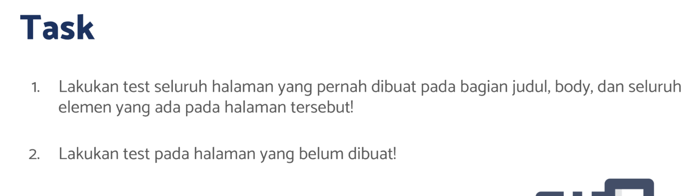
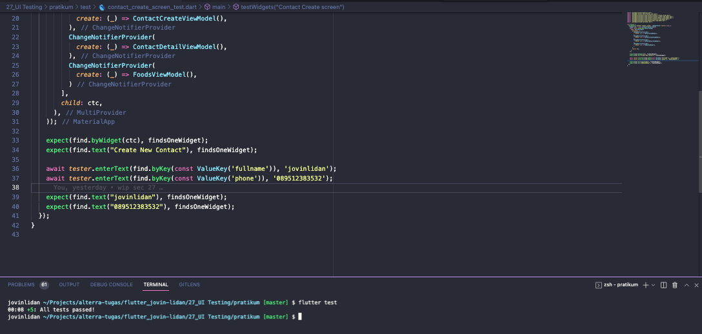
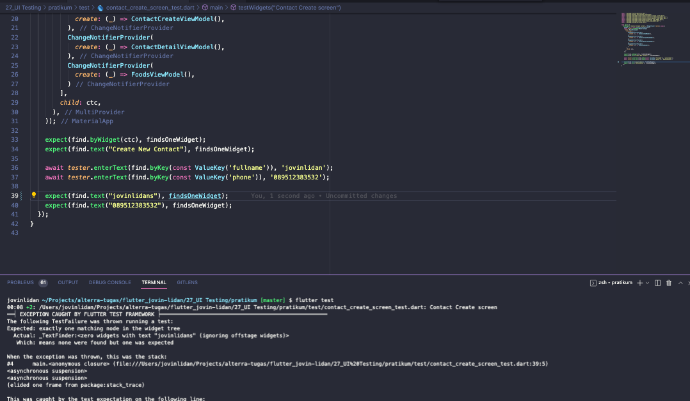

# (27) UI Testing

## Resume

Dalam materi ini, mempelajari :

1. UI Testing dalam flutter
2. UI Testing Dasar
3. UI Testing Lanjutan

### UI Testing dalam flutter

UI testing adalah sebuah tahap dalam pengembangan suatu aplikasi. UI Testing bertujuan untuk meminimalisir bug maupun kesalahan-kesalahan yang dapat terjadi didalam aplikasi , seperti logic error. UI testing melakukan pengujian terhadap tampilan user untuk memastikan apakah tampilan tersebut sudah sesuai dengan yang dirancang. Cara kerja UI Testing di flutter adalah dengan membuat script testing didalam folder test kemudian menjalankan testingnya.

### UI Testing Dasar

Untuk melakukan testing, membutuhkan package `flutter_test`. Kemudian kita dapat menulis script testing kita kedalam folder test dengan ketentuan nama file diakhiri `_test.dart`.

- testWidgets digunakan untuk membuat sebuah test case dengan description tertentu.
- tester.pumpWidget digunakan untuk memunculkan tampilan dengan widget sebagai parameternya.
- expect digunakan untuk menguji, terdapat 2 parameter, parameter pertama dapat diisi dengan nilai aktual, dan parameter kedua berisi nilai yang diharapkan
- find adalah sebuah finder untuk membantu kita melakukan testing.
- `flutter test` untuk menjalankan testing.

### UI Testing Lanjutan

- tester.enterText , untuk memasukkan text kedalam widget text input
- tester.tap , untuk melakukan simulasi tap
- tester.drag , untuk melakukan swipe
- find.byWidget untuk mencari berdasarkan widget
- find.byWidgetPredicate untuk mencari berdasarkan predikat widget
- find.dragFrom untuk melakukan swipe dari titik tertentu
- find.pumpAndSettle untuk mengupdate tampilan

## Task

**Soal1 dan Soal2:**



**Output:**




**Penjelasan:**

```dart

void main() {
  testWidgets('Contact Counts screen', (WidgetTester tester) async {
    Widget ctc = const ContactCountsScreen();
    await tester.pumpFrames(
        MaterialApp(
          home: MultiProvider(
            providers: [
              ChangeNotifierProvider(
                create: (_) => ContactsViewModel(),
              ),
              ChangeNotifierProvider(
                create: (_) => ContactCreateViewModel(),
              ),
              ChangeNotifierProvider(
                create: (_) => ContactDetailViewModel(),
              ),
              ChangeNotifierProvider(
                create: (_) => FoodsViewModel(),
              )
            ],
            child: ctc,
          ),
        ),
        const Duration(seconds: 10));

    expect(find.byWidget(ctc), findsOneWidget);
    expect(find.text("Contact Counts"), findsOneWidget);
    expect(find.text("1"), findsOneWidget);
  });
}
```

Kode diatas melakukan testing terhadap screen ContactCounts. Pengecekan yang dilakukan adalah :

- Cek apakah widget ctc sudah di masukkan dengan baik dengan maksimal 1 buah widget
- Mencari apakah ada 1 widget text "Contact Counts"
- Mencari apakah ada 1 widget text "1"

---

```dart
testWidgets('Contact Create screen', (WidgetTester tester) async {
    Widget ctc = const ContactCreateScreen();
    await tester.pumpWidget(MaterialApp(
      home: MultiProvider(
        providers: [
          ChangeNotifierProvider(
            create: (_) => ContactsViewModel(),
          ),
          ChangeNotifierProvider(
            create: (_) => ContactCreateViewModel(),
          ),
          ChangeNotifierProvider(
            create: (_) => ContactDetailViewModel(),
          ),
          ChangeNotifierProvider(
            create: (_) => FoodsViewModel(),
          )
        ],
        child: ctc,
      ),
    ));

    expect(find.byWidget(ctc), findsOneWidget);
    expect(find.text("Create New Contact"), findsOneWidget);

    await tester.enterText(find.byKey(const ValueKey('fullname')), 'jovinlidan');
    await tester.enterText(find.byKey(const ValueKey('phone')), '089512383532');

    expect(find.text("jovinlidan"), findsOneWidget);
    expect(find.text("089512383532"), findsOneWidget);
  });
```

Kode diatas melakukan testing terhadap screen CreateContact. Pengecekan yang dilakukan adalah :

- Cek apakah widget ctc sudah di masukkan dengan baik dengan maksimal 1 buah widget
- Mencari apakah ada 1 widget text "Create New Contact"
- Masukkan text "jovinlidan" pada widget dengan key "fullname"
- Masukkan text "089512383532" pada widget dengan key "phone"
- Mencari apakah ada 1 widget text "jovinlidan"
- Mencari apakah ada 1 widget text "089512383532"

---

```dart
testWidgets('Contact detail screen', (WidgetTester tester) async {
    Widget ctc = const ContactDetailScreen();
    await tester.pumpWidget(MaterialApp(
      home: MultiProvider(
        providers: [
          ChangeNotifierProvider(
            create: (_) => ContactsViewModel(),
          ),
          ChangeNotifierProvider(
            create: (_) => ContactCreateViewModel(),
          ),
          ChangeNotifierProvider(
            create: (_) => ContactDetailViewModel(),
          ),
          ChangeNotifierProvider(
            create: (_) => FoodsViewModel(),
          )
        ],
        child: ctc,
      ),
    ));

    expect(find.byWidget(ctc), findsOneWidget);
    expect(find.text("1"), findsOneWidget);

    //Testing data
    expect(find.text("Jovin"), findsOneWidget);
    expect(find.text("0895414368368"), findsOneWidget);
    expect(find.text("0895414368367"), findsNothing);
  });
```

Kode diatas melakukan testing terhadap screen ContactDetail. Pengecekan yang dilakukan adalah :

- Cek apakah widget ctc sudah di masukkan dengan baik dengan maksimal 1 buah widget
- Mencari apakah ada 1 widget text "1"
- Mencari apakah ada 1 widget text "Jovin"
- Mencari apakah ada 1 widget text "0895414368368"
- Mencari apakah tidak ada widget text "0895414368367"

---

```dart
testWidgets('Contact screen', (WidgetTester tester) async {
    Widget ctc = const ContactsScreen();
    await tester.pumpFrames(
        MaterialApp(
          home: MultiProvider(
            providers: [
              ChangeNotifierProvider(
                create: (_) => ContactsViewModel(),
              ),
              ChangeNotifierProvider(
                create: (_) => ContactCreateViewModel(),
              ),
              ChangeNotifierProvider(
                create: (_) => ContactDetailViewModel(),
              ),
              ChangeNotifierProvider(
                create: (_) => FoodsViewModel(),
              )
            ],
            child: ctc,
          ),
        ),
        const Duration(seconds: 10));

    expect(find.byWidget(ctc), findsOneWidget);
    expect(find.text("Contacts"), findsOneWidget);
    expect(find.text("Create New Contact"), findsOneWidget);

    //Testing data
    expect(find.text("Jovin"), findsOneWidget);
    expect(find.text("0895414368368"), findsOneWidget);
    expect(find.text("0895414368367"), findsNothing);

    expect(find.byKey(const ValueKey('ContactKey')), findsOneWidget);
    expect(find.byWidgetPredicate((widget) => widget is InkWell), findsWidgets);
    expect(find.byWidgetPredicate((widget) => widget is Consumer), findsWidgets);

    await tester.dragFrom(tester.getTopLeft(find.byType(MaterialApp)), const Offset(300, 0));
    await tester.pumpAndSettle();

    expect(find.text("Foods"), findsOneWidget);
    expect(find.text("Contacts"), findsWidgets);
  });
```

Kode diatas melakukan testing terhadap screen Contacts. Pengecekan yang dilakukan adalah :

- Cek apakah widget ctc sudah di masukkan dengan baik dengan maksimal 1 buah widget
- Mencari apakah ada 1 widget text "Contacts"
- Mencari apakah ada 1 widget text "Create New Contact"
- Mencari apakah ada 1 widget text "Jovin"
- Mencari apakah ada 1 widget text "0895414368368"
- Mencari apakah tidak ada widget text "0895414368367"
- Mencari apakah ada 1 widget dengan ValueKey("ContactKey")
- Mencari apakah ada lebih dari 1 widget dengan predikat InkWell
- Mencari apakah ada lebih dari 1 widget dengan predikat Consumer
- Melakukan swipe dari offset(300,0) dari kiri atas.
- Melakukan update tampilan
- Mencari apakah ada 1 widget text "Foods"
- Mencari apakah ada lebih dari 1 widget text "Contacts"

---

```dart
testWidgets('Food Counts screen', (WidgetTester tester) async {
    Widget ctc = const FoodCountsScreen();
    await tester.pumpFrames(
        MaterialApp(
          home: MultiProvider(
            providers: [
              ChangeNotifierProvider(
                create: (_) => ContactsViewModel(),
              ),
              ChangeNotifierProvider(
                create: (_) => ContactCreateViewModel(),
              ),
              ChangeNotifierProvider(
                create: (_) => ContactDetailViewModel(),
              ),
              ChangeNotifierProvider(
                create: (_) => FoodsViewModel(),
              )
            ],
            child: ctc,
          ),
        ),
        const Duration(seconds: 10));

    expect(find.byWidget(ctc), findsOneWidget);
    expect(find.text("Food Counts"), findsOneWidget);
    expect(find.text("2"), findsOneWidget);
  });
```

Kode diatas melakukan testing terhadap screen FoodCounts. Pengecekan yang dilakukan adalah :

- Cek apakah widget ctc sudah di masukkan dengan baik dengan maksimal 1 buah widget
- Mencari apakah ada 1 widget text "Food Counts"
- Mencari apakah ada 1 widget text "2"

---

```dart
testWidgets('Foods screen', (WidgetTester tester) async {
    Widget fd = const FoodsScreen();
    await tester.pumpFrames(
        MaterialApp(
          home: MultiProvider(
            providers: [
              ChangeNotifierProvider(
                create: (_) => ContactsViewModel(),
              ),
              ChangeNotifierProvider(
                create: (_) => ContactCreateViewModel(),
              ),
              ChangeNotifierProvider(
                create: (_) => ContactDetailViewModel(),
              ),
              ChangeNotifierProvider(
                create: (_) => FoodsViewModel(),
              )
            ],
            child: fd,
          ),
        ),
        const Duration(seconds: 10));
    expect(find.byWidget(fd), findsOneWidget);
    expect(find.text("Foods"), findsOneWidget);
    expect(find.text("Nasi Goreng"), findsOneWidget);

    expect(find.byWidgetPredicate((widget) => widget is Scaffold), findsOneWidget);
    expect(find.byWidgetPredicate((widget) => widget is AppBar), findsOneWidget);
    expect(find.byWidgetPredicate((widget) => widget is Consumer), findsOneWidget);

    await tester.dragFrom(tester.getTopLeft(find.byType(MaterialApp)), const Offset(300, 0));
    await tester.pumpAndSettle();

    expect(find.text("Foods"), findsWidgets);
    expect(find.text("Contacts"), findsOneWidget);

    expect(find.byWidgetPredicate((widget) => widget is ListView), findsWidgets);
  });
```

Kode diatas melakukan testing terhadap screen Foods. Pengecekan yang dilakukan adalah :

- Cek apakah widget fd sudah di masukkan dengan baik dengan maksimal 1 buah widget
- Mencari apakah ada 1 widget text "Foods"
- Mencari apakah ada 1 widget text "Nasi Goreng"
- Mencari apakah ada 1 widget dengan predikat Scaffold
- Mencari apakah ada 1 widget dengan predikat AppBar
- Mencari apakah ada 1 widget dengan predikat Consumer
- Melakukan swipe dari offset(300,0) dari kiri atas.
- Melakukan update tampilan
- Mencari apakah ada 1 widget text "Foods"
- Mencari apakah ada 1 widget text "Contacts"
- Mencari apakah ada lebih dari 1 widget dengan predikat ListView
