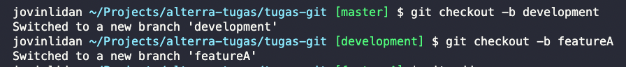
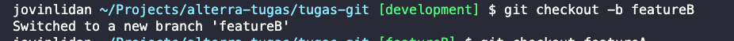
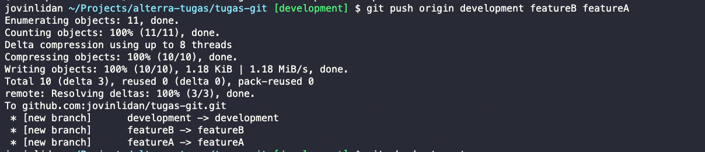
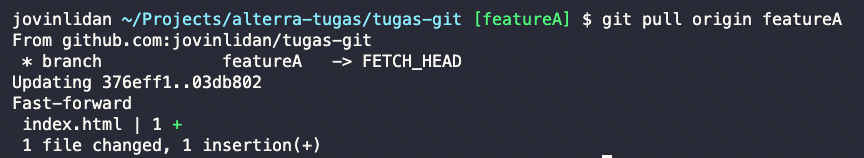
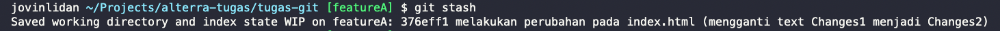
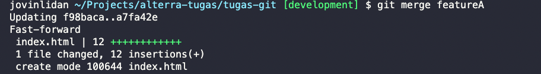
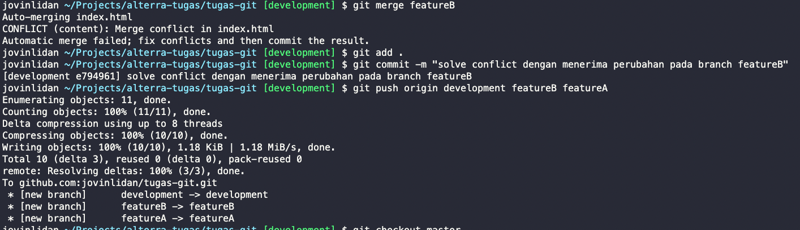
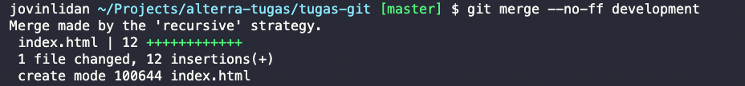

# (2) Basic Version and Branch Management (Git)

---

## Resume

---

Dalam Materi ini , mempelajari:

1. Definisi Git
2. Cara Menggunakan Git
3. Perintah Git

### Definisi Git

Git merupakan sebuah tools yang digunakan untuk mengatur versi dan menyimpan source code dari program kita. Git dapat digunakan secara local maupun remote, yang berarti meskipun server sedang bermasalah, kita tetap dapat melakukan aktivitas kita di local. Github merupakan salah satu hosting server untuk git di server atau remote\*\*

Cara paling rapi menggunakan git pada saat berkolaborasi dengan orang lain adalah dengan membiarkan branch master tidak disentuh langsung, kemudian membuka branch development yang akan menerima seluruh merge request dari branch featureA , featureB dan sebagainya. Kemudian apabila pada branch development sudah tidak ada bug dan codenya sudah clean, maka dilakukan merge ke branch master.

### Cara menggunakan Git

##### Cara menyimpan sebuah catatan perubahan dalam git :

1. Memanggil perintah `git add .` , "." berarti menambahkan seluruh perubahan yang terjadi dalam repository kita ke area staging dari working directory. (_dapat digantikan dengan nama file_)
2. Memanggil perintah `git commit -m "pesan atau catatan yang mendeskripsikan perubahan yang dilakukan"`
3. Jika kita ingin menyimpan perubahan kita ke remote / server, maka dapat memanggil perintah `git push origin {nama branch}`. (_Nama branch diisi dengan nama branch dimana commit dilakukan_)

### Perintah Git

- `git status`, untuk melihat status perubahan atau staged area kita.
- `git stash`, untuk menyimpan perubahan kedalam stash
- `git diff` , untuk melihat perbedaan antara working dengan staging
- `git log`, untuk melihat log commit sebelumnya
- `git checkout`, untuk berpindah branch ataupun commit
- `git pull` , untuk mengambil perubahan dari remote pada suatu branch
- `git fetch`, untuk memperbaharui repository local agar sync dengan remote
- `git reset`, untuk mundur ke commit sebelumnya
- `git branch`, untuk mendapatkan informasi branch
- `git merge`, untuk melakukan merge antar branch
- `git add`, untuk memasukkan perubahan kedalam staging area
- `git commit`, untuk melakukan commit pada staging area

## Task

---

### 1. Membuat repository

Membuat repository baru di alamat https://github.com/jovinlidan/tugas-git

### 2. Membuat Branch

Perintah diatas digunakan untuk membuat branch baru.

### 3. Git Push, Pull, Stash, dan Merge

#### - Git Push

Perintah diatas untuk memasukkan branch development, featureB dan featureA ke remote server.

#### - Git Pull

Perintah diatas untuk mengambil perubahan yang terjadi pada branch remote server dan mengupdatenya kedalam local branch kita.

#### - Git Stash

Perintah Stash diatas untuk menyimpan perubahan kita secara lokal ke dalam stash

#### - Git Merge

Perintah diatas menggabungkan kedua branch antara development dengan branch featureA

### 4. Conflict

Terjadi Conflict ketika melakukan merge dari branch featureB ke branch development dikarenakan kedua branch tersebut mengedit file index.html, kemudian pada saat solve conflict dipilih perubahan yang ada di dalam branch featureB.
Setelah memilih salah satu perubahan yang menyebabkan conflict, maka ketika tidak ada conflict lagi, seluruh perubahan akan di commit dan di push ke remote server.

### 5. Merge no fast forward

Perintah diatas untuk melakukan merge dari branch development ke branch master dengan metode no fast forward dengan menggunakan perintah `git merge --no-ff {branch-name}`
