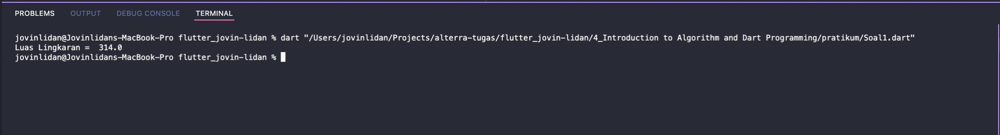
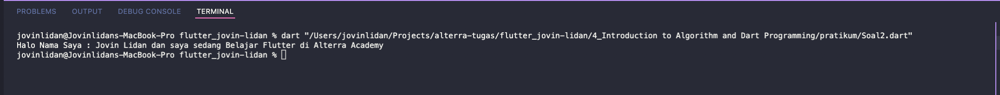

# (5) Basic Dart Programming

## Resume

Dalam materi ini, mempelajari :

1. Definisi Dart
2. Sintaks Dasar Dart
3. Operasi pada Dart

### Definisi Dart

Dart adalah bahasa pemrograman yang digunakan untuk membuat software atau perangkat lunak pada beberapa platform seperti website, desktop dan mobile.
Kelebihan dart adalah type safe, null safety, terdapat banyak library support dan multiplatform.

### Sintaks Dasar Dart

`main()` adalah fungsi utama yang dijalankan pertama kali oleh bahasa pemrograman dart.
Sintaks dasar dart: -`print()`, untuk mencetak sesuatu ke terminal -`// atau /* teks */`, untuk membuat komentar dimana komentar tidak akan dieksekusi oleh komputer. -`var` pada dart untuk membuat variabel dengan tipe data dynamic tergantung nilai yang diberikan pada saat inisialisasi. -`final`, konstanta / nilai variabel tidak dapat diubah.
####Jenis Tipe data Variable: -**`int`**, bilangan bulat -**`String`**, kumpulan karakter -**`bool`**, berisi `true` atau `false` -**`double`**, berisi bilangan desimal atau pecahan
_Cara membuat variable baru : `{tipe data} {nama variable} = {nilai variable};`_

### Operasi pada Dart

- **Aritmatika**
  1 **`+`**, untuk melakukan operasi penjumlahan
  2 **`-`**, untuk melakukan operasi pengurangan
  3 **`*`**, untuk melakukan operasi pengkalian
  4 **`/`**, untuk melakukan operasi pembagian
  5 **`%`**, untuk melakukan operasi modulo

- **Assignment**
  1 **`=`**, untuk memasukkan hasil operator ke variabel
  2 **`+=`**, untuk melakukan operasi penjumlahan dan memasukkan hasilnya kedalam variabel
  3 **`-=`**, untuk melakukan operasi pengurangan dan memasukkan hasilnya kedalam variabel
  4 **`*=`**, untuk melakukan operasi pengkalian dan memasukkan hasilnya kedalam variabel
  5 **`/=`**, untuk melakukan operasi pembagian dan memasukkan hasilnya kedalam variabel
  5 **`%=`**, untuk melakukan operasi modulo dan memasukkan hasilnya kedalam variabel

- **Perbandingan**
  1 **`==`**, untuk membandingkan kesamaan kedua nilai
  2 **`<`**, untuk membandingkan apakah nilai bagian kiri lebih kecil dari nilai bagian kanan
  3 **`<=`**,untuk membandingkan apakah nilai bagian kiri lebih kecil atau sama dengan dari nilai bagian kanan
  4 **`>`**, untuk membandingkan apakah nilai bagian kiri lebih besar dari nilai bagian kanan
  5 **`>=`**, untuk membandingkan apakah nilai bagian kiri lebih besar atau sama dengan dari nilai bagian kanan

- **Logika**
  1 **`&&`**, bernilai `true` hanya apabila kedua perbandingan di kiri dan di kanan bernilai `true`
  2 **`||`**, bernilai `true` apabila salah satu perbandingan di kiri atau di kanan bernilai `true`
  3 **`!`**,untuk melakukan negasi dari sebuah nilai `bool`, `true` menjadi `false` dan sebaliknya.

## Task

### 1. Implementasi Luas Lingkaran



```
void main() {
  //Membuat Rumus Luas Lingkaran
  final pi = 3.14;
  double jari2 = 10;

  print("Luas Lingkaran =  ${pi * (jari2 * jari2)}");
}
```

`final` diatas untuk membuat konstant pi tidak dapat diubah untuk menghindari hal-hal yang tidak diinginkan seperti tidak sengaja mengre-assign nilai pi.
`double` untuk membuat nilai jari-jari dapat memiliki koma.

### 2. Gabungkan 3 Variabel String



```
void main() {
  // Membuat 3 variable string dan menggabungkannya
  String var1 = "Halo Nama Saya :";
  String var2 = " Jovin Lidan dan saya sedang";
  String var3 = " Belajar Flutter di Alterra Academy";

  print(var1 + var2 + var3);
}
```

`String` untuk membuat variabel dengan nilai string.
kemudian memanggil perintah print untuk mencetak nilai ke dalam terminal.
