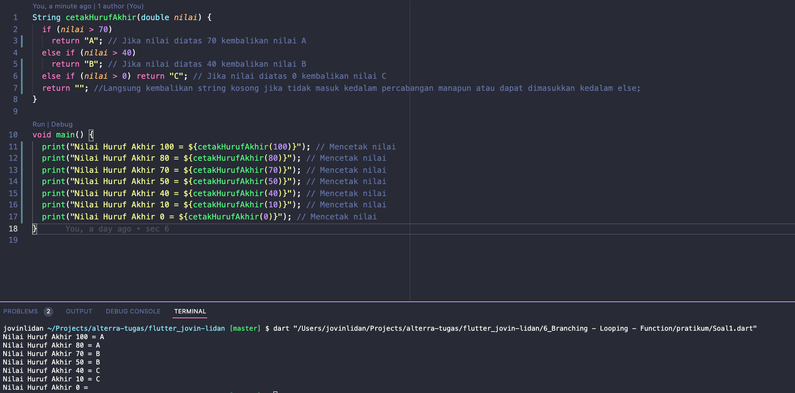
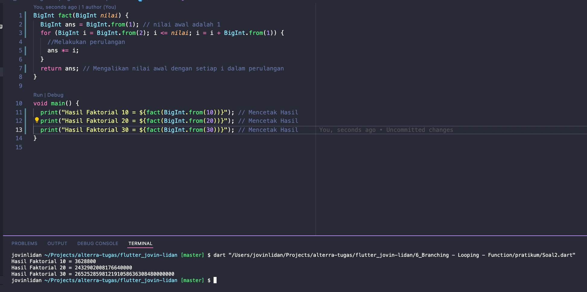

# (6) Branching - Looping - Function

## Resume

Dalam materi ini, mempelajari :

1. Percabangan dalam dart
2. Perulangan dalam dart
3. Mengenal fungsi

### Percabangan dalam dart

Percabangan adalah cara yang digunakan untuk mengubah alur kerja program kita sesuai dengan kondisi atau nilai yang diberikan.

Sintaks percabangan :

- `if`, sebuah percabangan harus dimulai dari keyword ini.
- `else if`, untuk melanjutkan percabangan dari `if` ataupun `else if` _(hanya apabila nilai yang diberikan tidak memenuhi kondisi yang diinginkan)_, dapat menggunakan `else if` ini kembali. _(Percabangan tidak wajib memiliki `else if`)_
- `else`, untuk mengakhiri sebuah percabangan, apabila nilai yang diberikan tidak memenuhi seluruh kondisi dari `if` dan `else if` , maka kode pada `else` akan dijalankan tanpa memerdulikan nilai yang diberikan._(Percabangan tidak wajib memiliki `else`)_

### Perulangan dalam dart

Perulangan adalah cara yang digunakan untuk mengulangi beberapa baris program sekaligus dalam jumlah yang ditentukan.

Sintaks Perulangan

- **For loop**,
  `for(nilai_awal; kondisi; pengubah_nilai_awal){`
  `//baris program`
  `}`
  Nilai awal diisi dengan nilai awal dan hanya akan dipanggil sekali, kemudian jika kondisi bernilai `true` maka perulangan akan dijalankan, pengubah nilai awal digunakan untuk mengubah nilai awal agar membuat kondisi menjadi `false`

- **while**,
  `while(kondisi){ `
  `//baris program`
  `}`
  Perulangan akan selalu terjadi apabila kondisi bernilai `true`.

- **do while**,
  `do {`
  ` //baris program`
  `}while(kondisi);`
  Hampir sama dengan while diatas, akan tetapi pada do while baris program pasti akan dijadikan sekali _(meskipun kondisi bernilai `false`)_ kemudian akan dijalankan kembali hanya apabila kondisi bernilai `true`

Adapun beberapa sintaks yang biasanya dipakai dalam perulangan yaitu:

- `break`, untuk menghentikan proses perulangan secara total.
- `continue`, untuk menghentikan proses perulangan hanya 1x , kemudian program akan dijalankan mulai dari baris awal perulangan. _(Pada for loop, pengubah nilai awal akan dijalankan setelah `continue`)_

### Mengenal Fungsi

Fungsi adalah kumpulan perintah program yang dimasukkan kedalam sebuah wadah yang disebut fungsi , dan dapat digunakan berulang-ulang kali.

Cara Membuat sebuah fungsi adalah diawali dengan mengetikkan tipe data yang akan dikembalikan oleh fungsi tersebut kemudian diikuti oleh nama fungsi tersebut, dan dilanjutkan oleh sekumpulan parameter yang akan diterima oleh fungsi tersebut kemudian diakhiri dengan baris program didalam fungsi.

`void hitung(int angka1){`
`//baris program`
`}`
Keyword `void` diatas dapat diganti dengan berbagai tipe data seperti `int`, `String`, `dynamic`, dan lain-lain.
`angka1` adalah parameter yang diterima oleh fungsi tersebut dan harus sesuai dengan tipe data yang diminta.Misalnya di contoh diatas diminta `int`, maka harus diberikan data berupa `int`, dan berlaku sama dengan tipe data lainnya.

Cara memanggil fungsi diatas adalah dengan `hitung(12);`.

Kemudian untuk kasus dimana `void` diganti dengan `int`, atau tipe data lainnya , maka fungsi wajib mengembalikan nilai berupa tipe data tersebut dengan cara `return 12;` pada akhir fungsi atau dimana fungsi akan berakhir.

## Task

### 1. Implementasi Percabangan dan Fungsi

Kode program diatas menampilkan hasil dari percabangan dengan menggunakan sebuah fungsi.

- Apabila nilai > 70 maka akan mengembalikan A
- Apabila nilai > 40 maka akan mengembalikan B
- Apabila nilai > 0 maka akan mengembalikan C
- Selain dari itu maka kembalikan string kosong

  Solusi diatas menggunakan implementasi dari fungsi dimana dalam fungsi tersebut akan dilakukan beberapa percabangan, apabila memenuhi suatu kondisi maka akan mengembalikan sebuah karakter nilai.

### 1. Implementasi Perulangan dan Fungsi

Kode program diatas untuk menampilkan hasil dari perulangan, dimana setiap perulangan dari _(1 <= x <= nilai)_ akan dikalikan dan dimasukkan dalam sebuah variabel dengan tipe data `double`. Hasil tersebut kemudian dikembalikan dalam sebuah fungsi.
