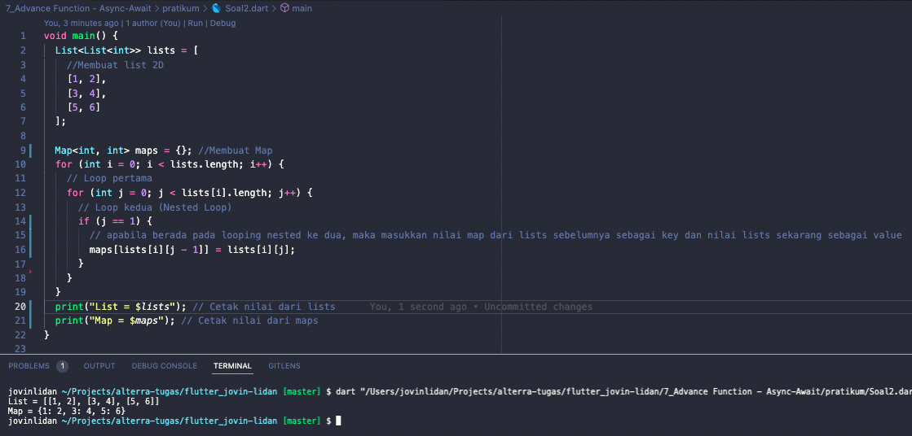

# (7) Advance Function - Async-Await

## Resume

Dalam materi ini, mempelajari :

1. Fungsi Lanjutan & Async-Await
2. List
3. Map

### Fungsi Lanjutan & Async-Await

#### -Fungsi Anonymous

Fungsi Anonymous adalah fungsi yang tidak memiliki nama, biasanya digunakan untuk callback pada suatu fungsi.
Contoh:

Fungsi yang terdapat didalam `Future.forEach` adalah salah satu fungsi anonymous yang bersifat async.

```
(item) async {
    hasil.add((item as int) * pengali);
    print("loop ${item}");
}
```

#### -Fungsi Arrow

Fungsi arrow adalah fungsi yang hanya memiliki 1 baris.
Contoh :
`var iniFungsiArrow = (String val) => print("ini fungsi arrow : $val");`

#### -Async Await

Async await adalah salah satu cara yang digunakan untuk menjalankan baris program secara asynchronous dan menunggu proses itu hingga selesai sebelum menjalankan proses berikutnya.

Cara menggunakan async await adalah dengan meletakkan keyword `async` pada fungsi dimana kita ingin fungsi tersebut berjalan secara asynchronous, setelah itu dapat menggunakan `await` untuk menunggu suatu proses secara asynchronous.

Nilai yang dikembalikan oleh suatu fungsi yang memiliki keyword `async` selalu bertipe data `Future`, seperti `Future<void>` dan lain-lain.

Untuk mendapatkan data yang direturn oleh suatu variabel yang bertipe data Future, harus menggunakan metode async await, dimana async diletakkan pada bagian fungsi dan await diletakkan pada bagian yang bertipe data `Future`.

Contoh :

Pada Program diatas await Future.forEach digunakan untuk menunggu hingga loop foreach selesai dikarenakan fungsi yang di gunakan oleh foreach tersebut adalah fungsi async, maka nilai yang direturn adalah `Future`.

### List

List adalah variabel yang menampung beberapa data sekaligus.
List dapat berupa kumpulan `int`, `String`, `bool`, `dynamic`, bahkan `List` sekalipun dan masih banyak tipe data yang dapat diisi oleh list.

Contoh Penggunaan:

`List<List<int>> lists = [[1,2],[3,4],[5,6]];`, list disamping adalah jenis list yang setiap elemennya merupakan list juga.

Beberapa cara Penggunaan List:

- `lists.add(elemenBaru);`, digunakan untuk menambahkan nilai atau elemen baru kedalam list.
- `lists[index]`, digunakan untuk mengakses nilai dari list, index dapat digantikan 0 hingga panjang dari list - 1
- `lists.remove(elemenList)`, digunakan untuk menghapus nilai atau elemen yang sudah ada didalam list.
- `lists.length`, digunakan untuk mendapatkan panjang dari list.
- `lists.reversed`, untuk membalikkan nilai dari list dan mengembalikan nilai list yang sudah dibalik.
- `lists.first`, mengembalikan nilai pertama dari list.
- `lists.isEmpty`, mengembalikan nilai `false` apabila list tidak kosong dan sebaliknya `true` apabila list kosong.
- `lists.isNotEmpty`, mengembalikan nilai `true` apabila list tidak kosong dan sebaliknya `false` apabila list kosong.
- `lists.clear()`, menghapus nilai dari list.
- Salah satu cara untuk iterasi elemen list satu per satu adalah menggunakan for. Contoh:

```
    for (var list in lists) {
        for (var item in list) {
            print(item);
        }
    }
```

### Map

Map juga merupakan variabel yang menyimpan beberapa nilai sekaligus seperti list.Perbedaannya ada pada dimana list diakses menggunakan index sedangkan map diakses menggunakan key, karena sistem penyimpanan pada map berbasis key-value.

Contoh Penggunaan:

`Map<int,List<int>> maps = {};` pada baris ke 9 adalah salah satu cara menggunakan map.
Map diatas memiliki key dengan tipe data `int`, dan value dengan tipe data `List<int>`.

Jika ingin memasukkan nilai pada awal dapat menggunakan cara :
`Map<int,List<int>> maps = {1 : [1,2]};`

Beberapa cara Penggunaan List:

- `maps.containsKey(key)`, untuk mengecek apakah key tersebut sudah memiliki nilai didalam maps tersebut atau belum. Jika iya, maka akan mengembalikan nilai `true`, dan `false` jika belum.
- `maps.update(key,value)`, untuk memperbaharui nilai dari key yang diberikan , dan harus memastikan jika key yang diberikan didalamnya sudah terdapat nilai.
- `maps[key] = value;` digunakan untuk memasukkan nilai kedalam maps pada key tertentu.
- `maps.keys`, mengembalikan key yang terdapat dalam maps, biasanya digunakan untuk iterasi dalam map.
- `maps.remove(key)`, untuk menghapus nilai pada key tertentu.
- Salah satu cara untuk iterasi elemen list satu per satu adalah menggunakan for. Contoh:

```
for(var key in maps.keys){
    print(maps[key]);
}
```

## Task

### 1. Membuat Fungsi dengan spesifikasi sebagai berikut


- A. Menerima 2 parameter, yaitu list data dan pengali.
  ```
    var fungsiPengali = (List<int> list, int pengali) async {
    };
  ```
- B. Lakukan perulangan pada list data secara asynchronous

  ```
    await Future.forEach(list, (item) async {

    });
  ```

- C. Tiap Perulangan kalikan elemen list data dengan pengali
  ```
    hasil.add((item as int) * pengali);
  ```
- D. return list baru berupa hasil proses diatas.

  ```
  return hasil;
  ```

  Penjelasan singkat :
  pada fungsiPenggali didalamnya inisialisasikan variabel hasil untuk menampung hasil perkalian.Kemudian gunakan Future.forEarch dimana didalamnya diisi dengan anonymous function bersifat async, kemudian await forEach tersebut untuk meunggu hasil perkalian dan proses loop selesai.
  Apabila sudah selesai maka kembalikan list tersebut.

  Function tersebut mengembalikan Future karena menggunakan async, maka pada main ketika memanggil fungsiPenggali maka harus disertai await untuk menunggu hasil dari fungsi tersebut keluar.


Apabila tidak menggunakan await , maka program akan berjalan selesai baru kemudian percabangan selesai.

### 2. Buatlah list dengan spesifikasi berikut


- A. Tiap Elemen berupa list juga.
  ```
  List<List<int>> lists = [
    [1, 2],
    [3, 4],
    [5, 6]
  ];
  ```
- B. Tiap Elemen wajib terdapat 2 data (sub-elemeen)
  ```
  List<List<int>> lists = [
    [1, 2],
    [3, 4],
    [5, 6]
  ];
  ```
- Buatlah sebuah map dengan menggunakan list tersebut.

  ```
  Map<int, int> maps = {}; //Membuat Map
  for (int i = 0; i < lists.length; i++) {
    for (int j = 0; j < lists[i].length; j++) {
      if (j == 1) {
        maps[lists[i][j - 1]] = lists[i][j];
      }
    }
  }
  print("List = $lists");
  ```

  Penjelasan singkat:
  Untuk membuat maps menggunakan lists diatas adalah pertama-tama lakukan iterasi 2x untuk mendapatkan nilai tiap elemen di dalam list tersebut, kemudian jika j == 1 , itu menandakan bahwa elemen tersebut adalah elemen kedua dari sub list, maka masukkan nilai list tersebut sebagai value, dan key nya adalah nilai sebelum nilai tersebut, yaitu j - 1 atau index ke-0.
