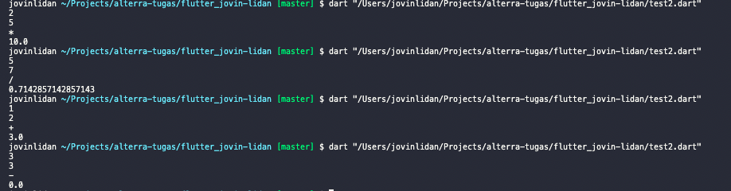

# Task

1.  ```dart
    void main() {
        print("Hello World");
    }
    ```

2.  int, String ,bool, Future, dynamic

3.  ```dart
    void main() {
        String firstName = "Jovin";
        String lastName = "Lidan";
        int age = 20;
        double height = 166.6;

        print("$firstName $lastName $age $height");
    }
    ```

4.  ```dart
    void main() {
        String title = "jOViN LiDan";
        print(title.toUpperCase());
        print(title.toLowerCase());
    }
    ```

5.  Your name is Dhimas

6.  ```dart
    void main() {
        String title = "jOViN LiDan";
        String desc = "jOViN LiDan";
        print(title + desc);
    }
    ```

7.  - toUpperCase, untuk merubah seluruh huruf string menjadi huruf besar.
    - toLowerCase, untuk merubah seluruh huruf string menjadi huruf kecil.

8.  toUpperCase berguna untuk merubah seluruh huruf string menjadi huruf besar.

9.  x : 2, y: 0, z : 0

10. - `text` : const, var, dan final
      text dapat menggunakan const dan final karena variabel tersebut tidak berubah.
    - `topping` : const, var, dan final

      text dapat menggunakan const dan final karena variabel tersebut tidak berubah.

    - `favourite`: var
    - `newText` : var, dan final.

      newText hanya dapat menggunakan final karena nilai dari variabel ini diberikan saat runtime bukan compile-time.

11. null

12. 3 `(int)`

13. ```dart
    double celciusFahrenheit(double cel) {
        return (1.8 * cel) + 32;
    }
    double fahrenheitCelcius(double fah) {
        return (fah - 32) / 1.8;
    }
    void main() {
        print(celciusFahrenheit(30));
        print(fahrenheitCelcius(200));
    }
    ```

    

14. ```dart
    import 'dart:io';
    bool cekGenap(int arg) => (arg % 2 == 0) ? true : false;
    void main() {
        int angka = int.parse(stdin.readLineSync()!);
        print(cekGenap(angka) ? "Genap" : "Ganjil");
    }
    ```

    

15. - 2
    - 0
    - 8
    - 5
    - 0

16. ```dart
    import 'dart:io';
    double calculator(int angka1, int angka2, String op) {
        switch (op) {
            case "+":
            return (angka1 + angka2) * 1.0;

            case "-":
            return (angka1 - angka2) * 1.0;

            case "*":
            return (angka1 * angka2) * 1.0;

            case "/":
            return angka1 / angka2;
            default:
            return 0;
        }
    }

    void main() {
        int angka1 = int.parse(stdin.readLineSync()!);
        int angka2 = int.parse(stdin.readLineSync()!);
        String op = stdin.readLineSync()!;

        print(calculator(angka1, angka2, op));
    }
    ```

    

17. - true
    - false

18. a. int jumlah(int a, int b) => a + b;

19. ```dart
    List list = [];
    Map map = {};
    ```

20. `[1, dua, true]`

21. ```dart
    List<dynamic>
    ```

22. `{spring: 1, summer: 2, autumn: 3}`

23. ```dart
    Map<String, int>
    ```
24. ```DART
    void main() {
        List n = [1, 2, 3, 4, 5];
        print(n.reduce((prev, next) => prev + next));
    }
    ```

25. `restaurants[0]['name']`

26. ```dart
    restaurants.add({
        'name': "Jovin Lidan",
        'cuisine': "Deserts",
        'ratings': [5.0, 5.0, 5.0],
    });
    ```

27. ```dart
    for (var restaurant in restaurants) {
        restaurant.keys.forEach((key) {
            print("$key : ${restaurant[key]}");
        });
    }
    ```

28. ```dart
    for (var restaurant in restaurants) {
        print("Rata rata ratings pada restaurant ${restaurant['name']} : ${(restaurant['ratings'] as List<double>).reduce((prev, next) => prev + next) / (restaurant['ratings'] as List<double>).length}");
    }
    ```

    

29. - hello
    - data berhasil di dapatkan

30. - data berhasil di dapatkan
    - hello
