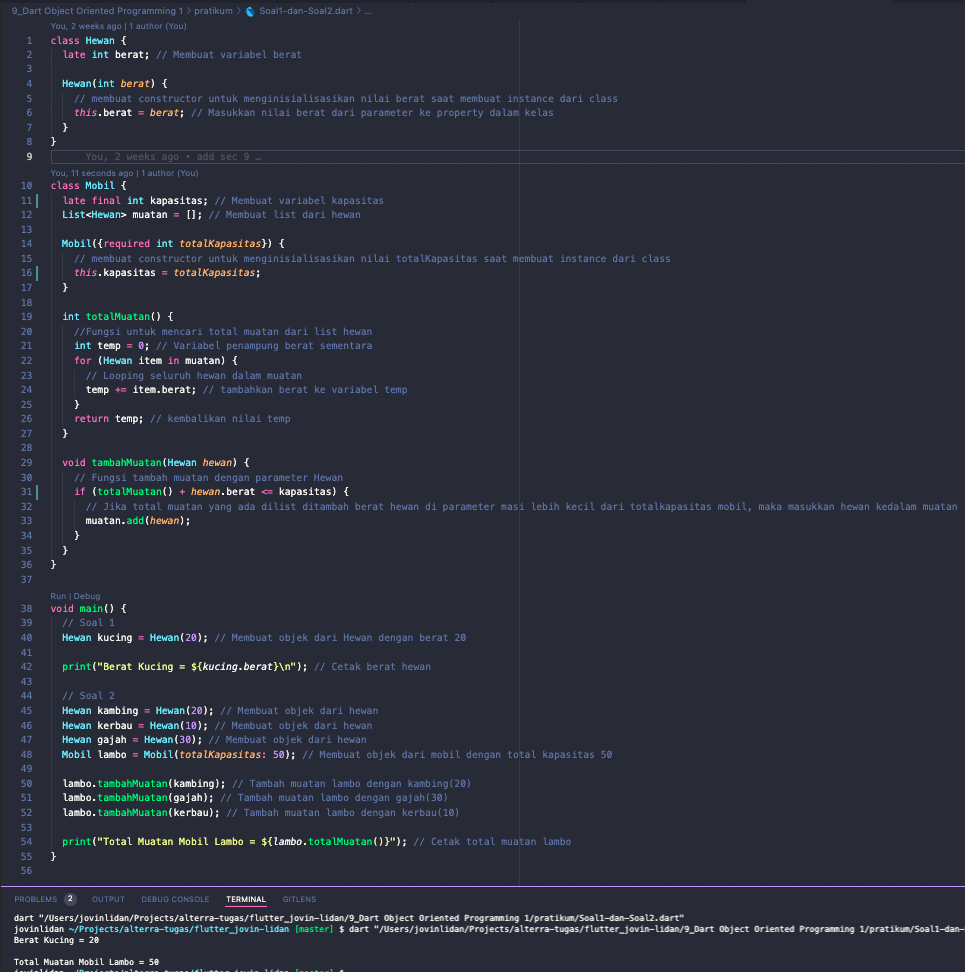

# (9) Dart Object Oriented Programming 1

## Resume

Dalam materi ini, mempelajari :

1. Object Oriented Programming dalam Dart
1. Property Class dalam dart
1. Method Class dalam dart

### Object Oriented Programming dalam Dart

Object Oriented Programming atau OOP adalah metode pemograman yang berorientasi pada objek.
Pada OOP kita seperti mensimulasikan objek-objek pada kehidupan nyata. Seperti Objek Mobil yang memiliki property jumlah ban dan memiliki fungsi yaitu berjalan.

Cara Membuat Class :

```
    class Manusia{
        //Program dalam class
        var umur = 10;

        void berjalan(){
            print("walk--walk);
        }
    }
```

Cara Membuat objek dari class :

```
    Manusia jovin = Manusia();
    //atau
    var jovin = Manusia();
```

### Property Class dalam dart

Property adalah variabel yang terdapat didalam class, property hanya terdapat didalam class itu sendiri.
Kita dapat mengakses sebuah property dengan cara memanggil nama instance dari class yang dibuat kemudian akses nama property nya. Contoh :
`print(jovin.umur);`

### Method Class dalam dart

Method adalah sebuah fungsi yang terdapat didalam class, method juga hanya terdapat didalam class itu sendiri.
Method menggambarkan apa yang dapat dilakukan oleh class tersebut.
Kita dapat mengakses sebuah method dengan cara memanggil nama instance dari class yang dibuat kemudian akses nama method nya seperti memanggil suatu fungsi. Contoh:
`jovin.berjalan()`

## Task

### 1. Membuat class dengan rangkaian berikut



- ##### A. Class Hewan dengan Property Berat yang menyimpan berat badan hewan.

  ```
  class Hewan {
    late int berat;

    Hewan(int berat) {
        this.berat = berat;
    }
  }
  ```

  Penjelasan:

  - `late` diatas digunakan untuk membuat variabel berat dapat diisi melalui constructor dan bukan diisi pada saat deklarasi.
  - ```
    Hewan(int berat) {
        this.berat = berat;
    }
    ```
    Kode diatas adalah sebuah constructor kelas yang dipanggil ketika membuat object dari class tersebut dengan parameter berat, kemudian mengisi property berat dari class dengan nilai yang diberikan oleh parameter.

- ##### B. Class Mobil dengan property muatan yang menampung list data hewan yang menjadi muatan

  ```
  class Mobil {
      List<Hewan> muatan = [];
      //Kode lainnya...
  }
  ```

  Kode diatas membuat list dengan masing masing elemennya adalah objek dari class Hewan.

- ##### C. Method Tambah muatan, jika kapasitas mencukupi, maka tambahkan muatan data hewan pada list muatan.

  ```
  late final int totalKapasitas;
  Mobil({required int totalKapasitas}) {
       this.totalKapasitas = totalKapasitas;
  }
  ```

  Kode diatas untuk membuat sebuah property totalKapasitas yang menandakan maksimum kapasitas tampung sebuah objek mobil. Property total kapasitas akan terisi pada saat membuat objek Mobil dengan menggunakan sebuah constructor dimana parameter totalKapasitas adalah named parameter yang bersifat required atau weajib. Kemudian masukkan nilai totalKapasitas dari parameter kedalam property totalKapasitas class.
  Named parameter adalah parameter yang ketika kita panggil , kita dapat mengisinya secara tidak berurutan , dan bergantung pada namanya masing-masing

  `final` digunakan agar property totalKapasitas tidak dapat diubah lagi dari luar kelas ketika objek dibuat

### 2. Pada class Mobil, tambahkan method totalMuatan untuk menghitung total muatan yang diangkut oleh mobil tersebut.


```
int totalMuatan() {
    int temp = 0;
    for (Hewan item in muatan) {
        temp += item.berat;
    }
    return temp;
}
```

Penjelasan :
variabel temp dibuat untuk menampung hasil penjumlahan sementara, kemudian loop untuk setiap hewan di dalam muatan, tambahkan berat tiap hewan dengan cara mengaksesnya seperti mengakses property, simpan hasil penjumlahan kedalam variabel temp, kemudian kembalikan nilai temp

Pejelasan Singkat Program Task Soal 2:

```
Hewan kambing = Hewan(20);
Hewan kerbau = Hewan(10);
Hewan gajah = Hewan(30);
Mobil lambo = Mobil(totalKapasitas: 50);

lambo.tambahMuatan(kambing);
lambo.tambahMuatan(gajah);
lambo.tambahMuatan(kerbau);

print("Total Muatan Mobil Lambo = ${lambo.totalMuatan()}");

```

Pada Kode program diatas, saya membuat objek hewan kambing, kerbau , gajah dengan masing masing berat 20,10 dan 30. Kemudian saya membuat objek mobil dengan totalKapasitas yaitu 50.
Kemudian saya menambahkan masing masing hewan kedalam mobil secara berurutan dimulai dari kambing, gajah dan kerbau.

- Pada saat memasukkan kambing, sisa kapasitas adalah totalKapasitas - (total muatan ) = 50 - 20 = 30
- Kemudian memasukkan gajah, sisa kapasitas adalah = 30 - 30 = 0;
- Kemudian memasukkan kerbau, sisa kapasitas adalah = 0 - 10 = -10 , karena jumlah kapasitas tidak mencukupi, maka kerbau tidak dimasukkan kedalam muatan mobil.
- Maka totalMuatan adalah 50, dengan sisa muatan adalah 0, dan hewan yang masuk kedalam muatan adalah kambing dan gajah.
