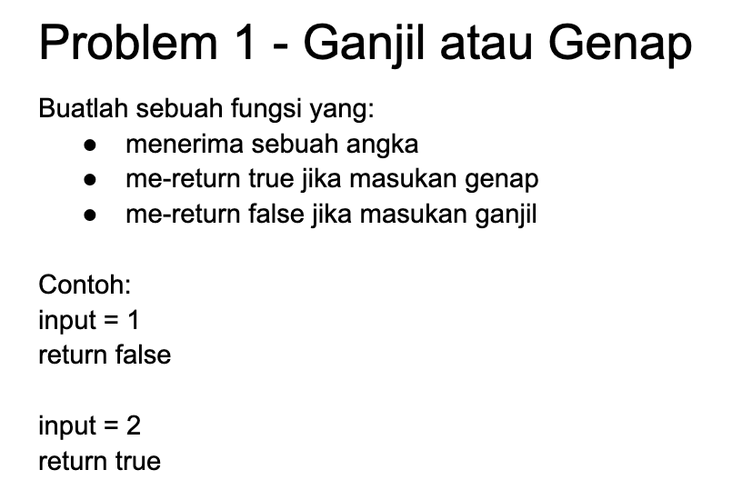
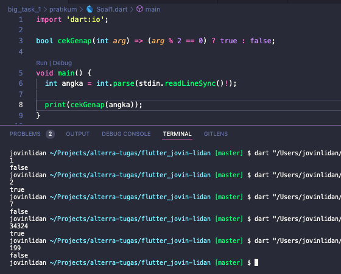
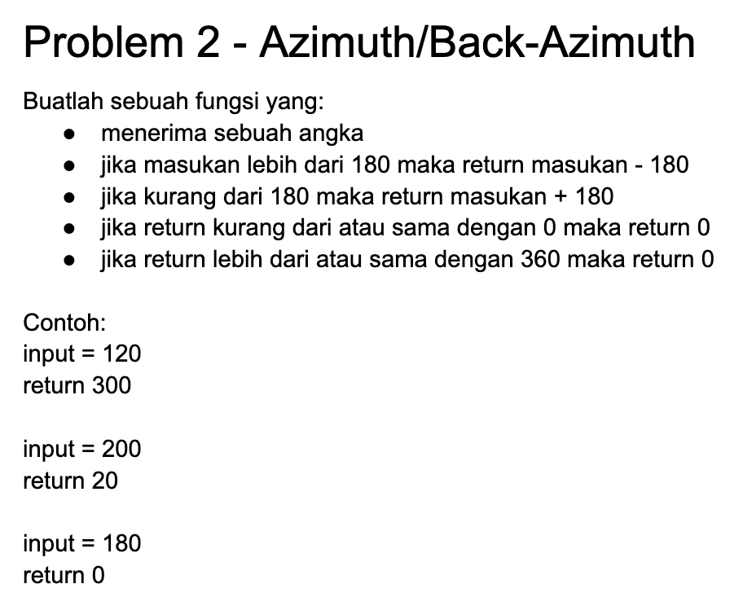
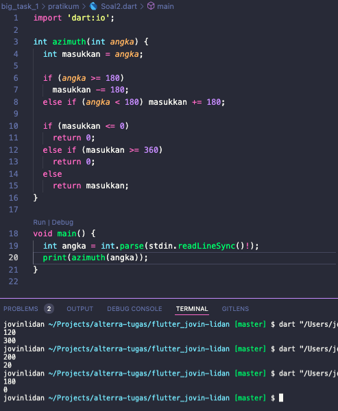
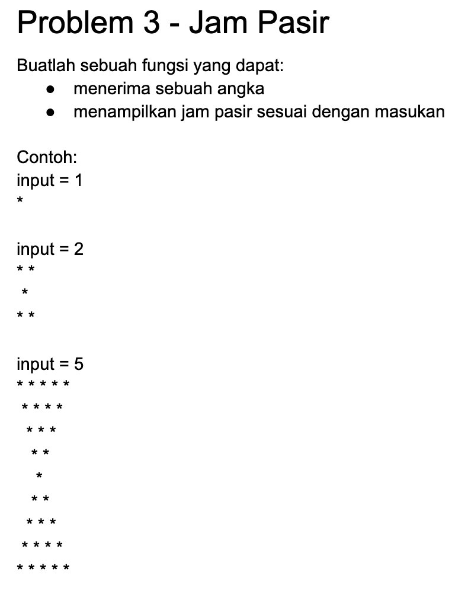
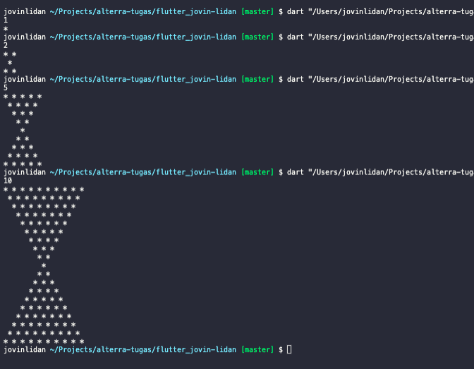
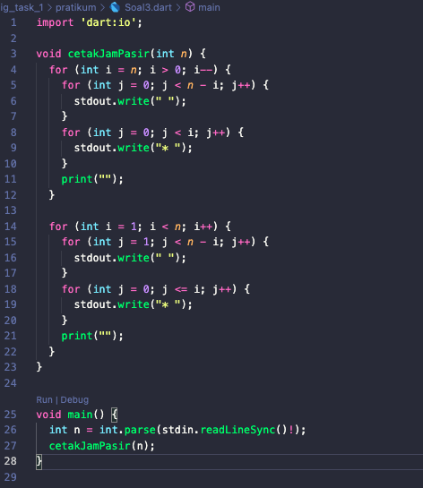
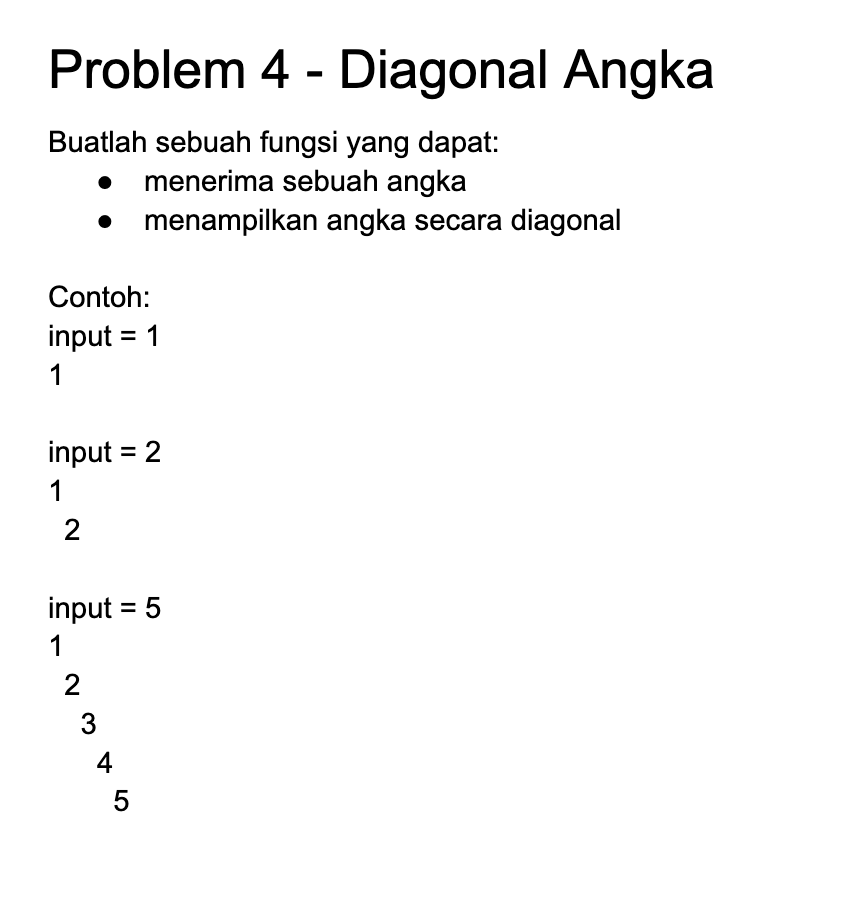
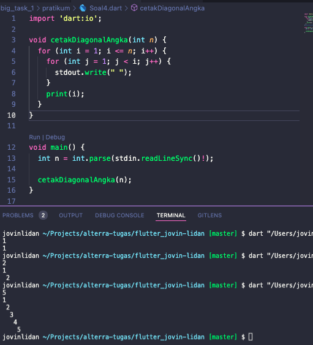

# BIG TASK 1

## Task

### 1. Soal 1

**Soal:**



**Output:**



**Penjelasan**

Pada kode diatas saya membuat sebuah fungsi bernama `cekGenap` dengan 1 parameter yaitu angka yang di masukkan melalui input, kemudian dengan return type nya adalah `bool`.
Jenis fungsi diatas adalahj arrow function, yang didalam fungsi tersebut dicek apakah hasil dari parameter yang dimasukkan apabila di modulo 2 (`arg % 2 == 0`) adalah 0 atau habis dibagi 2. Jika kondisi tersebut dipenuhi maka kembalikan boolean `true` yang menandakan bahwa angka tersebut adalah genap, dan kembalikan boolean `false` yang berarti kebalikannya.

Kemudian pada fungsi main, untuk mengambil inputan maka diperlukan library `dart:io`, oleh karena itu di paling atas dilakukan `import 'dart:io';`.

Untuk mengambil inputan gunakan syntax `stdin.readLineSync()`, kemudian parse ke dalam tipe `int`, kemudian cetak hasil dari fungsi tersebut dengan memanggil fungsi tersebut dan masukkan inputan sebelumnya ke dalam parameter.

### 2. Soal 2

**Soal:**



**Output:**



**Penjelasan**

Fungsi azimuth menerima 1 parameter yaitu angka , kemudian buat variabel baru masukkan yang nilainya sama seperti angka.

- Apabila angka lebih besar dari atau sama dengan 180 maka nilai dari angka dikurangi 180
- Apabila angka lebih kecil dari 180 maka nilai dari angka ditambah 180
- Apabila nilai dari masukkan lebih kecil atau sama dengan 0 maka kembalikan nilai 0
- Apabila nilai dari masukkan lebih besar atau sama dengan 360 maka kembalikan nilai 0
- Jika tidak maka kembalikan masukkan

Kemudian panggil fungsi azimuth dengan parameter angka dan cetak hasil dari fungsi tersebut

### 3. Soal 3

**Soal:**



**Output:**




**Penjelasan**

`stdout.write()`, digunakan untuk mencetak tanpa memasukkan newline.

Fungsi `cetakJamPasir` menerima 1 parameter , yaitu angka yang dimasukkan melalui inputan.

**Pejelasan Baris Kode**

```
for (int i = n; i > 0; i--) {
    for (int j = 0; j < n - i; j++) {
        stdout.write(" ");
    }
    for (int j = 0; j < i; j++) {
        stdout.write("* ");
    }
    print("");
}
```

- Lakukan looping `i` dari `n` hingga `1` , untuk setiap `i` lakukan perulangan kembali `j` dari `0` hingga `(n-i)-1`, kemudian cetak spasi untuk tiap perulangan `j`.
- Lakukan perulangan `j` kembali setelah perulangan `j` diatas selesai, pada perulangan kali ini cetak bintang disertai spasi dari `0` hingga `i-1`.
- Sehingga pada perulangan pertama jumlah spasi yang akan tercetak adalah `0`, dan jumlah bintang adalah `n`, jumlah spasi akan selalu bertambah `1` setiap perulangan dikarenakan nilai `i` akan selalu mengecil sehingga ekspresi `n-i` akan semakin besar setiap perulangan.
- Jumlah bintang pada setiap perulangan akan berkurang karena mengikuti nilai `i`.
- `print("")`, untuk mencetak baris kosong.

**Pejelasan Baris Kode**

```
for (int i = 1; i < n; i++) {
    for (int j = 1; j < n - i; j++) {
        stdout.write(" ");
    }
    for (int j = 0; j <= i; j++) {
        stdout.write("* ");
    }
    print("");
}
```

- Lakukan looping `i` dari 1 hingga n-1, untuk setiap i lakukan perulangan `j` dari 1 hingga `(n-i)-1`, kemudian cetak spasi untuk setiap perulangan `j` tersebut.
- Jumlah perulangan `j` pada perulangan pertama akan menjadi yang terbesar dikarenakan nilai `i` dimulai dari `1`, sehingga `n - 1` menghasilkan nilai terbesar dan jumlah perulangannya akan mengecil seiring perulangan `i`.
- Setelah perulangan `j` tersebut selesai, maka dilanjutkan perulangan `j` yang baru dari 0 hingga i untuk mencetak bintang dan spasi. Jumlah perulangan `j` akan membesar seiring perulangan `i`.
- Kemudian `print("");` untuk mencetak baris kosong

Setelah itu pada fungsi main, dilakukan penerimaan inputan dari user dan dikonversi ke bentuk tipe data `int`, kemudian dipanggil fungsi `cetakJamPasir` dengan parameter adalah inputan angka dari user.

### 4. Soal 4

**Soal:**



**Output:**



**Penjelasan**

Fungsi cetakDiagonalAngka menerima parameter angka yaitu masukkan dari inputan user.

**Penjelasan Kode Program**

```
for (int i = 1; i <= n; i++) {
    for (int j = 1; j < i; j++) {
        stdout.write(" ");
    }
    print(i);
}
```

- Lakukan perulangan `i` dari `1` hingga `n`, untuk setiap `i` lakukan perulangan `j` dari `i` hingga `i-1`. Kemudian untuk setiap perulangan `j` cetak spasi.Jumlah perulangan `j` akan semakin membesar seiring `i`.
- Setelah perulangan `j` selesai maka cetak angka `i`.

Kemudian panggil fungsi cetakDiagonalAngka dengan parameter n yang berasal dari inputan user yang telah dikonversi ke tipe data `int`.
